# Demon's Winter 冬之魔 — 繁體中文化

SSI《Demon's Winter》（1988, DOS）的引擎逆向與繁體中文化專案。

目標有兩層：先透過反組譯理解原版引擎的行為，在 Go / Ebiten 上重寫一套跨平台可執行的引擎；
再基於這套引擎完成介面與劇情文本的中文化，讓這款 1988 年的 CRPG 能用中文玩完。

原版遊戲的執行檔、資料檔、美術與音樂都不在本專案散布範圍內，玩家需自備合法副本。
（下面的截圖是本專案的引擎讀取自備資料後跑出來的畫面，不含可再利用的原版素材。）

---

## 目前跑得起來的樣子

引擎已經可以從原版資料載入並實際遊玩 —— 走地圖、打仗、進城、紮營、觸發劇情、存檔，
畫面與介面全部中文化。素材預設走原版的 **EGA 十六色**（`.SHE` ＋ 原版自己設進調色盤
暫存器的那 16 個值），CGA 四色版可用 `-video cga` 啟動；第三套可選
Modern Icon 可用 `-video modern` 啟動。遊戲中按 `F8` 可即時輪替
EGA → CGA → Modern Icon，不改遊戲規則或存檔。
以下都是 `tools/screenshot.sh` 在 headless 環境實跑截下來的。

| | |
|---|---|
| 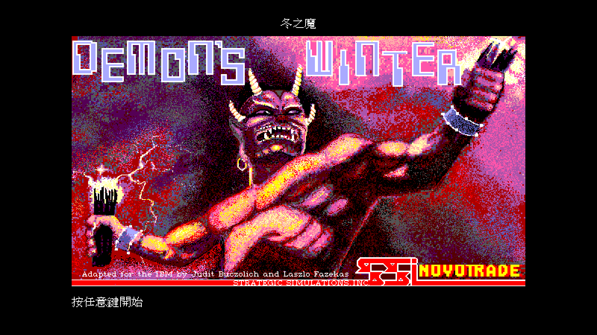 | 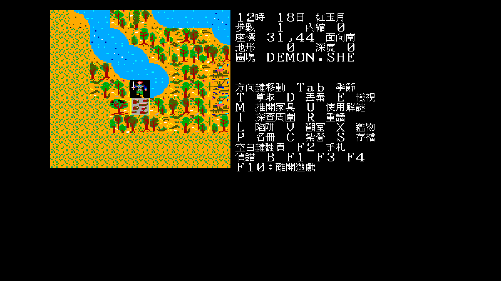 |
| **標題**　原版美術一格未動，中文標題「冬之魔」放在圖上方的黑邊 | **探索**　原版地圖與 EGA 圖塊、隊伍與船的走路 glyph、可通行性、日夜與時間推進 |
| 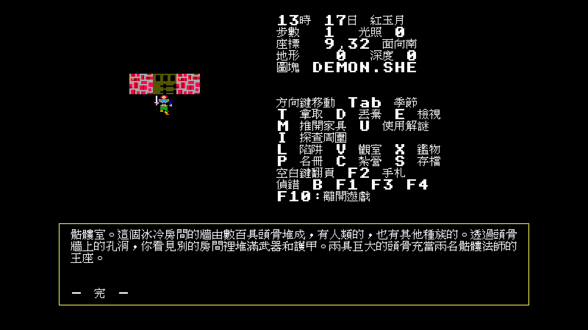 | 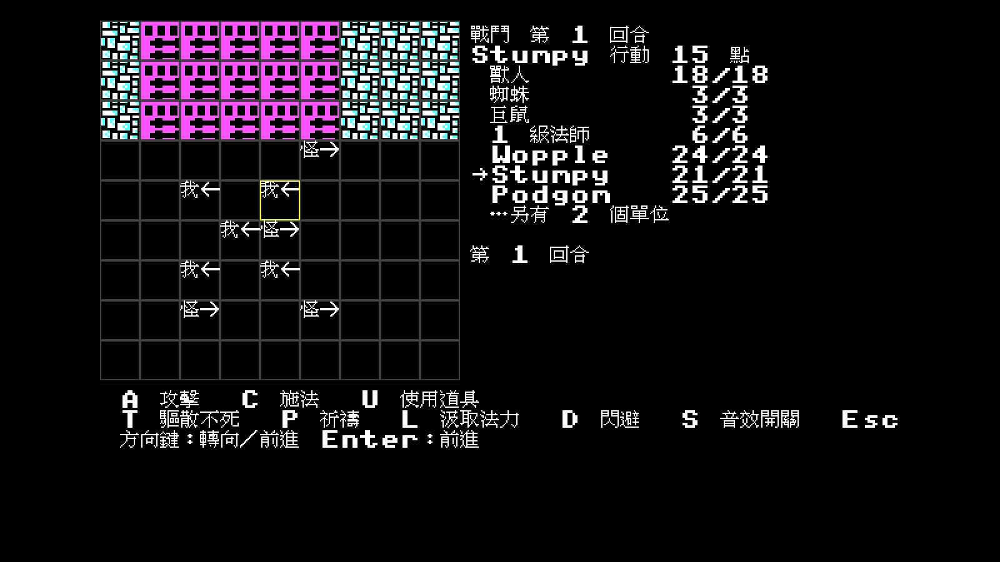 |
| **事件**　踩到特殊格觸發敘述，資料文字 500/500 全數中文化。地城的照明照原版：視窗固定 9×9，看得到多大一塊由光源決定（矮人的黑暗視覺 +1） | **戰鬥**　行動點、法術、地形與視線遮蔽，怪物 AI 照原版 |
| 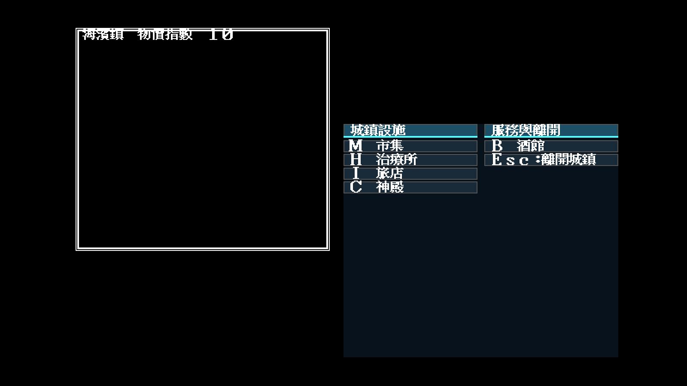 | 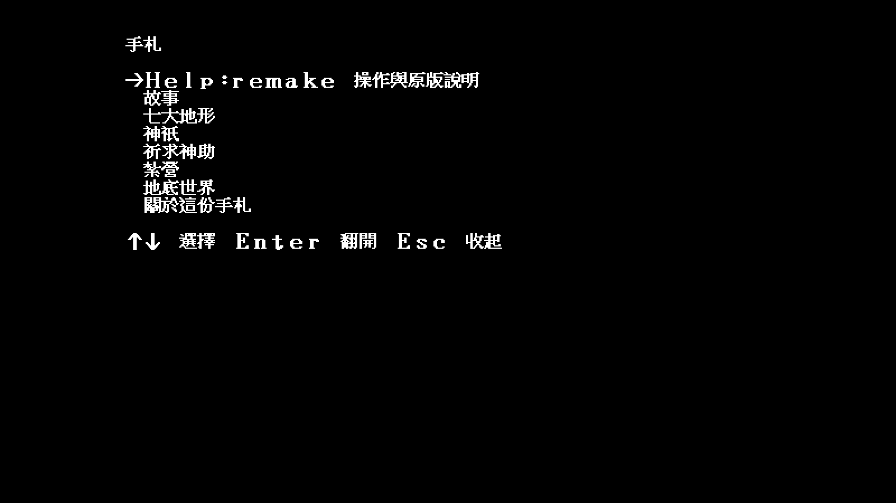 |
| **城鎮**　八種設施、市集議價、物價指數依城鎮不同 | **手札**　原版印在紙本手冊上的資料，搬進遊戲裡按 `F2` 直接查 |

### 原版畫面、EGA／CGA 還原與 remake 差異

下列三張保留同一組原版初始隊伍（Gold 65、Provisions 8）作視覺基準。左圖是
DOSBox 中的 1988 原版；中、右圖是 remake 在同一個戶外測試位置的 EGA／CGA
實跑畫面。原版截圖停在鄰近城鎮格，故這不是逐像素同座標疊圖，而是版面與素材
管線比較；地形逐格正確性另由固定座標截圖與 atlas contact sheet 驗收。

| 1988 DOS EGA 原版 | Remake：原版 EGA 素材 | Remake：原版 CGA 素材 |
|---|---|---|
| 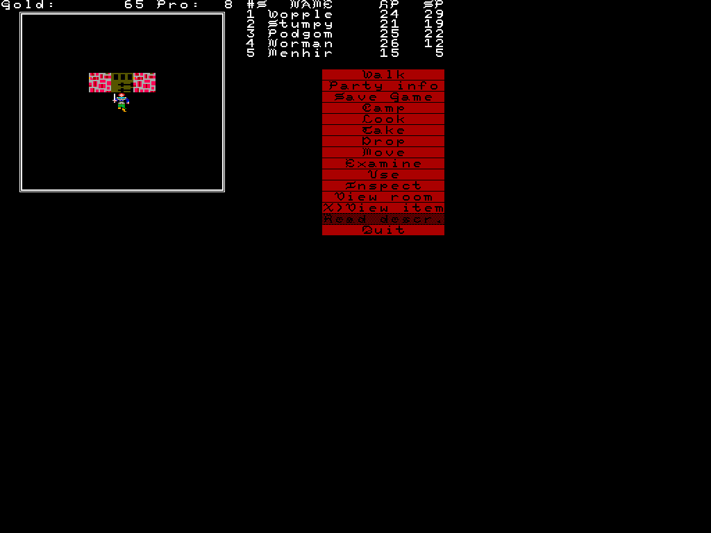 |  | 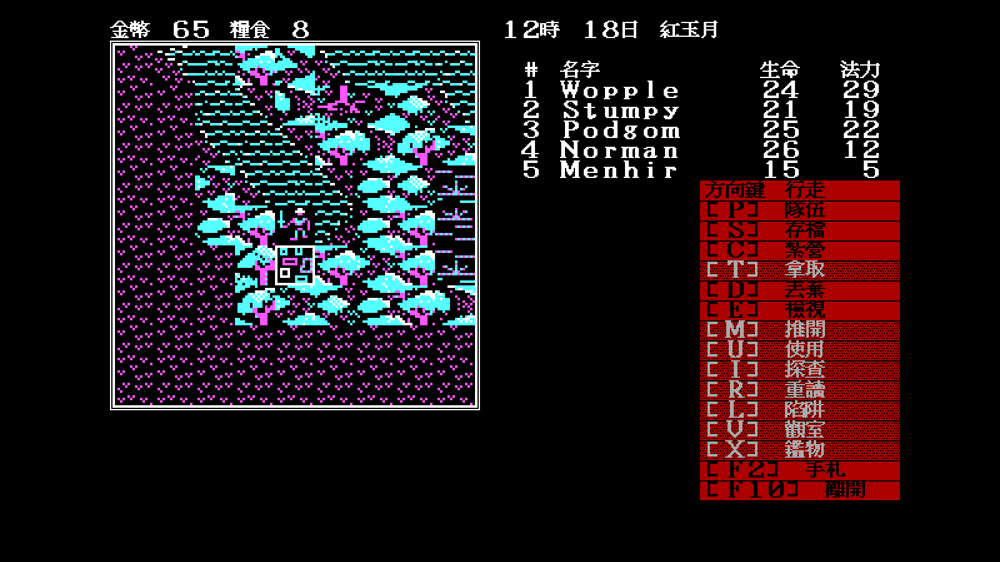 |
| 640×350；288×252 地圖窗；英文哥德字與紅底直式命令列 | 640×400 中文邏輯畫布；讀取原版 `.SHE` 與遊戲實設 16 色調色盤 | 同一局讀取原版 `.SHP` 四色圖塊；16×16 frame 以整數倍顯示 |

具體差異：

| 面向 | 原版 | 現在的 remake |
|---|---|---|
| 美術資料 | EGA 或 CGA 版本各自啟動 | `F8` 依 EGA → CGA → Modern Icon 輪替；Modern Icon 是另行重繪的可選現代主題，切換不改存檔與戰鬥狀態 |
| 還原尺度 | EGA 640×350、CGA 320×200 | EGA tile 還原為 32×28；CGA 16×16 以 nearest-neighbor 放到 32×32，不假裝兩者原始比例相同 |
| 字型與語言 | 英文 `ASC/GOT` 點陣 | 中文與全形英數使用倚天 16×15 預設粗體；哥德章節字仍取原版 `GOT.FNE` |
| 版面 | 右側固定紅底指令列，80×25 字元式資訊密度 | 保留地圖、隊伍表與紅底選單的骨架，擴成 640×400 以容納可讀中文、訊息與遊戲內手札 |
| 探索操作 | 紙本介面為相對左右轉、`Return` 前進 | C4 已定案為現代絕對方向：方向鍵轉向並前進；背後攻擊仍讀實際面向 |
| 海戰操作 | 相對轉舵與直行分開，轉向耗點 | 刻意保留原規則，不套用探索的絕對方向簡化 |
| 噴吐特效 | race 選 terrain tile 6／7／8，沿錐形逐格繪製 | 已由 IDA 9.4 追到同一 draw call 並照接，不再使用暫代橘色方塊（[`docs/re/106`](docs/re/106-breath-tile-source.md)） |

#### Modern Icon（高解析重繪方向已核准）

第三套主題不是「原版還原」，也不再稱為 Modern EGA。它是 remake 專用的
**Modern Icon**：保留原版 tile index、位置、碰撞、角色朝向與規則語意，但美術
不受 32×28 像素格或復古點陣風格限制，改由高解析呈現層繪製重新設計的圖示。
原有調色預覽暫時只作 F8 與全流程相容底稿，不代表正式 Modern Icon 美術。

| 核准的主要概念方向 | 新的 Modern Icon 延伸方向 |
|---|---|
| [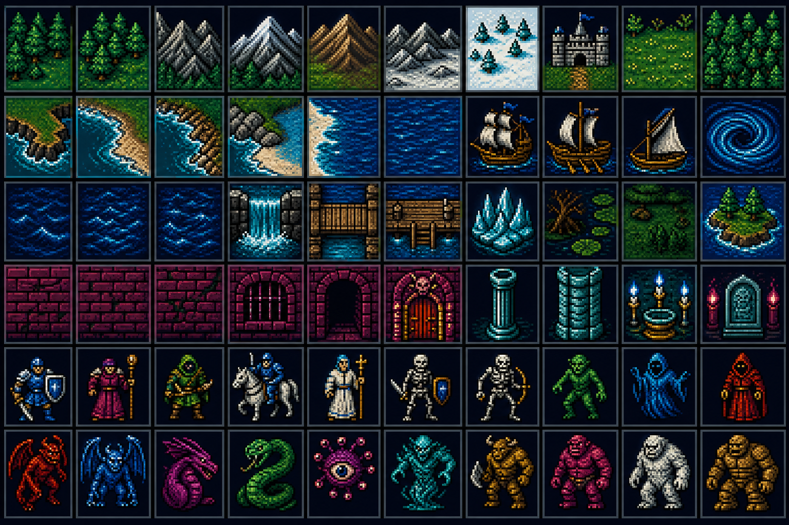](docs/design/modern-ega-theme.md) | [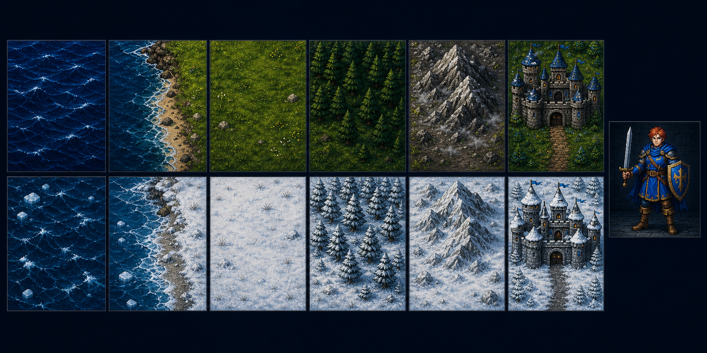](docs/design/modern-ega-theme.md) |

輔助參考 `modern-ega-m0-terrain-study-b.png` 亦已核准。先前的
`modern-ega-m1-b-runtime-trial.png`、`modern-ega-m0-terrain-study-b-runtime-proof.png`
及 `modern-ega-b-direct-downscale-failed.png` 已由使用者明確否決；它們只保留為
歷史研究證據，不會延伸、量產或進入正式素材。

詳見 [`Modern Icon 美術與整合規格`](docs/design/modern-ega-theme.md)。跨作品引擎則已完成
第一輪抽離評估：建議先在 monorepo 抽 gfx、runtime、storage、grid 與可重播 RNG，
取得第二款真實遊戲的格式證據後才發布通用 module，避免把單一作品的硬編碼誤稱為
SSI 通用引擎（[`研究報告`](docs/design/engine-extraction-study.md)）。

##### Modern Icon 規劃索引

目前方向已核准，但全套重繪及實機驗收尚未完成：

| 階段 | 狀態 | 內容與驗收 |
|---|---|---|
| P0 相容調色預覽 | **已實作，僅作底稿** | 驗證 F8、完整流程及主題切換不影響規則 |
| P1 視覺方向審查 | **已核准** | 以 `modern-ega-concept.png` 為主、M0-B 為輔；主題定名 Modern Icon，否決縮圖與像素化路線 |
| P2 高解析代表素材與呈現層 | **進行中** | 以同一邏輯索引與格位，於放大後畫布繪出高解析 terrain、角色、怪物與船樣本 |
| P3 全素材量產 | 待代表畫面核准 | 補齊常態／冬季、戰鬥、怪物、船及必要 UI 圖示，逐索引檢查語意與方向 |
| P4 最終視覺驗收 | 待量產 | 世界、冬季、地城、戰鬥、海戰同狀態三主題截圖；密門、陷阱、黑色地形與色弱辨識抽樣 |

完整呈現架構、素材分批與驗收門檻，以
[`docs/design/modern-ega-theme.md`](docs/design/modern-ega-theme.md) 為單一設計規格。
在 P2–P4 完成前，README 與發行說明不得把 Modern Icon 稱為完成重畫。
高解析 loader 與第一張實機架構證據見
[`docs/playtest/20`](docs/playtest/20-modern-icon-high-resolution-layer.md)：它已證明
64×56 最終畫布覆寫可行；實際索引盤點後，首批平原與深海也已進入同一固定場景。

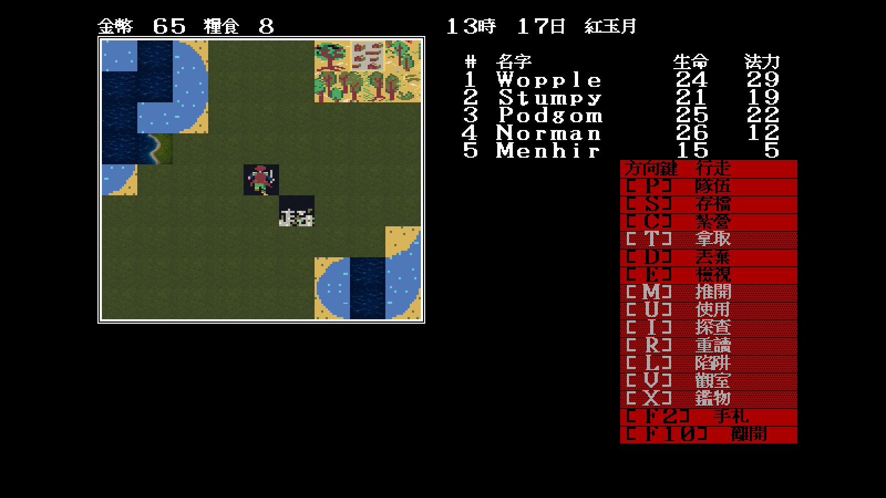

實際樹木索引 `0x04` 單株古樹、`0x07` 前後雙樹、`0x0b` 低矮林緣已各自重畫，
並完成常態／冬季配對；它們不是共用一張森林圖：

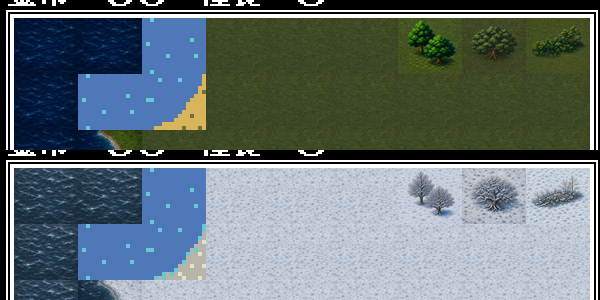

完整固定場景與裁決見
[`docs/playtest/23`](docs/playtest/23-modern-icon-tree-indices.md)。其餘方向岸線、
城鎮、特殊格、隊伍方向及其他索引尚未重畫，因此仍不能稱為完整主題。

劇情會把神殿替換成的 `0x5b` 毀壞廢墟也已完成正常／冬季配對：

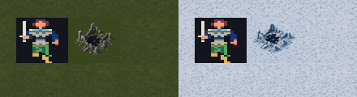

它保留殘牆、折柱與中央燒灼空洞的同一構圖；規則語意與固定場景證據見
[`docs/playtest/24`](docs/playtest/24-modern-icon-ruins-5b.md)。

同一固定種子、座標與按鍵序列的三主題比較：

| 原版 EGA 還原 | 原版 CGA 還原 | Modern Icon M1 |
|---|---|---|
|  |  |  |

三圖的金幣、糧食、日期時間、隊伍數值與物件格位一致。重播方式與裁決見
[`docs/playtest/21`](docs/playtest/21-three-theme-same-state-comparison.md)。

同三個索引也已有冬季一一對應版本：

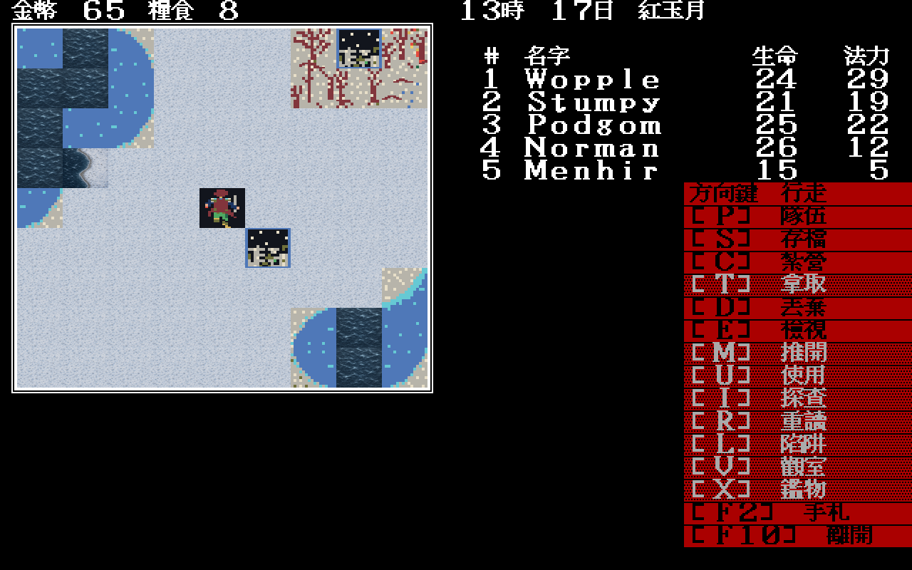

雪原、冬季深海、`0x17` 冬季岸線及 `0x04/07/0b` 冬季樹木已實跑；尚未重畫的
角色方向、城鎮、特殊格及其他岸線仍刻意顯示 WINTER.SHE 相容底稿。

北向隊伍也改為透明高解析 overlay，不再帶原版整格 glyph 的黑色方框：

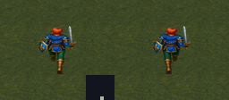

它會先畫腳下的真實 terrain，再疊角色；EGA/CGA 仍保留原版 glyph。透明契約、
去背與兩步實機證據見 [`docs/playtest/22`](docs/playtest/22-modern-icon-transparent-party.md)。

驗收採「前期完整垂直切片＋後期高風險串接抽樣」：新遊戲建角、購物與換裝，
正常戰鬥／死亡／治療、狗頭人營地、升級、跨圖抵達加穆爾神殿均由可重播腳本實際跑通；
後期另抽驗購船、密語輸入、三符印、頭目與結局序列。重複房間不逐格人工踏查，
規則層則由全套單元測試覆蓋。三場夢、艾瑞戈爾與結局序列都已接上且完成中文化。

### 開發者場景書籤

remake 不必像原版一樣每次走完整座地城才能重現一個 bug。`-scene` 提供具名、
可重播的開發者書籤，而且**不會偷偷解掉劇情條件**；例如：

```bash
tools/go.sh run ./cmd/demonwinter -list-scenes
tools/go.sh run ./cmd/demonwinter -scene armory -seed 11
tools/go.sh run ./cmd/demonwinter -scene circle-light -glyphs -seed 11
tools/go.sh run ./cmd/demonwinter -scene trap-pool -give-skill 27 -seed 7
tools/go.sh run ./cmd/demonwinter -battle -battle-examine-fixture -give-skill 7,25 -seed 11
tools/go.sh run ./cmd/demonwinter -battle -battle-illusion-fixture -seed 11
```

清單涵蓋附魔工坊、恆世寶珠、惡魔水晶、兵器庫、活動牆、艾瑞戈爾、墓園、
夜鐘、旅人的床、兩道密語、光之環與固定朝向的水池陷阱。`-give-skill`／
`-remove-skill` 可重播技能有無的分支；戰鬥檢視 fixture 只補目標記憶與一隻
召喚物，幻象 fixture 只固定下一次消失判定來截取訊息，兩者都不寫存檔。
`-map/-x/-y/-event` 等底層旗標仍保留，
供逐 byte 的逆向邊界實驗使用；正常玩家不需要任何這些旗標。

### 發行包

A6 抽樣與完整測試通過後，可建立不含原版資料／倚天字型的 Linux amd64 包：

```bash
tools/package-release.sh 2026.07.29
```

產物與 SHA-256 放在 `dist/`。玩家解壓後依 `開始遊戲.txt` 指向自己的合法
`DEM_DATA` 與倚天 16×15 字型目錄；翻譯、遊戲內手札與三主題引擎已包含在包內。

---

## 現況

> 這張表 2026-07-27 對程式碼核實過。狀態以 [`CONTEXT.md`](CONTEXT.md) §7 的
> worklist 為準 —— 那裡是單一真相來源，這裡只是摘要。

| 項目 | 狀態 |
|---|---|
| 官方手冊繁中版 | 完成（全 28 頁 + 附錄），並已搬進遊戲內手札 |
| 社群攻略繁中版 | 完成（1,914 行）|
| 反組譯筆記 | 115 篇；主線、海戰、時間進位、arena、命中修正、營地法術、魔法物品充能與幻象行動前 20% 消失均有位址證據 |
| 資料格式 | 地圖、事件、道具、怪物、存檔、字型、圖形、音效皆已解 |
| Go / Ebiten 引擎 | **可遊玩**：探索、戰鬥、城鎮八設施、紮營 14 項、建角、存檔、音效 |
| 遊戲內文字中文化 | **500/500（100%）** 資料字串，另有 **749 條**中文介面文案 |
| 試玩驗收 | **完成前期垂直切片與後期高風險抽樣**；可重播腳本與 trace 工具在 `tools/playthrough/` |

---

## 文件索引

### 官方遊戲手冊（繁體中文）

SSI 原版隨盒手冊全譯，含所有規則、數值表與附錄。這是遊戲機制的權威來源。

| 檔案 | 內容 | 對應原書頁碼 |
|---|---|---|
| [`docs/manual/part-0.md`](docs/manual/part-0.md) | 封面、法術速查表、有限保固、瑕疵磁片處理、目錄 | 封面與附錄摺頁 |
| [`docs/manual/part-1.md`](docs/manual/part-1.md) | 前言、開始遊戲、建立角色 | 1–4 |
| [`docs/manual/part-2.md`](docs/manual/part-2.md) | 探索、神殿與教堂、學院、城鎮、市集、紮營、商人 | 5–12 |
| [`docs/manual/part-3.md`](docs/manual/part-3.md) | 地底、物品、海域、戰鬥、戰鬥結束後、魔法 | 13–20 |
| [`docs/manual/part-4.md`](docs/manual/part-4.md) | 吟唱、學識、靈視、物品、遊戲提示、附錄 A–E、製作團隊 | 21–28 |

附錄 A–E 分別是：各職業技能點數表、種族屬性上限、魔法道具、法術一覽、標準裝備清單。

### 社群攻略（繁體中文）

2022 年版的玩家 FAQ 全譯，含完整破關流程與大量實測數據表。

| 檔案 | 內容 |
|---|---|
| [`docs/walkthrough/part-1.md`](docs/walkthrough/part-1.md) | 序言、基本機制、經驗值表 |
| [`docs/walkthrough/part-2.md`](docs/walkthrough/part-2.md) | 種族、技能（武器／戰鬥／符文／吟唱），含五系法術 SP 表 |
| [`docs/walkthrough/part-3.md`](docs/walkthrough/part-3.md) | 職業（31 技能 × 10 職業成本表）、護甲裝備表、雜項提示 |
| [`docs/walkthrough/part-4.md`](docs/walkthrough/part-4.md) | 破關流程：狗頭人營地 → 加穆爾神殿 → 庫瑞克 → 寒冰大教堂 → 白騎士地窖 → 馬利馮大神殿 → 最終對決 |
| [`docs/walkthrough/part-5.md`](docs/walkthrough/part-5.md) | 附魔系統：武器、護甲、道具，共 26 張對照表 |
| [`docs/walkthrough/part-6.md`](docs/walkthrough/part-6.md) | 最佳裝備清單、存檔十六進位編輯（含 `PARTY.DAT` 欄位位移表） |

### 翻譯基礎建設

| 檔案 | 內容 |
|---|---|
| [`translations/glossary.md`](translations/glossary.md) | 統一譯名表。種族、職業、技能、法術、裝備、附魔、神祇、城鎮、介面指令等。全專案唯一的譯名真相來源 |

譯名以 `DEMON.INT` 內的實際字串為準，因此收錄的是原版拼字（`Shamen`、`Xorcise`、`Small ax`），
而非手冊上的正確拼法。手冊與遊戲用語不同處（例如 Apple II 版 `Sense magic` 對 DOS 版 `Detect aura`）
兩者都收，並註明各自屬於哪個版本。

### 畫面改版

引擎功能面已經追上原版，觀感面還沒有。這一組文件把「差在哪、為什麼、怎麼改」量出來寫清楚，
含逐張 SVG 對照圖。方向是**保留原版骨架、重做觀感**，
而且**原版素材（sprite／tileset）一格不動** —— 只改外框、配色、字型與排版。

| 檔案 | 內容 |
|---|---|
| [`docs/ui/01-ui-assessment.md`](docs/ui/01-ui-assessment.md) | **現況 vs 原版的逐項量測**：原版座標全部從 DOSBox 截圖量出來（地圖視窗 288×252、紅底選單 176 px、停用列的網點比例），11 條問題依嚴重度排序 |
| [`docs/ui/02-ui-plan.md`](docs/ui/02-ui-plan.md) | **改版計畫**：定案約束、四個老遊戲重製版的做法調查（Wasteland Remastered、冰城傳奇、Wizardry 2024、Gold Box Companion）、七個階段的實作順序 |
| [`docs/ui/03-pc98-gold-box-layout-reference.md`](docs/ui/03-pc98-gold-box-layout-reference.md) | **PC-98 日文排版比對**：以《克萊恩英豪／Champions of Krynn》與《幽靈騎士／Death Knights of Krynn》為核心，再以 *Pool of Radiance*、*Curse of the Azure Bonds*、*Secret of the Silver Blades*、*Pools of Darkness* 交叉檢查 640×400、16×16 CJK 字格、38 格正文與探索／戰鬥資訊分區 |
| [`skill-build/research-pc98-golden-box-ui/`](skill-build/research-pc98-golden-box-ui/) | **可共用的 Codex knowledge skill**：以 Golden Box、PC-98、Krynn、幽靈騎士等關鍵字觸發，詳細 corpus 與量測規則只從 reference link 按需載入 |

原版 → 目前 → 建議，三張版面對照：

| | |
|---|---|
| [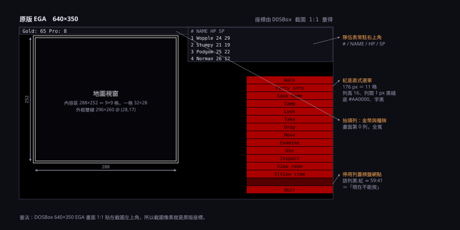](docs/ui/02-ui-plan.md) | [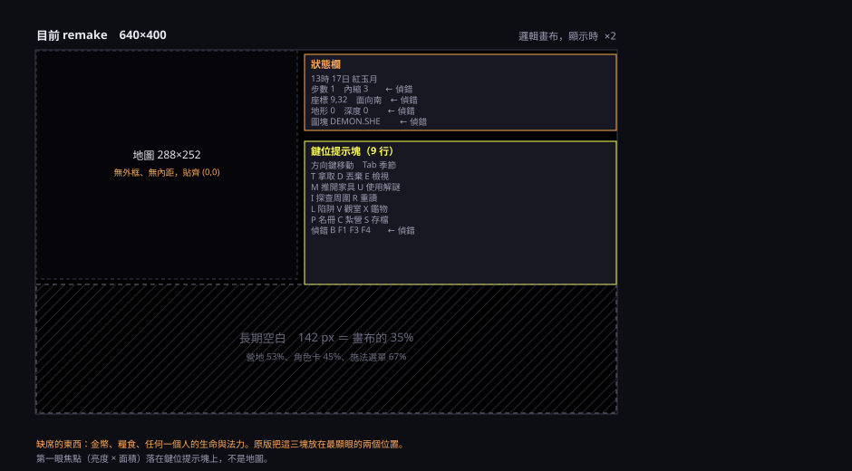](docs/ui/02-ui-plan.md) |
| **原版**　紅底直式選單、雙線地圖框、右上隊伍表、哥德花體 | **目前**　沒有框、選單退化成鍵位提示、偵錯欄位在正式畫面、下緣 35% 長期空白 |

[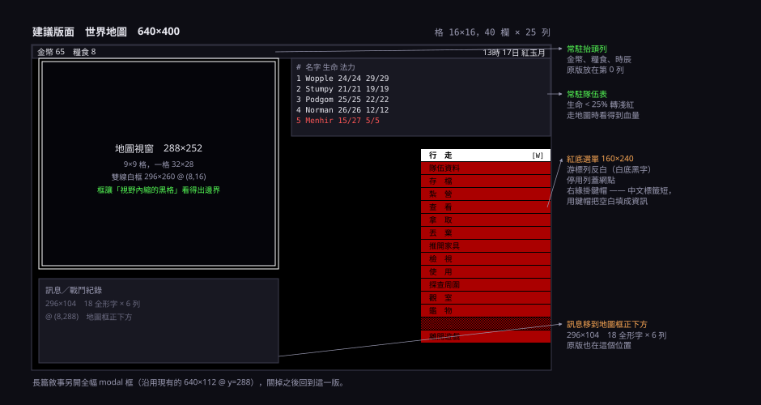](docs/ui/02-ui-plan.md)

畫面計畫的七個階段已完成：雙線框、EGA 提示色、版面重排、共用紅底選單、
中文段落排版、原版戰鬥 sprite 與哥德章節字型均已接上。

中文字型使用自備的倚天 16×15 點陣，預設橫向加粗一像素；作法參考
《猴島小英雄 2》中文化。原本中文走倚天點陣 16×15（1×1 像素）、英數走原版 CGA 8×8 放大兩倍
（2×2 像素），同一行兩種密度。追下去發現問題比密度更深一層 —— 原版兩套 ASCII 字模都是粗筆畫的
顯示體，直筆 4 px，而漢字是 1–2 px。改用倚天自己的全形英數之後兩者同重量，而且**寬度一樣是 16，
版面一行都不用改**。

[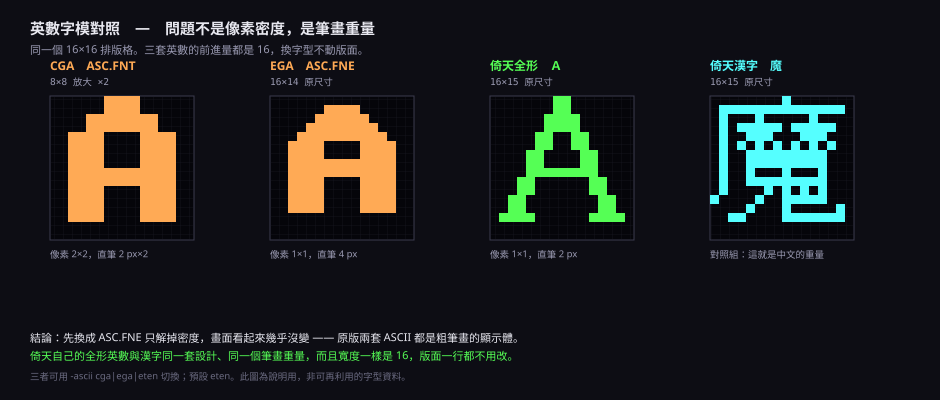](docs/ui/02-ui-plan.md#31-英數字模01-的-p7)

### 技術文件

| 檔案 | 內容 |
|---|---|
| [`PLAN.md`](PLAN.md) | 專案計畫：偵查事實、待驗證假設、架構決策、階段分解、驗收準則、風險 |
| [`docs/ui/`](docs/ui/) | 畫面評估與改版計畫（見上一節） |
| [`docs/design/retro-game-re-remake-lessons.md`](docs/design/retro-game-re-remake-lessons.md) | 從本作整理出的老遊戲反組譯、乾淨重寫、原版對拍與交接模板 |
| [`docs/design/engine-extraction-study.md`](docs/design/engine-extraction-study.md) | 本作引擎可抽離範圍、第二款遊戲相容性門檻與分階段方案 |
| [`skill-build/research-pc98-golden-box-ui/`](skill-build/research-pc98-golden-box-ui/) | PC-98 Golden Box CJK UI 共用 skill；同份已同步至 `~/.codex/skills` 與 `~/my_skill` |
| [`docs/playtest/15-modern-ega-png-theme-loader.md`](docs/playtest/15-modern-ega-png-theme-loader.md) | Modern EGA 五張 PNG atlas 經 manifest 載入後，與記憶體調色預覽逐 byte 相同的端到端證據 |
| [`docs/playtest/16-modern-ega-direct-downscale-rejection.md`](docs/playtest/16-modern-ega-direct-downscale-rejection.md) | B 方向稿強制縮入實機後的岸線接縫、重複噪音與角色比例反證，以及 M1 手工像素化裁決 |
| [`docs/playtest/17-modern-ega-m1-b-bounded-runtime.md`](docs/playtest/17-modern-ega-m1-b-bounded-runtime.md) | 七個已證 terrain index 的真正 32×28 手工試片、正式 loader 實跑與隊伍兩步 anchor 證據 |
| [`docs/playtest/18-remaining-skill-ui-sampling.md`](docs/playtest/18-remaining-skill-ui-sampling.md) | 解除陷阱、無技能 25%、觀室額度、戰術目標與召喚物 HP/SP 的實機閉合；並修掉檢視卡被紅色命令面板遮蔽 |
| `docs/formats/` | 資料格式規格書（建置中） |
| `docs/re/` | 反組譯筆記與 Ghidra 環境說明（建置中） |

---

## 技術路線

### 執行檔結構

| 檔案 | 大小 | 角色 |
|---|---|---|
| `DEMON.EXE` | 6 KB | loader。檢查 8087 協同處理器，載入開場畫面後啟動 `DEMON.INT` |
| `DEMON.INT` | 173 KB | 引擎本體。MZ 格式 16 位元 real mode，3,807 個 relocation，無 overlay |

`.INT` 是 SSI 的「interpreter」命名慣例，但檔案內容是**原生 8086 機器碼**，不是 bytecode。
本作沒有 SCUMM / AGI / SCI 那樣的虛擬機。資料驅動的那一層在 `DATA*.TXT`、`TOWN*.DAT`、
`EXITS.DAT` 的事件與定義表，那才是本專案要重建成腳本直譯器的對象。

### 架構決策

- **反組譯只當行為真值（oracle），程式碼乾淨重寫**。直接沿用反編出的 `FUN_xxx` 會纏繞
  8086 runtime、無型別、不可維護，也無法中文化。
- **素材兩套都收**。`.PIE/.SHE/.FNE`（EGA）優先，`.PIC/.SHP/.FNT`（CGA）隨後。
  CGA 素材不是砍掉的選項，只是排序在後。
- **中文排版拉畫布到 640×400**。中文需 16×16 點陣才可讀，英文 8×8 字型放大兩倍後與中文同高。

### 素材格式：3.5 倍規律與它的界線

CGA 與 EGA 素材檔的大小呈精確 3.5 倍對應（1728→6048、2048→7168、2816→9856、
6528→22848、15360→53760）。3.5 = 2（2bpp→4bpp 色深）× 1.75（200→350 掃描線）。

這條規律曾被當成「所有 EGA 素材都是 320×350 four-plane」的依據，
但實作解碼器並與 DOSBox 原版截圖肉眼比對後，結論要分開講：

| 素材 | 結論 |
|---|---|
| CGA `.PIC` / `.SHP` | **已驗證**。`OPEN.PIC` 是 320×200 2bpp **linear**（不是硬體 odd/even 交錯）；人像框 144×144；sprite frame **16×16**（64 B）|
| EGA `.PIE` 全螢幕圖／人像框 | **已驗證**。16 bytes 內嵌調色盤 + 4-plane sequential、MSB-first；檔內 144×252，畫到畫面上是 288×252 |
| EGA `.SHE` 精靈圖 | **已驗證**。檔內 frame **16×28**（224 B）、4-plane 列內分塊；載入時水平加倍成 32×28（448 B）|
| `OPEN.PIE`（102,160 B）| **未解**。確認不符 3.5 倍規律 |

EGA 素材的通則是「**檔案存半寬、顯示時寬度 ×2、高度 ×1.75**」，
差別只在加倍發生於載入時（`.SHE`）或 blit 時（`.PIE`）。

過程中踩到幾個「算術對但方向／單位錯」的陷阱：`OPEN.PIC` 是 linear 不是交錯；
sprite frame 尺寸更是連續猜錯兩輪（32×16 → 16×32 → 實際 16×16），
每一輪的錯誤版本都整除、都通過全部測試。最後靠的是讀出遊戲初始化時
自己宣告的 frame 大小常數。這也是本專案把「視覺產物一律 dump 出來比對原版」
列為硬性驗收條件的原因。

詳見 [`docs/formats/graphics.md`](docs/formats/graphics.md)。

---

## 授權與出處

### 程式碼

本專案自行撰寫的引擎程式碼與工具，授權方式待引擎開工後確定。

### 原版遊戲

《Demon's Winter》© 1988 Strategic Simulations, Inc.
遊戲執行檔、資料檔、美術與音樂的著作權歸原權利人所有，**不在本專案散布範圍內**，
已全數排除於版本控制之外。使用本專案的引擎需自備合法的原版遊戲副本。

### 手冊譯文

原文為 SSI 隨盒手冊，著作權歸 Strategic Simulations, Inc. 所有。
本專案的繁體中文譯本屬非商業性質的數位保存與研究用途，不作商業散布。

### 攻略譯文

原文為 2022 年 8 月 19 日版的玩家 FAQ（作者未於文中署名，文中向 Andrew Schultz
致謝並提及其 FAQ 與地圖）。著作權歸原作者所有。本專案譯本同屬非商業保存用途。

若原權利人對上述任一項有疑慮，請開 issue 告知，本專案會配合處理。
