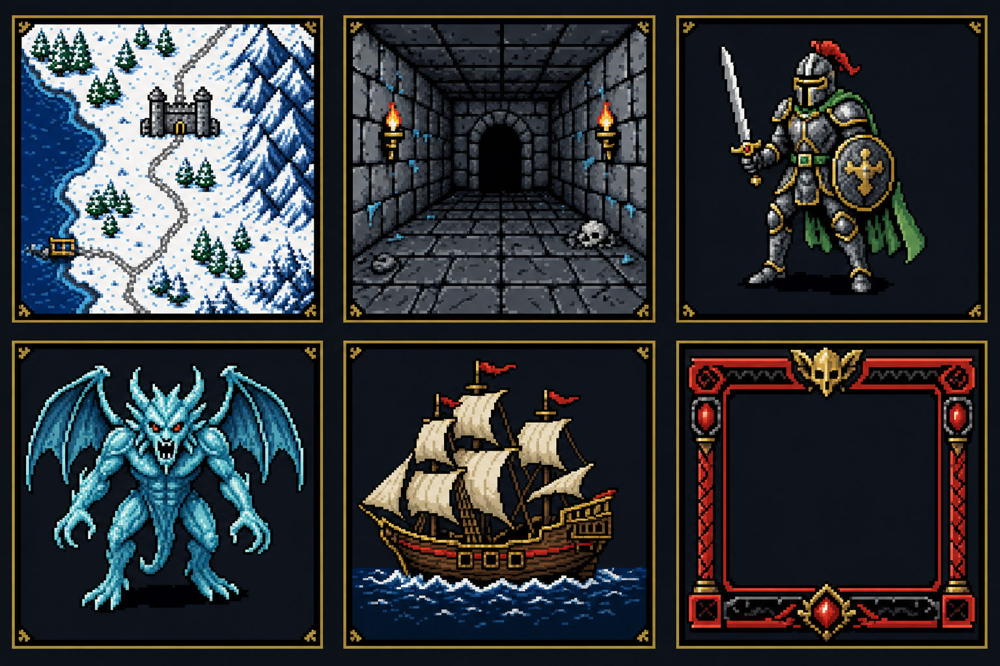
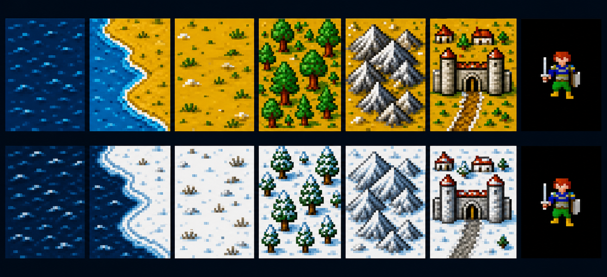
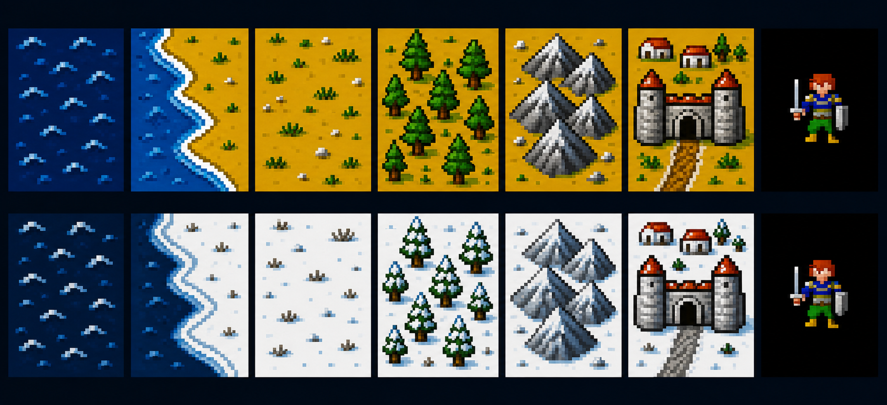
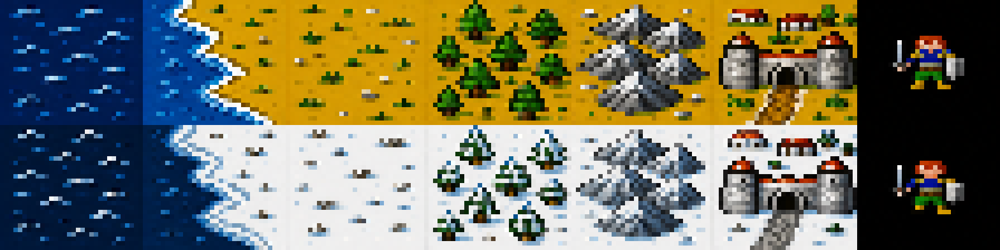
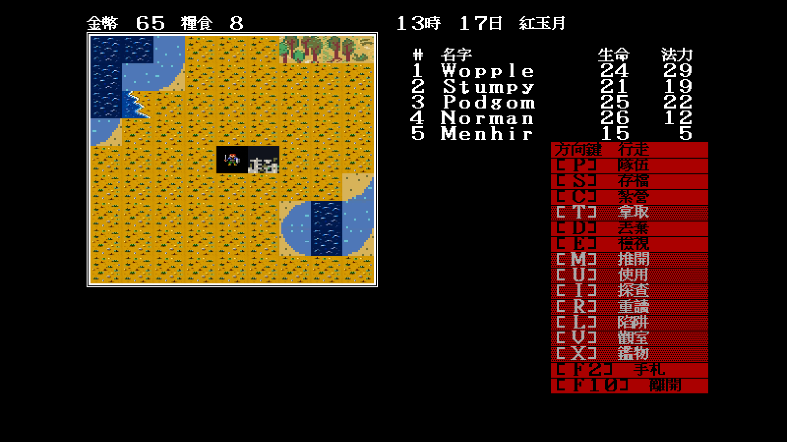
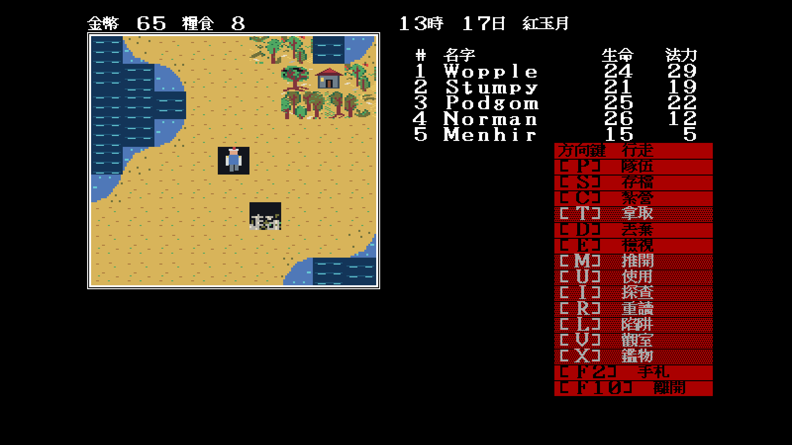

# Modern Icon 主題：美術與整合規格

> 狀態：使用者方向核准、執行期架構調整中（2026-07-29）
>
> 目標：延伸核准的概念稿，重畫成不受像素美術限制、細緻且易讀的現代圖示；
> 原版 EGA／CGA 永久保留，以 `F8` 依序輪替。

## 2026-07-29 使用者裁決

- 主題正式名稱由 **Modern EGA** 改為 **Modern Icon**。
- `img/modern-ega-concept.png` 是主要延伸方向；
  `img/modern-ega-m0-terrain-study-b.png` 可作輔助參考。
- `img/modern-ega-m1-b-runtime-trial.png`、
  `img/modern-ega-m0-terrain-study-b-runtime-proof.png` 與
  `img/modern-ega-b-direct-downscale-failed.png` 均已否決，不得作正式素材。
- remake 不必服從 32×28 像素美術限制，也不再把大圖 downscale 成原版 atlas。
  新素材要重新繪製，並由高解析呈現層依既有 tile index、位置與碰撞格繪出。

首張依此裁決產生的非像素代表方向稿：


`modern-icon-direction-v1.png` 是同輪產生的材質探索，但浮島式圓盤不符合地圖
拼接需求，因此不作 terrain 生產基準；v2 已修正為正投影方格、內容延伸至四邊，
同時維持非像素的高解析數位繪圖。

## 1. 主題定位

一句話方向是：**「記憶中的 EGA」，不是把 1988 年素材磨平，也不是換成另一款
奇幻遊戲。**

Modern Icon 必須保留：

- 同一個 tile／sprite index 表示同一件事，地圖、戰鬥、存檔均不轉碼。
- 原版的正投影視角、地形輪廓、角色朝向、怪物剪影與一格一單位規則。
- 黑、紅、金黃、冰青構成的 SSI 氣質；高彩度只用在游標、危險與魔法。
- 清楚的圖示輪廓與功能辨識；素材可使用平滑邊緣、數位繪圖與現代光影。
- 倚天 16×15 中文字型、既有資訊密度與遊戲邏輯座標。

第一輪視覺方向稿（用於色彩、材質與辨識度討論，不是可直接載入的 atlas）：


第二張是 2026-07-29 的生產方向表，集中校準雪地、地城、隊員、冰魔、船與
紅黑面板的材質語言。它仍是設計參考，不是可直接切片的 runtime atlas：



第三張是 M0 地形試片，第一次把同一語意的常態／冬季素材強制排成上下對：
深水、岸線、平原、森林、山、城鎮與隊伍圖示。它用來裁決季節配對、剪影與
紋理密度；仍是放大審稿圖，**不能直接縮圖切成 32×28 runtime tile**：



這張試片也暴露兩個量產前必修點：山與城鎮目前細節太大，縮回 32×28 會糊成
一團；岸線採單一大曲線，還不足以覆蓋原版多個方向／轉角索引。M1 必須逐格
沿用 EGA 輪廓手工像素化，不能從這張展示圖自動縮放。

第四張是 **B 方向**：把紋理密度再減半、加強大形與三階明暗，專門回答
「縮到原生 32×28 還剩多少資訊」。它仍是 AI 審稿圖，不是 runtime 素材：



下面不是另一張美術稿，而是把 B 的每一格**先強制壓成 32×28，再以最近鄰放大
八倍**的破壞性檢查。結果證明水岸、林、山、城與角色的大形仍可辨識，也同時
證明原始直式構圖被壓扁，不能直接切 atlas；正式 M1 必須以原版 32×28 frame
為底逐格重畫。



### 1.1 直接縮圖的 runtime 反證

為避免只在 contact sheet 裡看起來合理，本輪把 B 的七格強制縮成 32×28，
覆蓋到已由原版證明的少數 DEMON 索引，再經真正的 PNG manifest loader 進遊戲：



這張是**失敗證據，不是候選成品**。它一次暴露三個問題：

1. 同一張海岸大圖被塞入不同鄰接語意，tile 邊界產生明顯斷裂；
2. 平原的高對比草點以 32×28 重複後形成規律噪音，搶過角色；
3. 直式角色被壓進橫式格後縮得太小，戰場／世界 glyph 失去份量。

裁決：保留 B 的低紋理、大形與色彩方向，但**禁止任何直接縮圖或一格套多索引**。
正式 M1 必須：

- 每個海岸方向／轉角依原版 index 分別畫，且四邊做 continuity 測試；
- 平鋪地形使用低頻、邊界可接的紋理，不在每格放相同高亮點；
- 人物依原版 1-bit silhouette 與 anchor 逐像素重建，不由直式概念圖變形。

可重跑方法、觀察與清理邊界另記於
[`docs/playtest/16`](../playtest/16-modern-ega-direct-downscale-rejection.md)。

### 1.2 第一批原生 32×28 M1-B 試片

`artwork/modern-ega/m1/` 已用手工像素 primitive 產生常態／冬季各九張原生
32×28、不透明試片，並附 contact sheet 與 3×3 continuity proof。正式 runtime
驗證只批准具有 code／data 語意證據的七個 index：森林 `0x01`、深水
`0x14/0x62`、平原 `0x23`、城鎮 `0x2e`、北向隊伍 `0x1e/0x1f`；海岸
`0x17` 與山峰 `0x63` 仍排除。



結果：平原與深水的低頻邊界可平鋪，隊伍兩步 animation 共用中心／腳底 anchor，
原生尺寸方法通過 bounded trial；但其餘 atlas 尚未替換，風格跳接仍明顯。
因此這是可供使用者裁決 B 方向的第一張真正實機稿，**不是完整或核准的 theme**。
可重跑證據見 [`docs/playtest/17`](../playtest/17-modern-ega-m1-b-bounded-runtime.md)。

目前給使用者的裁決應是 A/B 方向選擇，而不是問「要不要 Modern EGA」：

| 方向 | 優點 | 風險 | 建議 |
|---|---|---|---|
| A：原 M0 | 材質較豐富、接近 16-bit JRPG 的華麗感 | 山、城、草紋在 32×28 易糊 | 適合作宣傳圖，不直接作 runtime 基準 |
| B：低紋理大形 | 原生縮圖辨識較穩，較接近「記憶中的 EGA」 | 細節較克制，需要靠逐格輪廓增添個性 | **建議作 M1 runtime 基準** |

## 0.1 目前已上線的可玩預覽

第一個可玩版本不假裝 AI contact sheet 能精確取代 476 個既有 frame。引擎在啟動時
把完整原版 EGA atlas 映到受限的 Modern EGA 色盤，保留所有 frame 數、32×28 尺寸、
索引、黑底與覆寫語意，再作為第三套 atlas 預載。`ThemeID` 已與檔案解碼用的
`VideoMode` 分離，`F8` 固定輪替 EGA → CGA → Modern EGA。

這使第三套主題現在可從頭玩到尾，也讓 A6 能先驗證「theme 切換不碰規則」；
真正逐格重畫仍按 M1/M2 門檻進行。README 一律稱它「完整調色預覽」，不稱完成重畫。

這張方向稿由內建影像生成工具依 `DEMON.SHE` atlas 作為內容／風格參考產生。
正式素材仍須依本文的固定索引、32×28 尺寸與逐格驗收流程重畫，不能把方向稿
直接切格後放進遊戲。

允許改善：

- 由單一亮暗面增加到三至四階明暗，讓山、林、水與建築有體積。
- 用相鄰色描邊取代大面積純黑外框，但互動輪廓仍須一眼可辨。
- 水面、火焰、呼吸攻擊與選取框可做二至四 frame 的低頻動畫。
- UI 黑底改成帶藍的近黑，外框加入極低對比金屬／石刻裝飾。

這份規格取代 `docs/ui/02-ui-plan.md` 的舊約束 C2「素材維持原版不動」中
**不得重畫**的部分；C2 對 EGA/CGA 原味主題仍成立。Modern EGA 是可選的第三套，
不覆蓋也不修改原檔。

## 2. 現況盤點

### 2.1 已有主題交換點

`cmd/demonwinter/theme.go` 的 `videoTheme` 已把一套可玩的畫面素材收成五組：

| 組別 | 原版來源 | 已知數量／尺寸 | Modern EGA 要交付 |
|---|---|---|---|
| 常態地形 | `DEMON.SHE` | 102 格，顯示 32×28 | 102 格，同索引 |
| 冬季地形 | `WINTER.SHE` | 102 格，顯示 32×28 | 102 格，同索引 |
| 隊員／戰鬥 | `COMBAT.SHE` | 44 frame，32×28 | 44 frame，同索引 |
| 怪物 | `MONSTER.SHE` | 240 frame；30 組×8 | 240 frame，同索引與朝向 |
| 船 | `SHIP.SHE` | 32×28 frame | 全部 frame，同索引 |

兩套原版 atlas 會在啟動時預載，F8 只換指標，因此沒有載入中的破圖。第三套也應
沿用這個原則。

### 2.2 目前需要解耦的部分

目前 `gfx.VideoMode` 同時表示：

1. 磁碟格式（`.SHE` 或 `.SHP`）；
2. frame 尺寸（32×28 或 16×16）；
3. 玩家所見的 theme 名稱。

Modern EGA 不是第三種原始檔格式，不應硬塞成另一個 `VideoMode`。建議新增呈現層
`ThemeID`：

```text
ThemeOriginalEGA  -> source ModeEGA, original atlases
ThemeOriginalCGA  -> source ModeCGA, original atlases
ThemeModernEGA    -> source PNG manifest, modern atlases
```

F8 輪替順序固定為：

```text
原版 EGA → 原版 CGA → Modern EGA → 原版 EGA
```

啟動參數則建議接受 `-theme ega|cga|modern`；舊的 `-video ega|cga` 可保留為
相容別名。

UI 色彩目前分散在 `cmd/demonwinter/main.go`、`seaui.go`、
`internal/ui/menulist.go` 等處。加入 Modern EGA 前應先收成 `UITheme` token，
否則素材切到現代版後，紅底選單與純白雙框仍會留在原味 EGA。

## 3. 美術規格

### 3.1 像素與尺寸

- 第一版以 **32×28 不透明像素圖**交付，完全沿用 EGA 邏輯尺寸。遊戲以整數倍
  nearest-neighbor 顯示，不會破壞像素。
- 工作檔可以 64×56 繪製，但輸出前必須由美術師手工修成 32×28；禁止直接用
  雙線性縮圖當成完稿。
- 地形與現有 sprite 都是「整格覆寫」，黑底不是透明遮罩。Modern EGA 第一版也
  採不透明格，避免人物疊在錯誤地形上而改變原作觀感。
- 所有 frame 的 anchor、朝向、武器伸出範圍與可辨認剪影須對齊 EGA 參考圖。
- 不新增半格位移、次像素或旋轉；它們會讓 9×9 戰場的格位判讀變差。

### 3.2 色彩

不限制在硬體 16 色，但每個 scene 同時出現的主色控制在約 24 色。建議核心 token：

| 用途 | 色值 | 說明 |
|---|---:|---|
| UI 最深底 | `#080D18` | 帶藍近黑，不用純黑鋪滿畫面 |
| UI 面板 | `#121C2B` | 地圖外圍與長文底 |
| 冷金屬暗面 | `#26364A` | 框內陰影 |
| 冷金屬亮面 | `#8798AA` | 次框，不與文字爭白 |
| 主要文字 | `#F1E7D0` | 暖白，長時間閱讀較柔和 |
| SSI 紅 | `#8E2331` | 選單／危險的大面積色 |
| 火焰亮紅 | `#E44B3F` | 小面積攻擊提示 |
| 金色焦點 | `#F1C65B` | 游標、當前角色 |
| 隊伍綠 | `#73C982` | 我方與安全狀態 |
| 冰青 | `#66C9D4` | 冬季、法術與水高光 |
| 深水 | `#174D72` | 取代原版平面亮藍 |
| 雪地陰影 | `#8EA8BE` | 雪不可只用灰階 |

原版 EGA 的功能色關係不變：黃＝焦點、綠＝我方、紅＝敵／危險、白＝陷阱。
色弱驗收不得只靠色相；框角形狀或 1 px pattern 也要不同。

### 3.3 地形語彙

- **平原／沙地**：保留原版大片金褐底，加入稀疏草束與方向一致的短陰影；紋理
  對比不得超過角色輪廓。
- **森林**：維持原版樹冠占格比例，深色樹幹、兩階葉叢、左上受光；常態與冬季
  必須仍能靠剪影配對。
- **山地／石牆**：用三角大面分光，避免每顆石頭都有高對比描邊造成雜訊。
- **水**：深水底加兩階水平波紋；動畫僅循環改波峰，不移動岸線。
- **道路／門／城鎮**：互動入口須比裝飾亮一階，不能因美化而讓秘密門更明顯。
- **WINTER 對照**：不是在 DEMON 上蓋白色。保留共同輪廓，但用積雪厚度、枯枝與
  藍灰陰影表達季節；通行性完全不變。

### 3.4 人物、怪物與船

- 每個怪物先以 EGA frame 做 1-bit silhouette 檢查；重畫版在 25% 縮圖下仍應能
  與原怪物配對。
- 30 組怪物的八 frame 必須維持現有順序，不可按「看起來較合理」自行重排。
- 武器、頭部與面向是戰場資訊，優先級高於服裝紋理。
- 船首方向、破損／姿勢 frame 與海戰轉向語意不可改；帆面可增加一階明暗和徽記，
  但不得擴出格界。
- 呼吸攻擊沿用原作的 terrain tile 6／7／8 語意時，Modern EGA 必須提供清楚且
  亮度相稱的三格，不能把它們畫成普通背景後造成攻擊不可見。

### 3.5 UI 裝飾

- 地圖與戰場雙框改為「1 px 暗外框 + 1 px 金屬亮邊 + 2 px 內陰影」；內容矩形
  與目前完全相同。
- 選單由純紅整片改為深紅面板；選中列用金色實心底配深色字。
- disabled 狀態保留原版棋盤網點的機制語彙，但降成低對比斜點，不只降低透明度。
- 背景紋理只能放在圖塊層外，對比不超過相鄰 UI 文字對比的四分之一。
- 中文仍使用倚天 16×15；Modern EGA 不另換抗鋸齒字型。

## 4. 素材封裝

Modern EGA 不應偽裝成 `.SHE`。建議使用版本化 manifest：

```text
assets/themes/modern-ega/
  theme.json
  terrain-demon.png
  terrain-winter.png
  combat.png
  monster.png
  ship.png
```

每張 PNG 為固定欄數的 atlas，`theme.json` 記錄：

```json
{
  "schema": 1,
  "id": "modern-ega",
  "label": "Modern EGA",
  "frameWidth": 32,
  "frameHeight": 28,
  "terrainFrames": 102,
  "combatFrames": 44,
  "monsterFrames": 240,
  "shipFrames": 32,
  "sheets": {
    "normal": "terrain-demon.png",
    "winter": "terrain-winter.png",
    "combat": "combat.png",
    "monsters": "monster.png",
    "ships": "ship.png"
  }
}
```

載入器必須驗證尺寸、frame 數與完全不透明；不合規時啟動即報出檔名及預期值，
不要在遊戲中以空格靜默代替。美術來源檔（Aseprite／Krita）可另存
`artwork/modern-ega/`，runtime 不讀取。

**2026-07-29 前置整合已完成**：`internal/assets/gfx/pngatlas.go` 會逐格驗證
PNG 幾何、格數與 alpha；`cmd/demonwinter/moderntheme.go` 驗證 schema、ID、
32×28、102/44/240/32 格與同目錄檔名。用
`-modern-theme-dir <dir>` 可載入候選 atlas；留空仍使用完整調色預覽。
範本在 `assets/themes/modern-ega/theme.example.json`。這只完成載入契約，
不代表逐格美術已完成或核准。

端到端證據見 [`docs/playtest/15`](../playtest/15-modern-ega-png-theme-loader.md)：
五張預覽 atlas 經 manifest 路徑載入後，與原記憶體調色路徑的相同場景截圖
SHA-256 完全相同且 `cmp` 回傳 0。匯出工具 `tools/modernpreview` 明確禁止提交
由原版素材衍生的輸出。

## 5. 製作批次

### M0：風格試片

先只畫以下索引，不要直接重畫 400 多格：

- DEMON：水、岸、平原、森林、山、城鎮／門、隊伍圖示各一。
- WINTER：上述相同索引，驗證季節對照。
- COMBAT：一名隊員四向。
- MONSTER：人形、骨骸、大型怪物各一組八 frame。
- SHIP：一艘船完整方向／狀態組。

把同一存檔的 EGA 與 Modern EGA 截圖並排，在 100% 邏輯尺寸與實際 2× 視窗各驗
一次。試片通過才進 M1。

### M1：可玩垂直切片

完成一張常態戶外地圖、一張冬季地圖、一次地城戰、一場海戰會用到的全部 frame。
此批用來找「索引正確但遊戲內辨識不清」的問題。

### M2：全量與 polish

補齊 atlas，逐格做 EGA/Modern contact sheet 對照；最後才加入水面、火焰等低頻
動畫。動畫缺失不得阻擋靜態完整主題上線。

## 6. 驗收門檻

1. F8 可在 EGA → CGA → Modern EGA 間連續切十輪，不重載存檔、不停頓、不漏 atlas。
2. 三套主題在世界、冬季、地城、一般戰鬥、海戰各留一張相同狀態截圖。
3. Modern EGA 的 102+102 地形索引與原 EGA 做接觸表；不得缺格或錯位。
4. 怪物 30 組每組八 frame 的方向與姿勢自動檢查數量，再由人眼抽樣至少每組一格。
5. 秘密門、陷阱與黑色地形不得因美化洩漏或改變玩法。
6. 色弱模擬下，當前角色／我方／敵方／陷阱四種框仍可由形狀或 pattern 區分。
7. `go test ./...`、UI 字串檢查與固定截圖流程全部通過。

## 7. 程式整合清單

此順序可避免重畫完成後才發現 theme 架構載不進去：

1. 新增 `ThemeID`，讓原始檔 `VideoMode` 專注表示解碼格式。
2. 將 `frameColor`、`markerColor`、`partyColor`、`enemyColor`、選單色與海面底色
   收入 `UITheme`。
3. ~~實作 PNG manifest loader 與 frame 數／尺寸驗證。~~ **已完成**，另驗完全不透明與路徑不得跳出 theme 目錄。
4. 啟動時預載第三套 atlas，F8 用固定 order 輪替；切換訊息顯示三個清楚名稱。
5. 增加 `-video modern` 與 theme 輪替單元測試。
6. 先接 M0 試片，截圖批准後才量產素材。

README 最終應展示同一場景的三欄比較（原版 EGA、原版 CGA、Modern EGA），並明確
說明前兩欄是原始素材還原、第三欄是可選美化，不把 Modern EGA 稱為「原版還原」。
