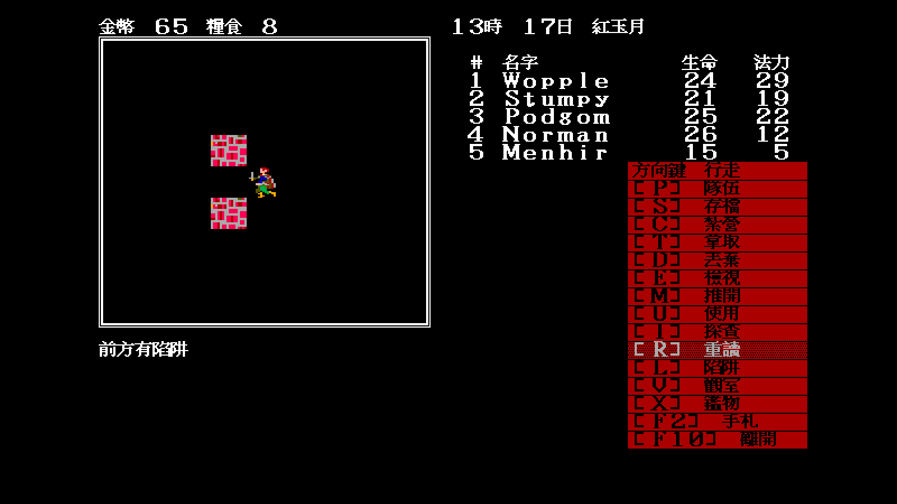
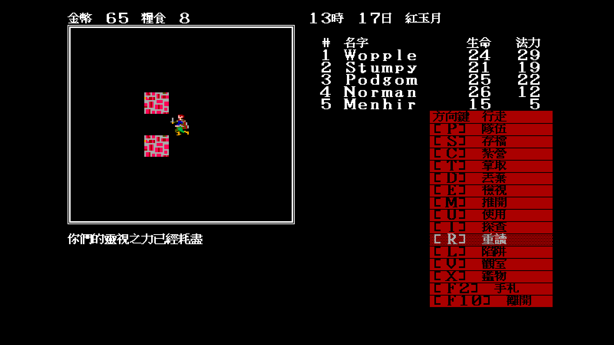
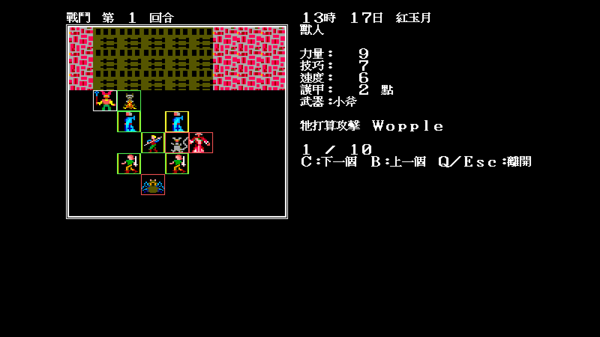
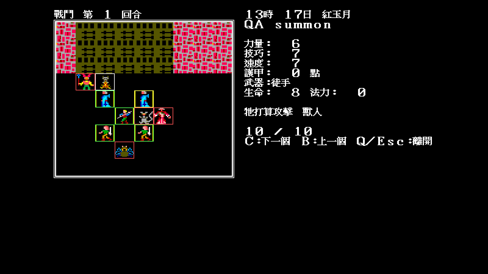

# 18 — 陷阱、觀室與戰鬥檢視剩餘實機抽樣

日期：2026-07-29。

這一輪專門關閉 `CONTEXT.md §7` 三個「規則與單元測試已完成，但玩家可見分支
尚未實跑」的證據缺口。所有場景都使用固定 seed、使用者可重播的正式按鍵與
只動記憶體的 debug fixture；沒有修改原版資料或測試存檔。

## 1. 解除陷阱與無技能 25%

新增具名書籤 `-scene=trap-pool`：地圖 1 `(12,17)`、固定朝西，正前方是
出貨 `1SS.DAT` 唯一一格「已注意」的水池陷阱。書籤只改地圖、座標與面向，
不自動授予技能或改寫陷阱。

```bash
tools/screenshot.sh /tmp/trap-disarm.png KEYS=Return,l \
  -scene=trap-pool -give-skill=11 -seed=7

tools/screenshot.sh /tmp/trap-25pct.png KEYS=Return,l,WAIT1 \
  -scene=trap-pool -remove-skill=10,11 -seed=20000
```


第一張顯示「已解除　找到 1 個陷阱」與白框；`LookForTraps` 實際走
`SpecialTiles.Consume`，attr 清零。


第二張先從全隊移除技能 10／11，再以 seed 20000 命中 `Roll(4) == 4`，
顯示「已注意　找到 1 個陷阱」。因此 100% 技能分支、解除分支與無技能
25% 成功分支現在都有實機證據。

`-remove-skill` 是對稱於既有 `-give-skill` 的驗收工具：只改本次執行記憶體，
不寫存檔；範圍與 ID 都有測試。

## 2. 技能 27 觀室

同一書籤固定朝向後，不必為了轉身先踩進陷阱：

```bash
tools/screenshot.sh /tmp/viewroom-trap.png KEYS=Return,v \
  -scene=trap-pool -give-skill=27 -seed=7

tools/screenshot.sh /tmp/viewroom-exhausted.png KEYS=Return,v,v,v,v \
  -scene=trap-pool -give-skill=27 -seed=7
```



第一次顯示「前方有陷阱」，隊伍 HP 未變、陷阱沒有觸發或被解除。



前三次可用，第四次顯示「你們的靈視之力已經耗盡」，與 DOS executable 的
每日三次計數一致。

## 3. 戰術列與召喚物 HP／SP

`-battle-examine-fixture` 只在既有測試戰鬥補兩種第一回合還沒有的面板狀態：
讓怪物記住第一名隊員為攻擊目標，並加入一隻召喚物。它不攻擊、不花行動點、
不改存檔。搭配技能 7／25 後用正式 `?`、`C` 鍵檢查：

```bash
tools/screenshot.sh /tmp/battle-tactics.png KEYS=Return,question \
  -battle -battle-examine-fixture -give-skill=7,25 -seed=11

tools/screenshot.sh /tmp/battle-summon.png \
  KEYS=Return,question,c,c,c,c,c,c,c,c,c \
  -battle -battle-examine-fixture -give-skill=7,25 -seed=11
```



怪物卡片顯示完整屬性與「牠打算攻擊 Wopple」。



召喚物卡片顯示 `生命 8／法力 0`。第一次實跑時這一行其實有生成，但右半被
紅色戰鬥指令選單覆蓋；原因是 `drawBattle` 讓 `?` 卡片占滿側欄，
`drawBattleCommands` 卻仍繼續畫選單。現在檢視開啟時不再畫第二層命令面板，
戰術目標、HP／SP 與 C／B／Q 提示都完整可見。

## 4. 重播同步

`tools/screenshot.sh` 新增 `WAIT1`、`WAIT2`… token。它只在指定位置等待整秒，
用來跨越 AI 回合、動畫或長文字切換；一般按鍵仍維持原本 0.25 秒間距。
這取代「多送幾次鍵碰碰運氣」，讓失敗能區分為規則錯誤或送鍵過早。
