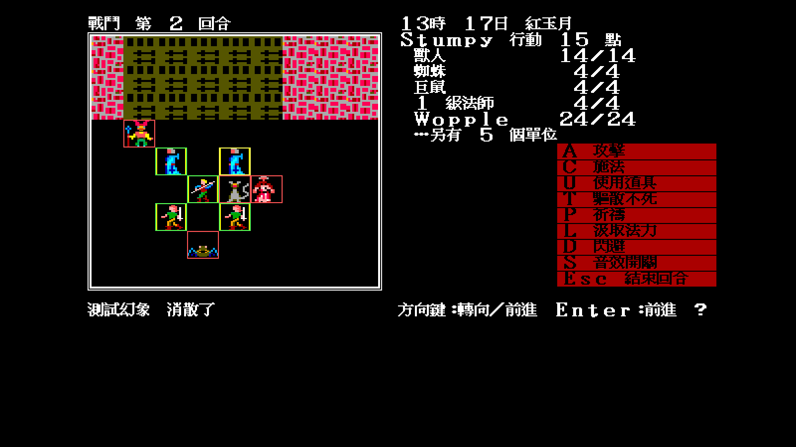

# 幻象第一次行動前消散：runtime 抽樣

日期：2026-07-29

## 目的

確認 `docs/re/115` 的規則不只存在於規則層測試，呈現層也會：

1. 在幻象正式取得動作之前執行判定；
2. 從戰場移除幻象；
3. 顯示繁中戰鬥訊息；
4. 繼續派發下一個合法單位，不卡住回合。

## 可重播 fixture

```bash
tools/screenshot.sh /tmp/illusion.png KEYS=Return \
  -battle -battle-illusion-fixture -seed=11
```

`-battle-illusion-fixture` 是記憶體內的可視驗收工具：

- 加入一隻最高速的玩家側幻象；
- 在 `PlaceSummon` 已擲完面向後把 RNG state 設為 1，使下一次
  `Roll(10)=1`，固定走原版的消失分支；
- 重建下一回合行動佇列；
- 不寫存檔、不直接殺死單位，也不繞過 `Battle.Current` 的正式規則。

fixture 只負責讓畫面可重播；20% 機率本身由 `internal/game/battle_test.go`
的 `Roll(10)=2`／`=3` 邊界測試證明。

## 實際結果



畫面可見：

- 已進入第 2 回合，符合「建立當回合不入列、下一回合才首次輪到」；
- 戰場上已沒有測試幻象；
- 左下戰鬥紀錄顯示「測試幻象　消散了」；
- 右側已正常輪到 Stumpy，指令選單仍可操作。

結果：**通過**。

## 自動化搭配

同一批測試另釘住：

- 敵我 side 3／13 都適用；
- `Roll(10)=2` 消失、`=3` 保留；
- 同一行動跨多個畫面更新不重擲；
- 非幻象陣營不消耗這次 RNG；
- 召喚物不追加到建立中的當回合佇列；
- 消失事件只交給 UI 一次。
