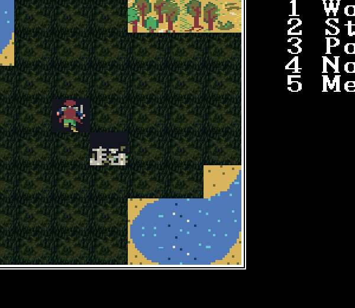
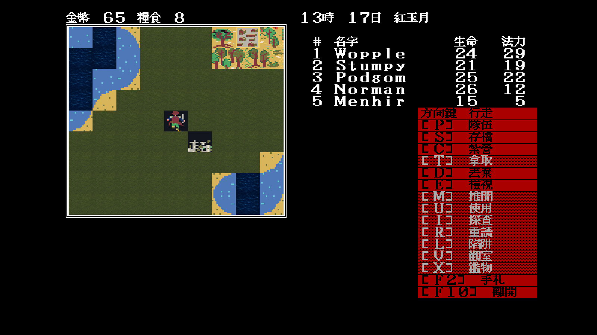

# 20 — Modern Icon 高解析呈現層首輪實機證據

日期：2026-07-29

## 1. 驗證目標

本輪不宣稱完成 Modern Icon 美術，而是先證明新方向可落在真正 runtime：

1. EGA／CGA 仍由 640×400 邏輯畫布以最近鄰放大；
2. Modern Icon 可在 1280×800 最終畫布直接繪製 `64×56` 素材；
3. 規則仍讀原版 tile index、碰撞、密門、事件與存檔；
4. manifest 可逐索引載入已重畫圖，不必用舊圖填滿假裝完整；
5. 舊 `32×28` M1-B 素材會被 loader 明確拒絕。

## 2. 契約

新旗標：

```text
-modern-icon-dir=<theme directory>
```

目錄內的 `theme.json` 使用 `id: modern-icon`、固定 `64×56` frame，並在
`tiles.normal`／`tiles.winter` 逐一列出索引與同目錄 PNG。PNG 必須完全不透明，
索引必須介於 0–101，路徑不得跳出目錄。未列出的索引保留相容預覽，不會被候選
美術偷偷覆寫。

## 3. 首次實機試驗

為了讓覆寫位置一眼可見，暫時把獨立重繪的森林試片掛在大量出現的 `0x23`；
這是**呈現管線 fixture，不是平原／森林索引裁決，也不是正式美術**。



畫面證明：

- 64×56 圖在最終畫布對齊既有 9×9 地圖格，沒有回到 32×28 atlas；
- 未列出的海岸、城鎮、隊伍與其他地形仍顯示底稿；
- 右側倚天 16×15 介面、地圖框與遊戲狀態沒有因覆寫層改位；
- 重複森林母稿會形成明顯接縫與圖樣重複，因此這張只通過架構驗證，
  **美術不通過量產門檻**。

下一步要以實際索引盤點為準，為平原、深水相位、各向岸線、森林、城鎮及隊伍
分別重畫；連續地形需要多變體與四邊接縫檢查，不能重複貼同一張母稿。

## 3.1 實際索引盤點後的第二次試驗

新增 `tools/mapwindow` 後，固定場景的真實 9×9 組成為：

```text
counts: 04=1 07=1 0b=1 14=9 17=1 1d=1 23=61 3b=1 3d=3 3e=1 5b=1
```

因此第一批正確覆寫改為 `0x14` 深海、`0x23` 平原。兩張母稿分別重新構圖，
不是從整張 concept sheet 裁切：



裁決：

- 平原在 61 格連續鋪陳下沒有先前規律亮點或森林路徑重複，通過本場景低頻檢查；
- 深海 9 格的色調相容，沒有中心漩渦，但 `0x14` 與尚未重畫的海岸仍有明顯
  新舊風格邊界；
- 隊伍、城鎮、樹木、岸線與特殊格仍是相容底稿，所以這是 terrain M1，
  不是完整 Modern Icon 畫面。

## 4. 自動驗證

`modernicon_test.go` 覆蓋：

- 正確 manifest；
- schema／id／空清單；
- 超界索引及逃出目錄路徑；
- 舊 32×28 frame 的拒絕訊息。

本輪 `go test ./cmd/demonwinter ./internal/assets/gfx` 在 Docker／Xvfb 通過。
