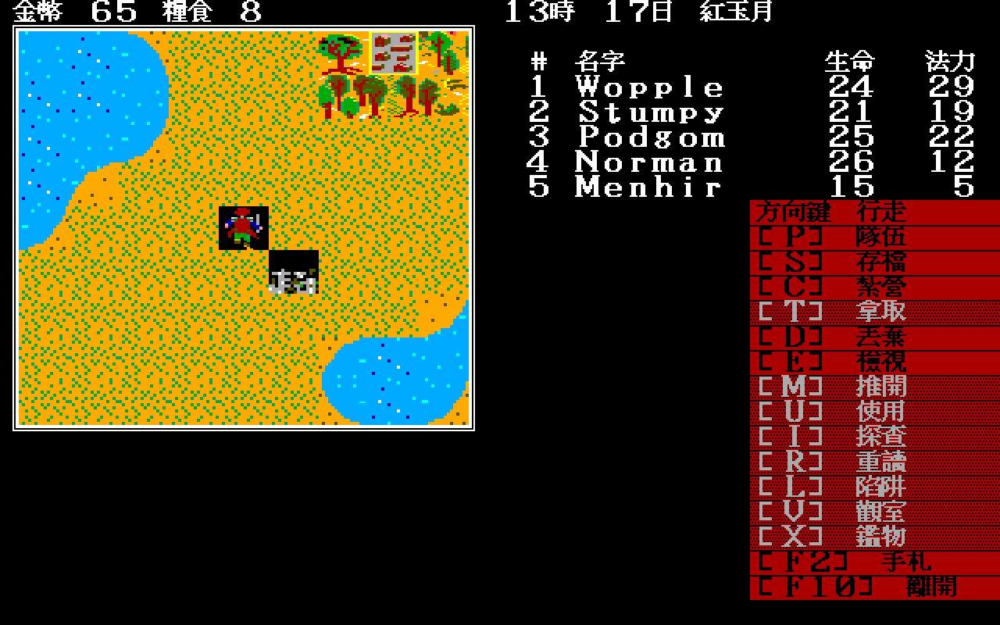
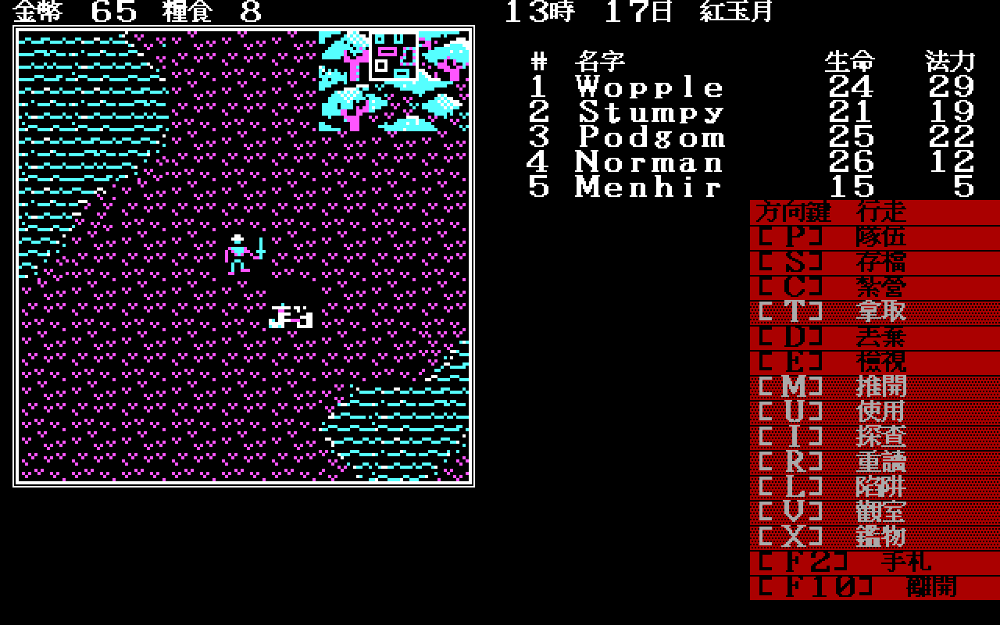
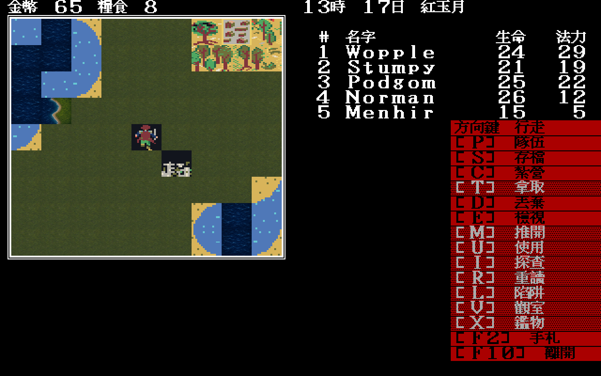

# 21 — EGA／CGA／Modern Icon 同狀態比較

日期：2026-07-29

## 方法

三次啟動使用完全相同的輸入：

```text
-map=34 -x=28 -y=50 -seed=11
Return, Up
```

只有 `-video` 不同；Modern Icon 額外載入
`-modern-icon-dir=artwork/modern-icon/m1/trial`。每次使用獨立 `/tmp` 測試存檔，
不改原版 `PARTY.DAT`。

| 原版 EGA 還原 | 原版 CGA 還原 | Modern Icon M1 |
|---|---|---|
|  |  |  |

## 觀察

- 三圖的金幣 `65`、糧食 `8`、時間 `13時 17日 紅月`、五名隊員及生命／法力
  完全一致；
- 隊伍與地城道具的相對格位一致，證明呈現層沒有改移動或物件座標；
- EGA 與 CGA 分別使用原版 `.SHE`／`.SHP` 素材；
- Modern Icon 只覆寫已列出的 `0x14` 深海、`0x17` 岸線、`0x23` 平原；
  樹木、隊伍、道具與其他岸線仍顯示相容底稿。

這組畫面通過「同一規則狀態可換三種呈現」門檻，但不表示 Modern Icon 素材已完成。
