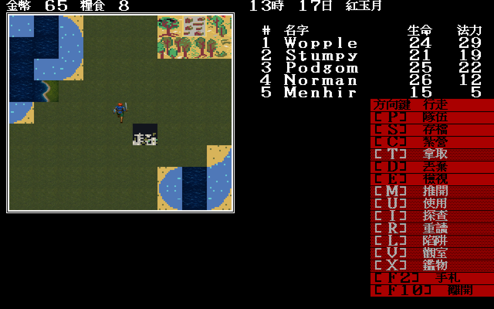
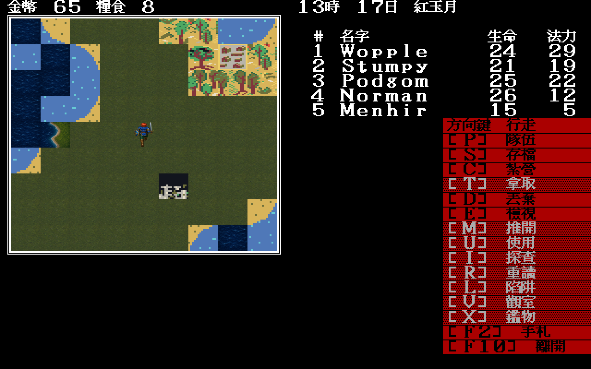

# 22 — Modern Icon 透明隊伍 overlay 與兩步動畫

> **2026-07-30 後續取代：**透明合成現也套用於 EGA／CGA 步行人物；本文
> 「只有 Modern Icon 透明」是當時狀態，不再是產品裁決。見
> `docs/playtest/56`。

日期：2026-07-29

## 問題

原版 EGA/CGA 的隊伍 glyph 是整格覆寫，黑底屬於原始素材。Modern Icon 若照搬
這個契約，角色即使重畫仍會站在黑色方框裡，不符合 remake 的高解析方向。

## 實作

- `theme.json` 新增 `sprites`，只允許 `64×56` PNG，但允許 alpha；
- terrain 仍要求完全不透明；
- 世界地圖中央若有對應 Modern Icon 隊伍 sprite，先以腳下真實 tile index
  重畫地面，再疊透明角色；
- 當時 EGA/CGA 完全不走這條路；此歷史狀態已由 `docs/playtest/56` 取代。

北向 `0x1e/0x1f` 以同一角色製作反相步伐；兩張母稿使用 imagegen 的純洋紅背景，
再以共用 `remove_chroma_key.py` 去背。第一次 B 稿在縮覽後相位差不足而被退回，
第二次明確交換前伸腿才進 runtime。

| A 步 | B 步 |
|---|---|
|  |  |

## 裁決

- 黑色底框已消失，角色站在 `0x23` Modern Icon 平原上；
- 角色中心與腳底均留在原本 64×56 邏輯格內；
- 左右腿剪影在縮覽下可分辨；
- 目前只完成北向兩步；東、南、西及航海 glyph 仍待重畫。
