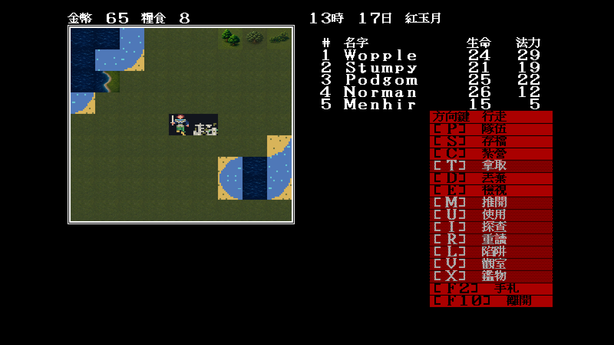
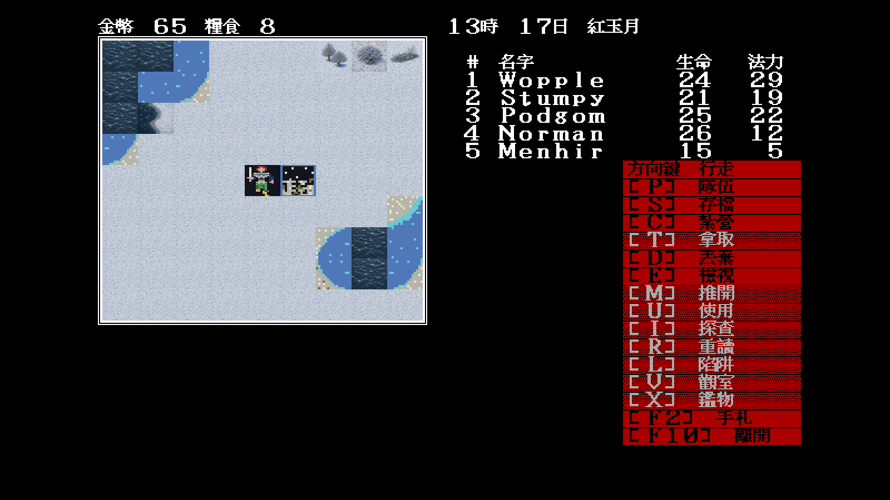

# 23 — Modern Icon 實際樹木索引與冬季配對

日期：2026-07-29

## 索引裁決

原版 `tileatlas-gamepal.png` 的實際輪廓顯示三格不是同一種森林：

- `0x04`：單株古樹；
- `0x07`：前後錯落的雙樹；
- `0x0b`：低矮林緣、幼樹與灌木帶。

因此三個索引各有獨立母稿與 `64×56` 執行期圖，不共用早期
`normal-forest.png`。每個正常版本另有構圖語意相同的冬季版本；主題切換只換
呈現素材，不改 tile index、碰撞、事件或存檔。

## 固定場景

使用下列可重現狀態，進入世界畫面後以 `Tab` 切換冬季：

```text
-video=modern
-modern-icon-dir=artwork/modern-icon/m1/trial
-map=34 -x=28 -y=50 -seed=11
```

該視窗上緣恰好同時出現 `0x04/07/0b`，可在同一縮放尺度比較三種剪影：


| 常態固定場景 | 冬季固定場景 |
|---|---|
|  |  |

## 裁決

- 三種索引在 `64×56` 縮覽下仍可分辨單樹、雙樹與低矮林緣；
- 正常地表與 `0x23` 草原相容，冬季地表與雪原相容；
- 正常／冬季的物件角色一致，沒有用單一森林圖冒充不同 atlas 語意；
- 固定場景其餘尚未重畫的岸線、城鎮與特殊格仍顯示相容底稿，這是下一批工作，
  不能把本次驗收表述成世界 atlas 已完成。
