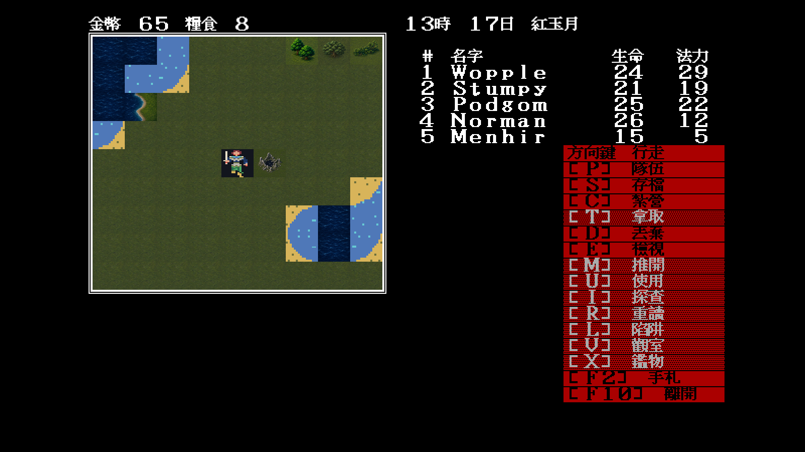
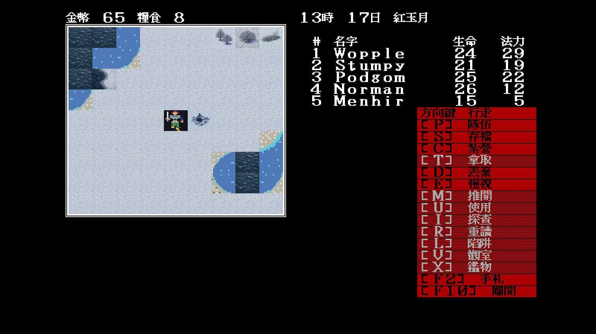

# 24 — Modern Icon `0x5b` 毀壞神殿廢墟

日期：2026-07-29

## 規則語意

`docs/re/79` 已確認 `0x5b` 是冬之魔降臨後由神殿 `0x25` 替換成的毀壞廢墟，
而且踩上去會走特殊地點分派。它不是普通岩石，也不能只畫成一般城鎮。

Modern Icon 因此以折斷石牆、殘柱、破拱與中央燒灼空洞建立明確剪影；正常與
冬季保留同一組構圖，只替換地表、積雪與色溫。


## 固定場景驗收

重播條件與 `docs/playtest/23` 相同：

```text
-video=modern
-modern-icon-dir=artwork/modern-icon/m1/trial
-map=34 -x=28 -y=50 -seed=11
```

| 常態 | 按 `Tab` 切換冬季 |
|---|---|
|  |  |

## 裁決

- `64×56` 實機縮覽仍可辨識殘牆、石柱與深色中心，不會誤認為完整神殿；
- 冬季版在雪原上仍保有深色中心與石牆層次；
- manifest 僅將兩張圖掛到 `0x5b`，不改神殿替換、踩格觸發或存檔狀態；
- 同場景的 `0x3b/3d/3e` 已確認是尚未成組重畫的岸線，保留相容底稿等待下一批。
