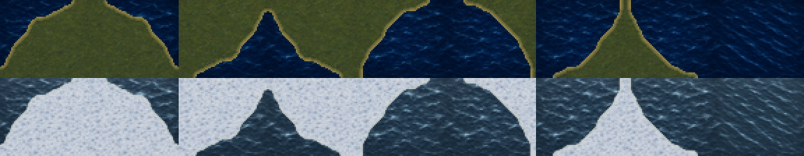
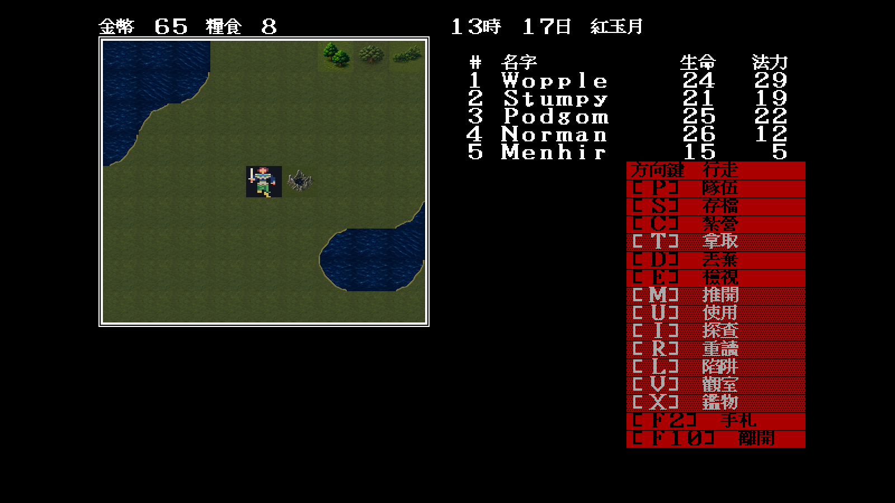
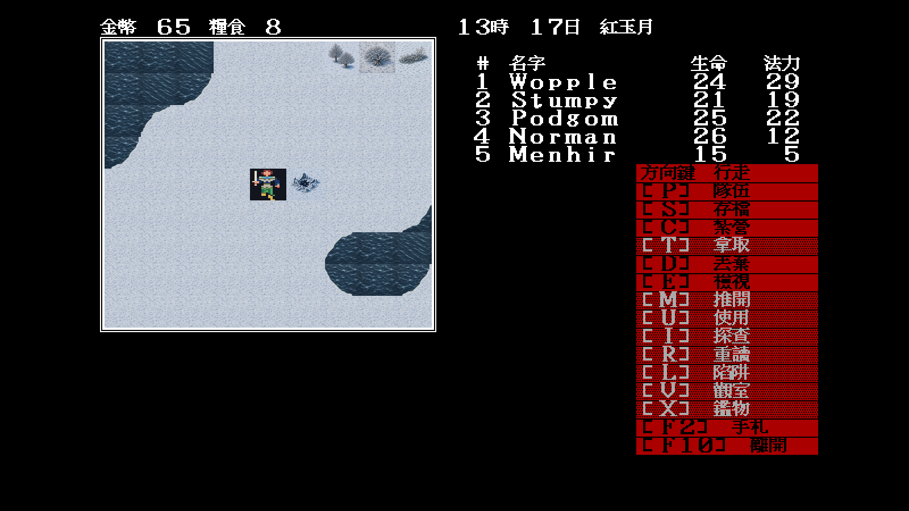

# 25 — Modern Icon 草原海岸組與第二海面

日期：2026-07-29

## 索引範圍

本批完成 `0x17/1a/1d/20/3b/3c/3d/3e` 八格草原海岸，以及第二種開放海面
`0x62` 的正常／冬季配對。`0x1d` 在規則遭遇表歸類為平原，但 EGA 圖像確實
含水陸邊界；規則類別不能取代視覺 atlas 的判讀。

contact sheet 由左至右依上述八個岸線索引排列，最後一格為 `0x62`；上列正常、
下列冬季：



## 重畫管線

`tools/moderncoast` 只從原版 EGA 讀取每格的水陸拓樸：

1. 抽取藍／青色水域遮罩，不複製原版顏色與圖樣；
2. 將 32×28 階梯遮罩作兩次曲線化濾波；
3. 以 Modern Icon 草原／雪原與深海重新合成岸緣；
4. 正常與冬季共用同一拓樸，避免切換時岸線跳動。

第一版仍留下像素階梯，因此未進 manifest；第二版才通過 contact-sheet 閘門。
較早的單格 `0x17` 手繪母稿仍保留作方向紀錄，執行期已改走同一管線，消除材質
方框。

`0x62` 使用獨立斜向浪紋母稿。冬季初稿平均亮度與 `0x14` 不同，實機形成棋盤；
校正 RGB 平均值後，再把四周 8 像素漸變錨定到 `0x14` 的邊界像素。中央浪紋仍
不同，但任意相鄰排列不再出現硬邊。

## 固定場景驗收

重播條件：

```text
-video=modern
-modern-icon-dir=artwork/modern-icon/m1/trial
-map=34 -x=28 -y=50 -seed=11
```

| 常態 | 按 `Tab` 切換冬季 |
|---|---|
|  |  |

裁決：

- 固定場景左上與右下的多格岸線連成曲線，無舊 EGA 青色方塊；
- `0x14/62` 混鋪保有浪紋差異，但沒有深淺棋盤或硬直相位線；
- 冬季只更換雪地、色溫與海面材質，不改海陸拓樸；
- 本批只結案草原海岸組；沙地／森林岸線仍須按其獨立地表素材處理。
