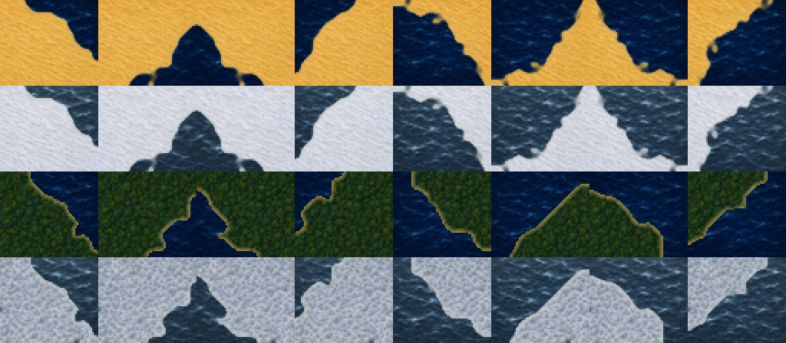
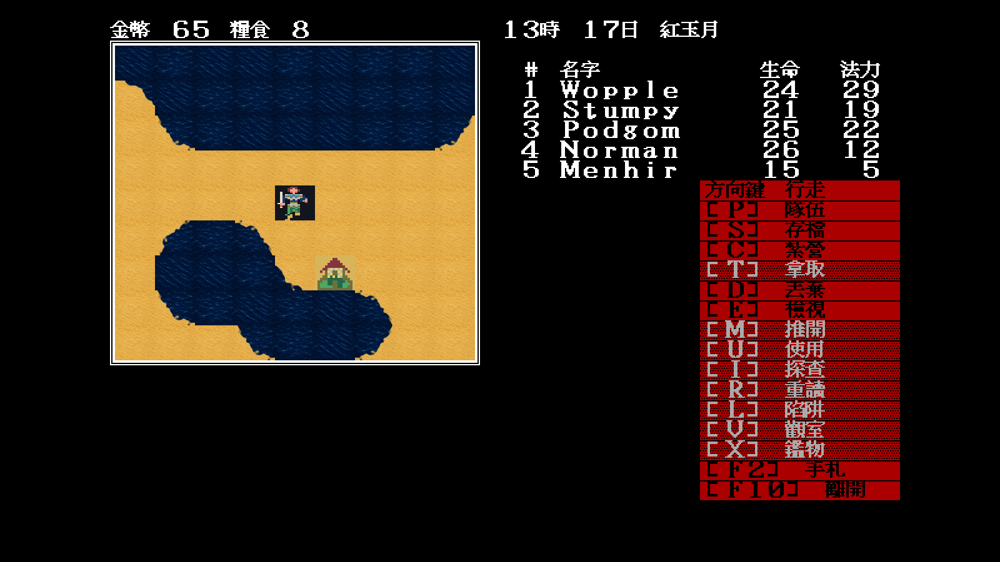
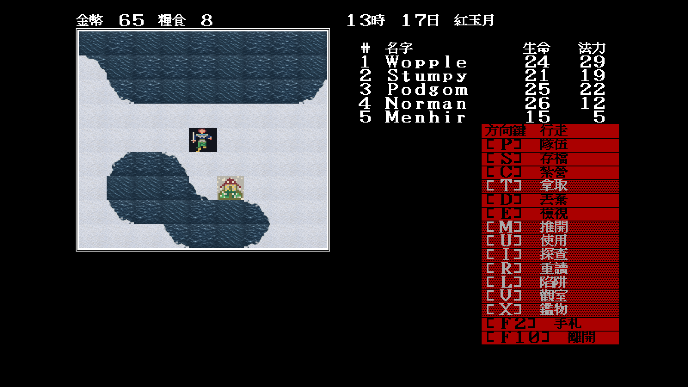
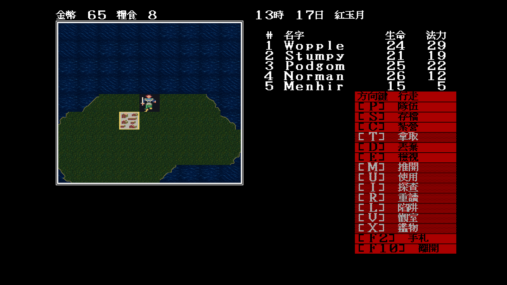
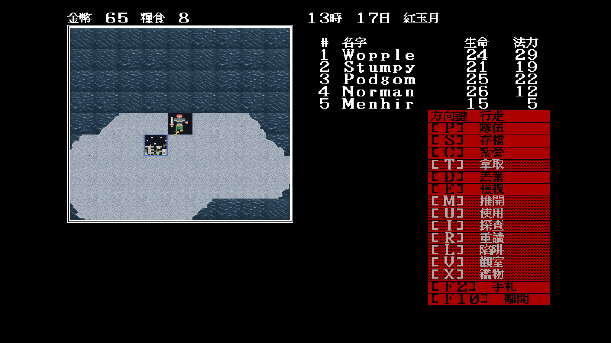

# 26 — Modern Icon 沙地與森林海岸

日期：2026-07-29

## 索引與材質

草原海岸在 `docs/playtest/25` 通過後，同一曲線化拓樸管線擴到：

- `0x43–0x4a`：沙地海岸，陸側使用獨立金赭沙紋；冬季保留風蝕沙紋與薄雪；
- `0x4b–0x52`：森林海岸，陸側使用獨立連續冠層；冬季改為覆雪灌木與裸枝。

contact sheet 由上到下依序為正常沙地、冬季沙地、正常森林、冬季森林；每列由
左到右按索引遞增：

## 固定場景

`tools/mapwindow -find-tiles` 掃描所有可載入地圖後選出：

- 沙地：`map 52 / (28,35)`，同畫面含 `0x43/45/47/48/49/4a`；
- 森林：`map 13 / (40,43)`，同畫面含 `0x4b/4c/4d/4e/50/51/52`。

| | 正常 | 冬季 |
|---|---|---|
| 沙地 |  |  |
| 森林 |  |  |

森林場景第一次抓圖時，岸線已重畫，但島內 32 格 `0x27` 仍顯示 EGA 彩色條紋。
`0x27` 在遭遇規則表被歸入平原，但 atlas 與實際場景明確把它當森林內陸；因此
manifest 改用森林冠層底材後才重新抓圖。這與 `0x1d` 同樣證明規則地形類別不能
取代視覺索引裁決。

## 裁決

- 三種地表的岸線拓樸均來自原版索引，但輪廓已曲線化，不保留像素階梯；
- 沙地、森林與草原沒有共用陸側底材；
- 正常／冬季海陸輪廓一致，切換不改碰撞、遭遇或存檔；
- 本批後仍看得到的 EGA 物件是城鎮／特殊格與尚未完成的隊伍方向，不屬岸線；
- 草原、沙地、森林三組世界岸線至此結案，下一批轉入城鎮與特殊地標。
