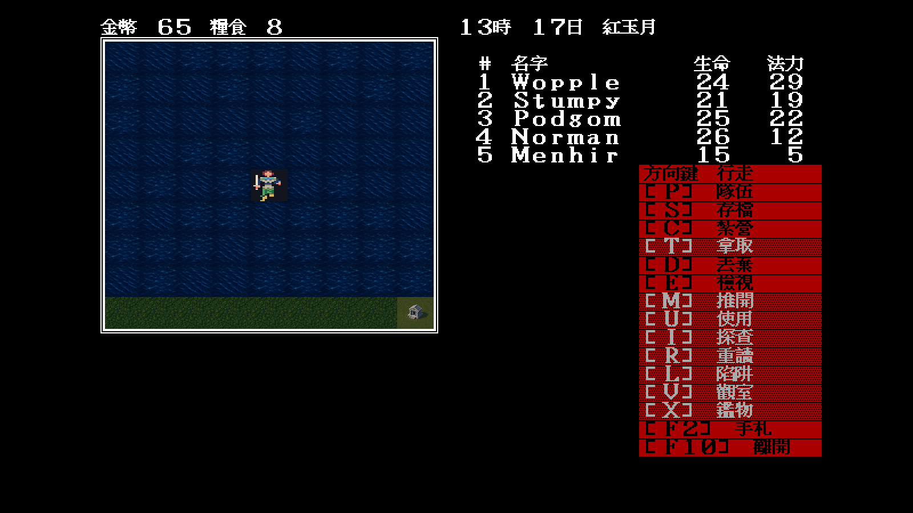
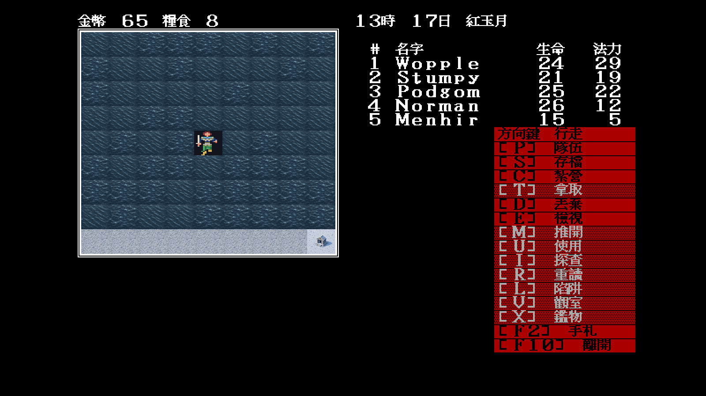
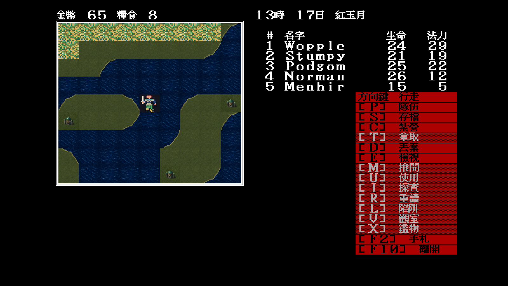
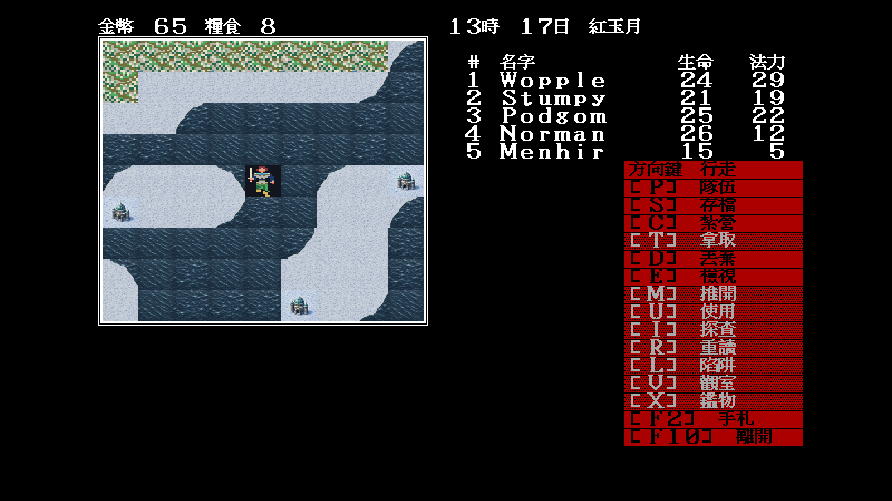
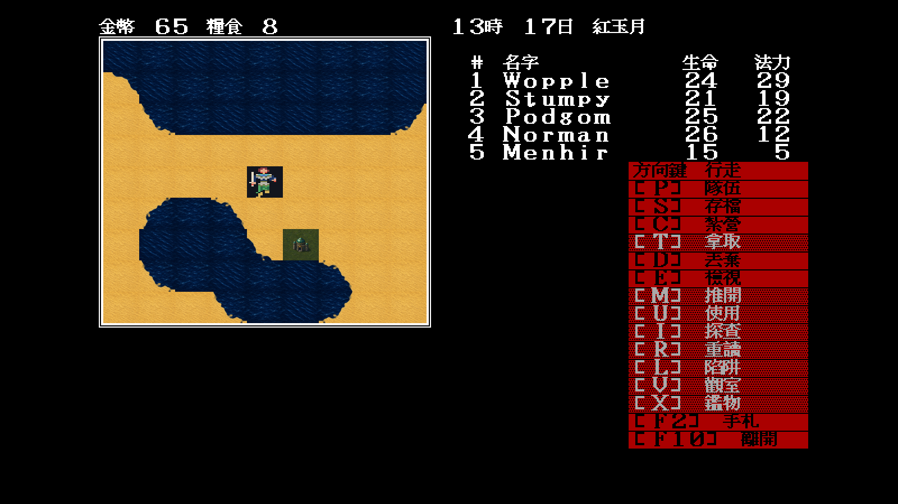
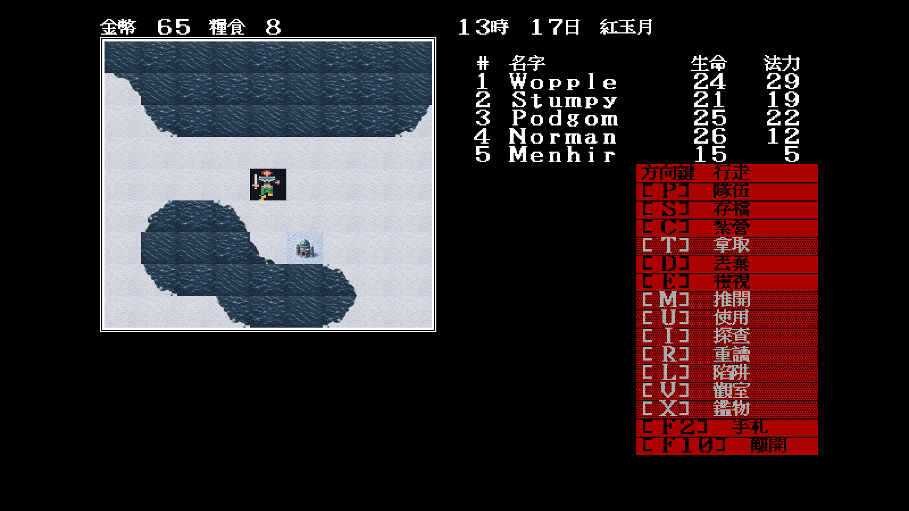
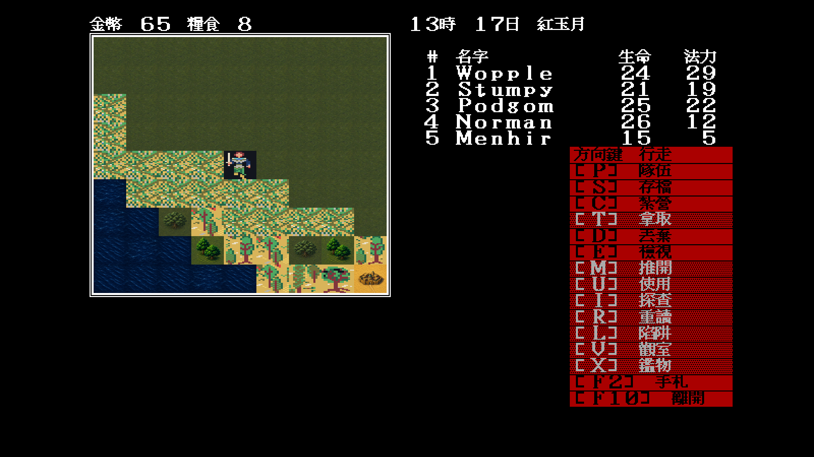
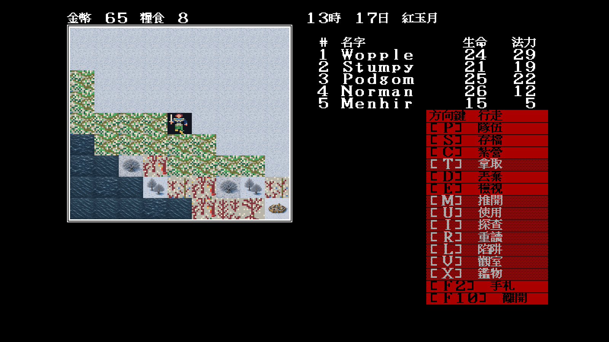

# 27 — Modern Icon 城鎮與特殊地標

日期：2026-07-29

## 索引裁決

本批依原版 atlas、地圖使用位置與劇情 consumer 分成四種，不共用通用城鎮圖：

| 索引 | 語意 | Modern Icon 剪影 |
|---|---|---|
| `0x25` | 完整運作的神殿 | 石造正殿與日輪徽記；必須能和 `0x5b` 毀壞神殿區分 |
| `0x26` | 魔法學院 | 青綠穹頂、雙塔與封閉式學院量體 |
| `0x2e` | 一般城鎮 | 紅瓦、城牆、旗幟與主要道路 |
| `0x64` | Asaht | 金赭平頂沙漠城，與一般城鎮明確分色、分形 |

正常與冬季沿用同一構圖與道路錨點，只改地表、積雪及色溫。母稿以
`artwork/modern-icon/m1/rebuild-sites.sh` 重建成 `64×56` 執行期素材。


## 固定場景實機抽樣

所有場景使用：

```text
-video=modern
-modern-icon-dir=artwork/modern-icon/m1/trial
-seed=11
```

| 地標 | 固定位置 | 正常 | `Tab` 冬季 |
|---|---|---|---|
| 神殿 | `map 22 / (45,7)` |  |  |
| 學院 | `map 44 / (19,42)` |  |  |
| 一般城鎮 | `map 52 / (28,35)` |  |  |
| Asaht | `map 43 / (35,36)` |  |  |

## 裁決

- 四種語意在 `64×56` 實機尺寸仍可由穹頂、城牆、平頂與神殿正殿分辨；
- `0x25` 與 `0x5b` 不會混淆為同一座完整建築；
- 正常／冬季道路及建築 footprint 一致，不因季節切換漂移；
- manifest 只換呈現素材，不改進城、學院、神殿劇情、碰撞或存檔；
- 本批結案不代表世界素材全數完成；碼頭、其他特殊索引、隊伍其餘方向及船仍待製作。
