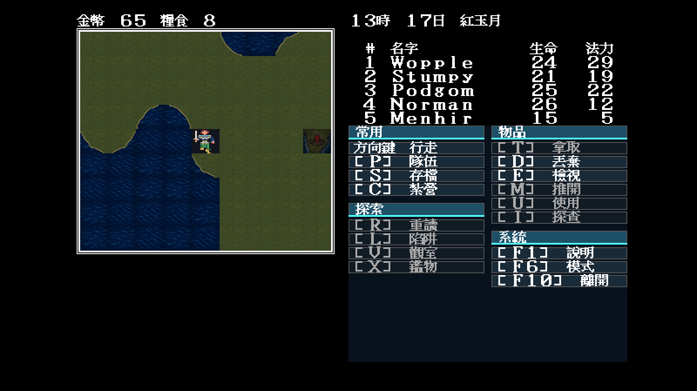
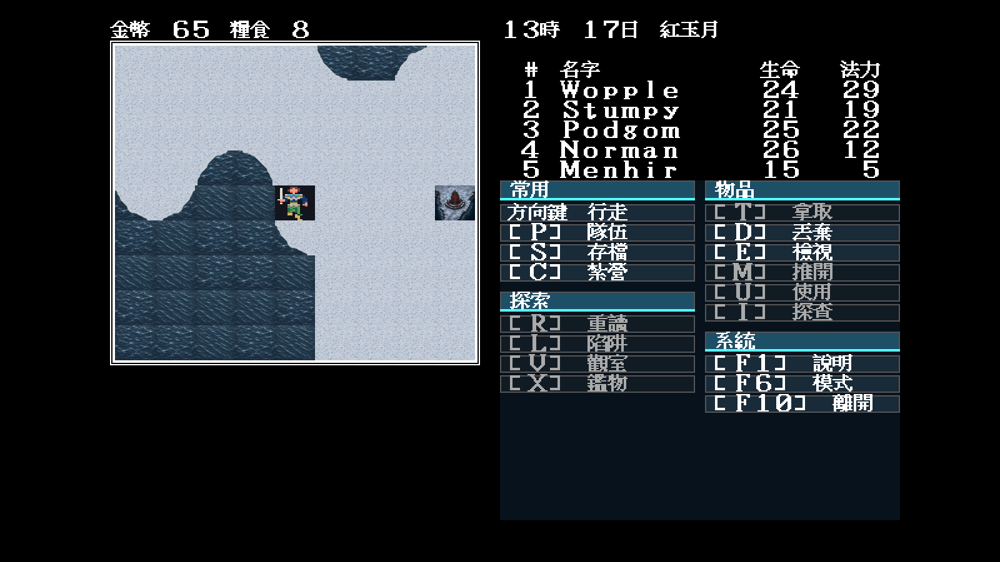

# 29 — Modern Icon 緋紅符印 `0x63`

日期：2026-07-29

## 索引與劇情語意

`docs/re/59`、`docs/re/60` 與 `docs/re/62` 已由反組譯、地圖掃描及實機主線閉合：
`0x63` 只出現在子地圖 55、56、66，各一格，是三枚必須以解咒解除的緋紅符印。
它不是舊 Modern EGA 試驗曾猜測的山峰，也不是工作表一度誤列的碼頭地形。

Modern Icon 因此使用裂紋符石、低矮環形基座與受控的緋紅光建立唯一剪影。冬季版
保留相同海岸、基座、符石及符文，只替換積雪與色溫。高解析母圖是依核准方向
重新構圖，不是原版圖塊放大、像素化或降採樣重畫。

## 固定場景實機驗收

兩張畫面使用相同存檔狀態與參數：

```text
-video=modern
-modern-icon-dir=artwork/modern-icon/m1/trial
-map=55 -x=43 -y=22 -seed=11
```

冬季畫面只多按一次 `Tab`。

| 常態 | 冬季 |
|---|---|
|  |  |

## 裁決

- `64×56` 執行期尺寸仍能辨認深色直立符石、環形基座與中央紅光；
- 冬季版在雪地上保有深色輪廓，符印不會被白色地表吞掉；
- `theme.json` 僅將正常／冬季素材掛到 `0x63`，不改解咒條件、50 法力消耗、
  三枚旗標、碰撞、亂數或存檔；
- `go test ./cmd/demonwinter ./internal/assets/gfx` 在無網路 Docker 內通過；
- 本批不憑空新增「碼頭地形」；碼頭是城鎮設施，世界海上可見素材另由
  `0x3f–0x42` 四向船隻圖示負責。
