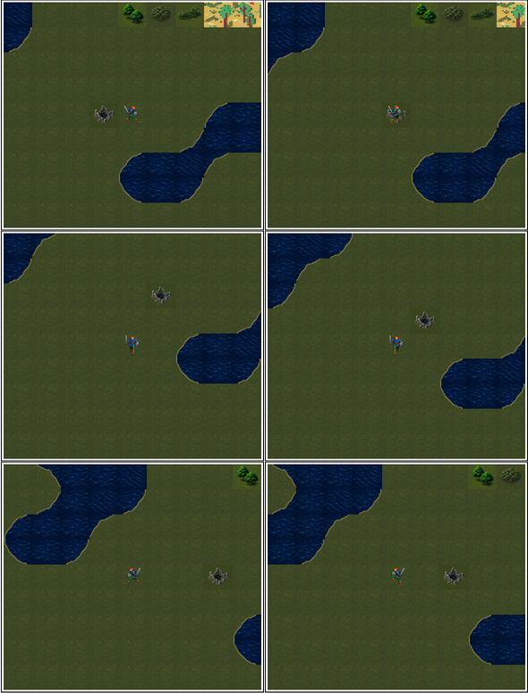
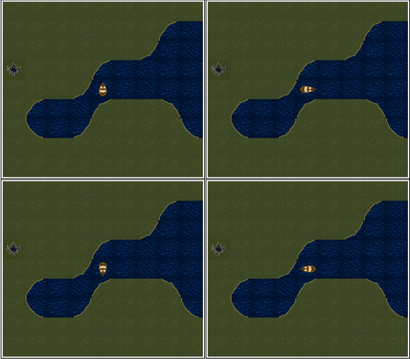

# 30 — Modern Icon 隊伍四向兩步與航海四向

日期：2026-07-29

## 原版索引契約

方向與索引不是美術猜測；`docs/re/97` 已由 `DEMON.INT` 的 `ds:0x210f` 與
`222f:0b85–0bc1` 釘死：

| 面向 | 徒步兩步 | 航海 |
|---|---|---|
| 北 | `0x1e/0x1f` | `0x3f` |
| 東 | `0x1b/0x1c` | `0x40` |
| 南 | `0x18/0x19` | `0x41` |
| 西 | `0x21/0x22` | `0x42` |

徒步相位由行進軸座標奇偶決定；航海沒有兩步相位。Modern Icon 僅替換透明
呈現素材，EGA/CGA 仍使用原版 glyph。

## 徒步固定場景

從 `map 34 / (28,50)`、固定種子 11 開始，分別向東、南、西走一步與兩步。
下圖每列依序為東、南、西；左／右是相鄰兩個座標奇偶。

東向 B 初稿在 `64×56` 下與 A 幾乎相同，未通過剪影閘門，已退回改成明顯抬膝
相位。西向由通過的東向兩步精確鏡射，避免分次生成造成角色、裝備或比例漂移。

## 航海固定場景

新增 `-sailing-facing=0..3` 偵錯旗標，只在開場設定航海呈現與面向，不新增船、
不解劇情、不改地圖。四張均在同一海面 `map 34 / (33,51)`、固定種子 11 抓取。
排列為北、東、南、西：

船隻以北向母圖為唯一造型來源，其他三向精確旋轉，避免船體、帆與比例漂移。

## 裁決

- 四向隊伍與船隻在執行期尺寸均能由頭身、劍盾或船首方向辨識；
- 徒步每走一步確實依 X／Y 奇偶切換相位，不是計時動畫；
- 透明 overlay 先重畫腳下真實地形，再疊角色／船隻，沒有原版黑底方框；
- 航海四向只改 `PartyGlyph` 對應的呈現圖，不改上船、航行、下船、碰撞、
  海戰、亂數或存檔；
- `rebuild-party.sh` 可重建四向徒步試片、鏡射西向及旋轉航海四向。
