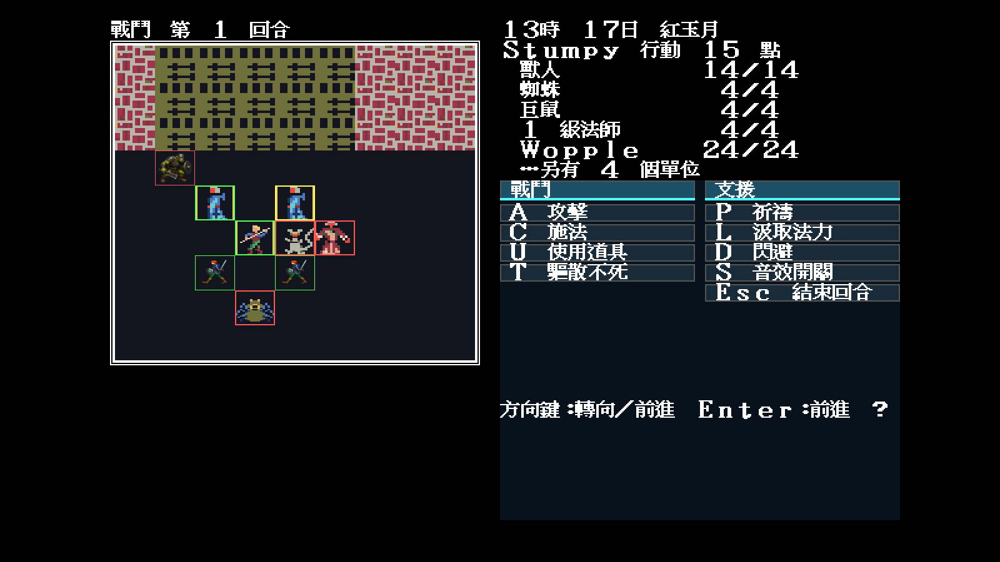
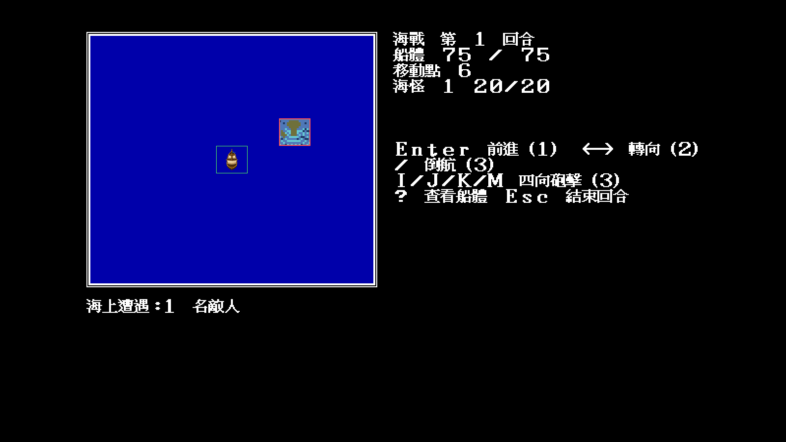

# 31 — Modern Icon 戰鬥／怪物／海戰漸進覆寫層

日期：2026-07-29

## 問題與資料邊界

原版 `COMBAT.SHE`、`MONSTER.SHE`、`SHIP.SHE` 的 sprite 會連黑底整格覆寫。
若 Modern Icon 只把透明新圖疊在舊圖上，黑方框仍留在下面；若把所有未知 frame
硬換成同一張圖，又會破壞職業、怪物外觀、面向與海戰陣營。

`theme.json` 因此新增 `battleSprites` 三個逐 frame 清單：

- `combat`：44 格玩家職業／面向空間；
- `monsters`：240 格，即 30 種外觀 × 四向兩步；
- `ships`：32 格，即玩家船、海盜船、海怪等四組 × 四向兩步。

未列出的 frame 保留相容底稿。列入的 frame 在最終 `1280×800` 畫布先重畫
真實戰場地形／海面，再疊 `64×56` 透明單位，最後重畫當前、友軍、敵軍與檢視框。
資料決定「哪一格覆寫」，Go 只實作通用繪製規則。

## 代表 frame 的證據

預設 `-battle` 怪物清單是 MONSTER.DAT 2、3、4、1。原始資料第 2 筆 Orc 的
`SpriteIndex=17`；怪物開場朝東、第一回合使用第二相位：

```text
17 × 8 + 東向 pair 4 + 相位 1 = 141 = 0x8d
```

玩家開場朝西，職業 0–2 的 COMBAT frame 是：

```text
0x14 + 西向 3 × 2 = 0x1a
```

所以首批不是猜一張「看起來差不多」的怪物，而是精確掛到實跑會消費的
`combat 0x1a` 與 `monsters 0x8d`。海戰玩家船的 `0x00–0x07` 依既有
南／西／東／北 pair 順序掛入，同方向兩個回合相位共用同一張船圖。

## 固定場景實跑

```text
-video=modern
-modern-icon-dir=artwork/modern-icon/m1/trial
-seed=11
```

| `-battle` | `-sea-battle` |
|---|---|
|  |  |

## 裁決

- Orc `0x8d`、玩家 `0x1a` 與海戰玩家船均在真實消費路徑出現；
- 新單位沒有黑底；原格地形／海面仍在；
- 當前單位綠框、友軍綠框、敵軍紅框仍保留；
- 未列入 JSON 的蜘蛛、老鼠、法師外觀與敵方海怪仍顯示相容底稿，沒有被冒充完成；
- manifest 拒絕 combat `>=44`、monster `>=240`、ship `>=32` 或越目錄路徑；
- 此批證明架構與三類代表素材，不代表 44／240／32 格已量產完畢。
