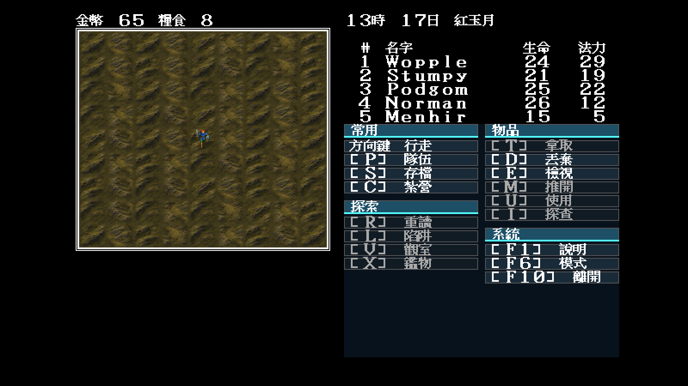
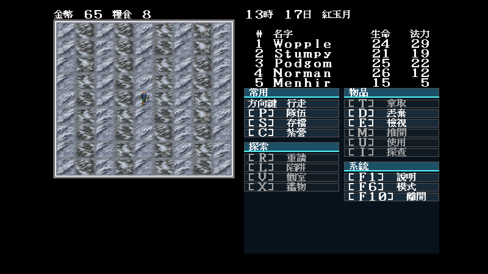

# 32 — Modern Icon 丘陵多變體與無縫拼接

日期：2026-07-29

## 索引與規則邊界

`0x0e`、`0x2b` 在原版地圖中會大量交錯出現，兩者的移動成本皆為平地兩倍。
它們不是可以共用一張圖的「普通山」：`0x0e` 使用西南—東北的窄脊，
`0x2b` 使用反向寬丘肩與草地鞍部。Modern Icon 只改呈現，不改索引、移動成本、
碰撞、遭遇或季節判定。

`theme.json` 的 `tileVariants.normal/winter` 分別列出每個索引的四張
`64×56` 變體。Go 載入器只負責驗證檔名、尺寸及索引，再以世界座標雜湊選圖；
這條路徑不讀遊戲 RNG，也不寫存檔。素材種類與清單仍由 JSON 決定。

## 失敗稿與修正

1. 把母稿直接縮成單格時，四周邊緣不一致，實機出現清楚的方形接縫。
2. 用鏡射邊界強行消縫後，連續地形變成規律的萬花筒，仍不合格。
3. 最終讓同一季節的八個來源共用四邊，再為每個索引輸出四個不同內部構圖；
   座標雜湊另做 avalanche 混合，避免低位元直接形成條紋。

這批保留丘陵地貌可辨識的重複語彙，但不再有硬接縫、鏡射十字或規律棋盤。

## 固定場景實跑

```text
-video=modern
-modern-icon-dir=artwork/modern-icon/m1/trial
-map=44 -x=33 -y=27 -seed=11
```

| 正常季節 | 冬季 |
|---|---|
|  |  |

## 裁決

- `0x0e/0x2b` 正常與冬季各四個變體均由執行期真實索引消費；
- 同索引跨座標可穩定重播，切換主題不改亂數序列與遊戲狀態；
- 兩個索引維持不同山脊方向，沒有用同圖冒充；
- 本批可作 M1 丘陵候選，但仍須由使用者審閱整體美術方向；
- `0x0f/0x10` 的高山／岩地是下一批，不包含在本次結案範圍。
