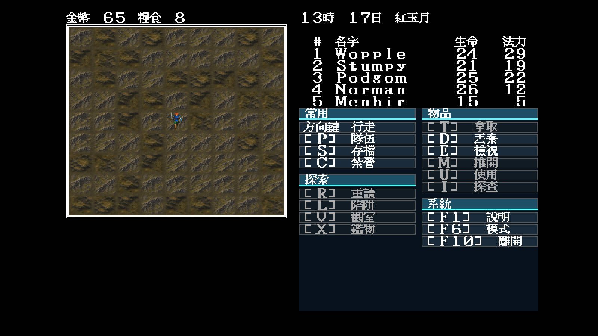
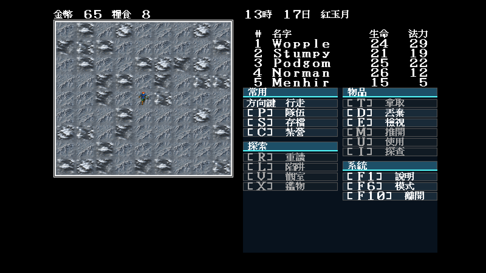

# 33 — Modern Icon 高山／岩地多變體

日期：2026-07-29

## 索引裁決

固定地圖 34 的 `(48,23)` 周圍大量交錯使用 `0x0f/0x10`。本批依原版索引保留
兩種不同輪廓：

- `0x0f`：尖峰雙脊與深色岩縫；
- `0x10`：寬岩台、層狀斷崖與暗色隘口。

兩者正常／冬季各有四個 `64×56` 變體，全部由 `theme.json` 的
`tileVariants` 列出。執行期沿用純座標雜湊，不讀遊戲 RNG、不改存檔。

## 固定場景

```text
-video=modern
-modern-icon-dir=artwork/modern-icon/m1/trial
-map=34 -x=48 -y=23 -seed=11
```

| 正常季節 | 冬季 |
|---|---|
|  |  |

## 裁決

- 尖峰與岩台在最終格位仍可分辨，沒有用同圖冒充兩個索引；
- 每季八張來源共用邊界，實機沒有方形硬縫或規律鏡射；
- 冬季保留深色岩壁與地形層次，不是單純覆蓋白色；
- 本批是 M1 執行期候選，仍須使用者審閱整體美術方向；
- 本次沒有改規則或玩家可見文字，素材清單仍在 JSON。
