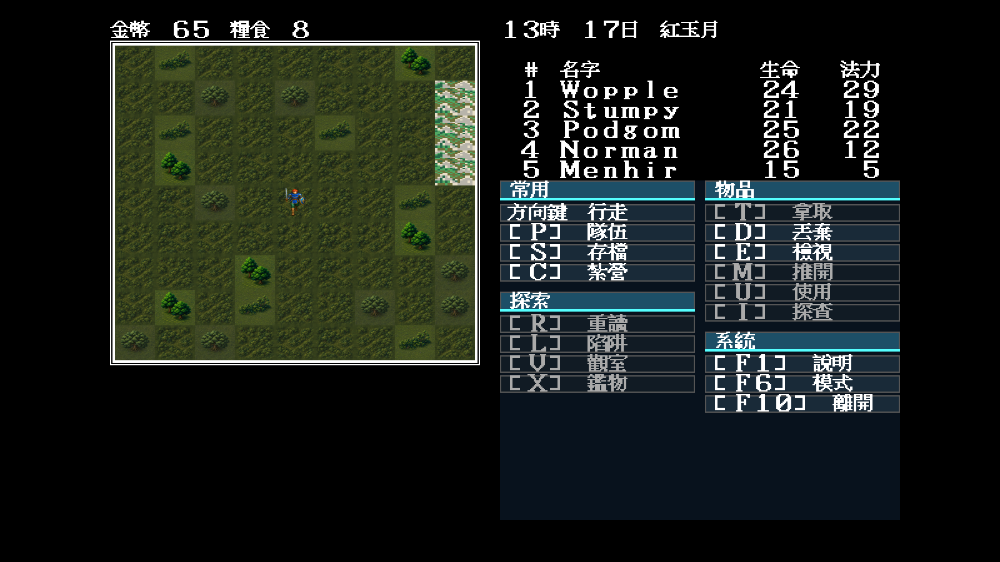
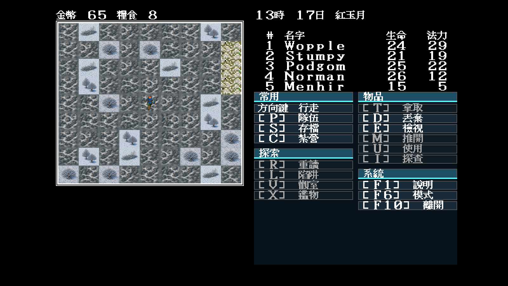

# 34 — Modern Icon 世界森林索引套組

日期：2026-07-29

## 盤點與索引邊界

`tools/mapwindow` 新增 `-min-map/-max-map` 後，可把世界地圖 33–64 與地城分開
盤點。結果證明 `0x01–0x0c` 在世界地圖是一套大量交錯的森林圖塊；既有
Modern Icon 只完成：

- `0x04` 單株古樹；
- `0x07` 前後雙樹；
- `0x0b` 低矮林緣。

本批補齊 `01/02/03/05/06/08/09/0a/0c`。正常與冬季各由一張連續密林母稿
裁出九個不同冠層構圖，再共同處理邊界；不是九個索引共用同一張圖。

## 固定場景

地圖 64 的 `(22,37)` 在 9×9 視窗內同時消費全部九個新索引，並混有既有的
`04/07/0b`：

```text
-video=modern
-modern-icon-dir=artwork/modern-icon/m1/trial
-map=64 -x=22 -y=37 -seed=11
```

| 正常季節 | 冬季 |
|---|---|
|  |  |

## 裁決

- 九個新索引在真實交錯地圖中沒有方形硬縫；
- 正常版保留冠層、林隙與林下暗影，冬季版保留常綠／落葉層次；
- `04/07/0b` 仍可讀成單樹、雙樹與林緣，沒有被密林圖覆蓋；
- Go 程式沒有新增索引特例，素材對應完全列在 `theme.json`；
- 這是 M1 執行期候選，整體 Modern Icon 仍須使用者畫面審閱。
