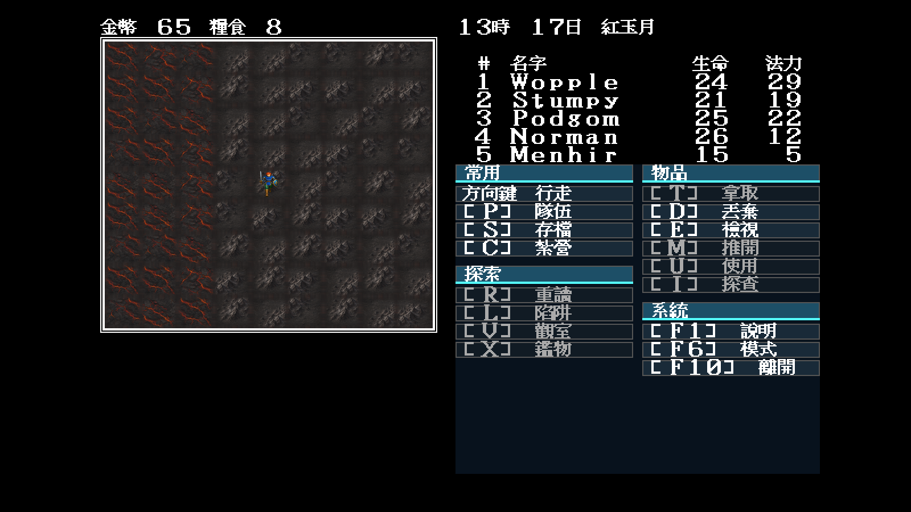
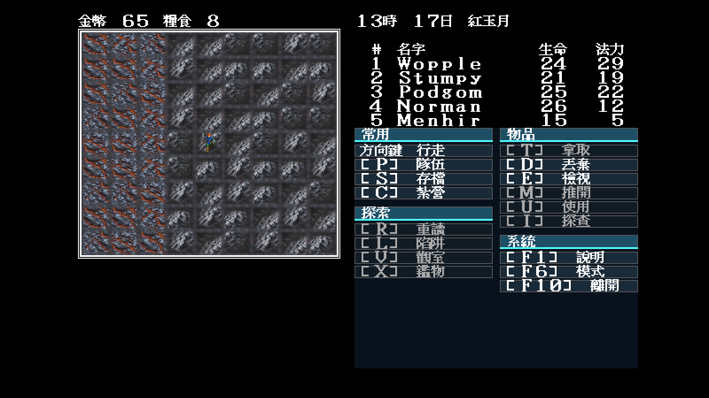

# 35 — Modern Icon 火山岩峰與熔岩裂地

日期：2026-07-29

## 索引與規則證據

世界地圖 56 大量交錯 `0x2a/0x33`。原版 EGA 輪廓與規則證據分別指出：

- `0x2a` 是灰白／黑灰岩峰，並列在戰場視線遮蔽表中；
- `0x33` 是紅黑熔岩裂地，不屬一般隨機遭遇地形。

Modern Icon 因此不重掛一般高山：`0x2a` 使用高聳火山岩脊，`0x33` 使用
焦黑玄武岩板與橙紅裂隙。兩者正常／冬季各四變體，共用黑灰岩地邊界；
選圖仍只依座標，不碰遊戲 RNG、視線規則或存檔。

## 固定場景

```text
-video=modern
-modern-icon-dir=artwork/modern-icon/m1/trial
-map=56 -x=54 -y=17 -seed=11
```

該視窗的 81 格全部是 `0x2a/0x33`，可直接檢查大量交錯時的接縫與重複：

| 正常季節 | 冬季 |
|---|---|
|  |  |

## 裁決

- 黑岩峰與熔岩裂地在 64×56 仍能立即分辨；
- 八張來源共用邊界，81 格密集場景沒有硬接縫或鏡射棋盤；
- 冬季積雪沒有蓋掉岩峰暗面及熔岩熱源；
- `0x2a` 的戰場視線遮蔽仍由原規則索引決定，素材不介入；
- 素材列表位於 `theme.json`，Go 沒有新增玩家文案或地形特例。
