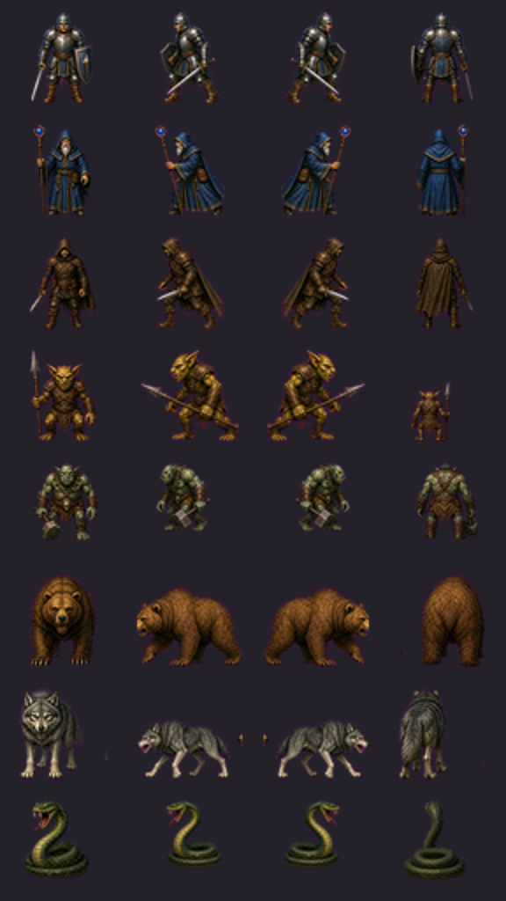
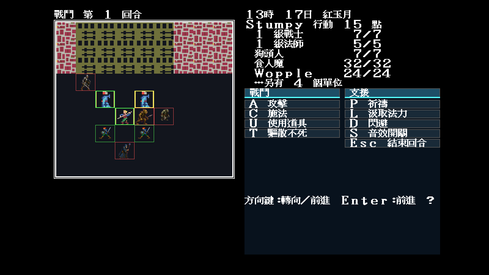
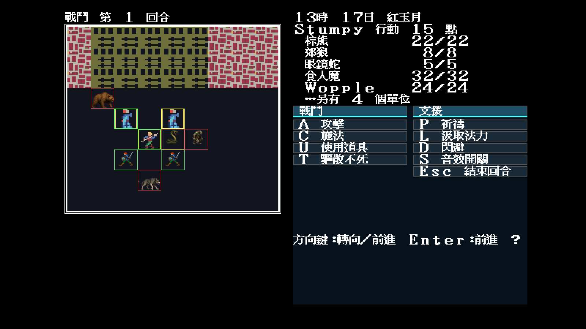

# 36 — Modern Icon 怪物四向量產第一波

日期：2026-07-30

## 盤點與資料格式

新增 `tools/battleframeinventory` 後，`MONSTER.DAT` 的 99 隻怪物可歸併成
28 組實際外觀、224 個方向／步態 frame；先前 Modern Icon 只覆寫 Orc 的
`0x8d`，覆寫率是 1/224。

`theme.json` 新增 `battleSprites.monsterSets`。每個 SpriteIndex 只列
南／西／東／北四張透明圖，載入器依原版 pair 展開：

```text
南 0/1、西 2/3、東 4/5、北 6/7
```

個別 `battleSprites.monsters` frame 的優先權較高，因此後續可以逐格補第二步
動畫，不必改資料格式或 Go 程式。

## 第一波外觀

首批完成 `00/01/02/03/04/07/08/0c` 八組：戰士、法師、盜賊、狗頭人／
小惡魔、巨魔／守衛者、熊、狼、蛇。正面、背面及東側面由同角色圖集生成，
西側面精確鏡射東側面；裁切器統一去背、縮放及腳底錨點。



本批每方向兩個步態 frame 暫共用同一視圖，方向與物種已完成，第二步動畫尚未
polish。覆寫率由 1/224 提升至 65/224，不把其餘 159 格冒充完成。

## 固定戰鬥抽樣

```text
-video=modern
-modern-icon-dir=artwork/modern-icon/m1/trial
-battle -seed=11
```

| 人形／巨魔 `0,1,26,55` | 野獸／蛇 `64,68,9,55` |
|---|---|
|  |  |

## 裁決

- 兩場戰鬥均由 `MONSTER.DAT SpriteIndex` 真實消費新圖；
- 新素材先恢復腳下地形再疊透明角色，沒有黑底與洋紅殘塊；
- 狗頭人、巨魔、熊、狼及蛇的相對體型和四向輪廓可辨；
- 當前、友軍、敵軍與檢視框仍由引擎最後重畫；
- 玩家可見文字與配置沒有進 Go；素材映射全部位於 JSON。
