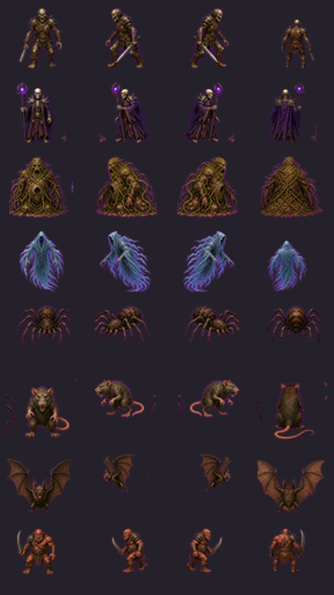
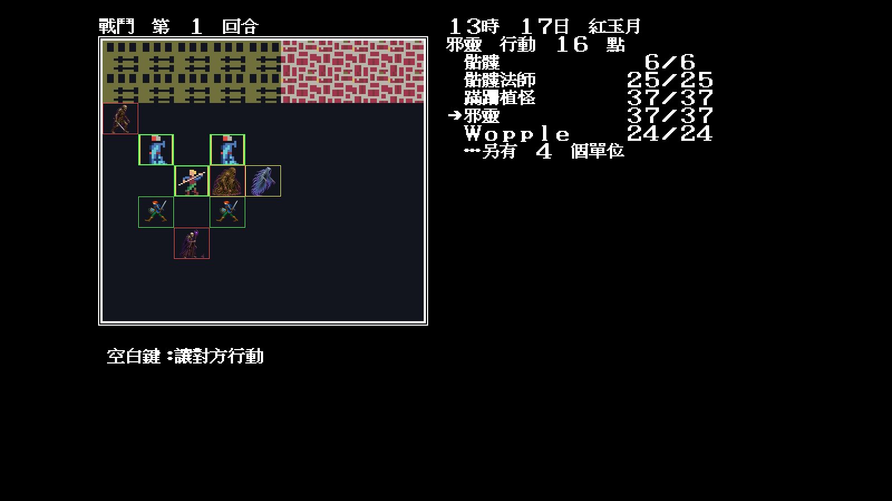
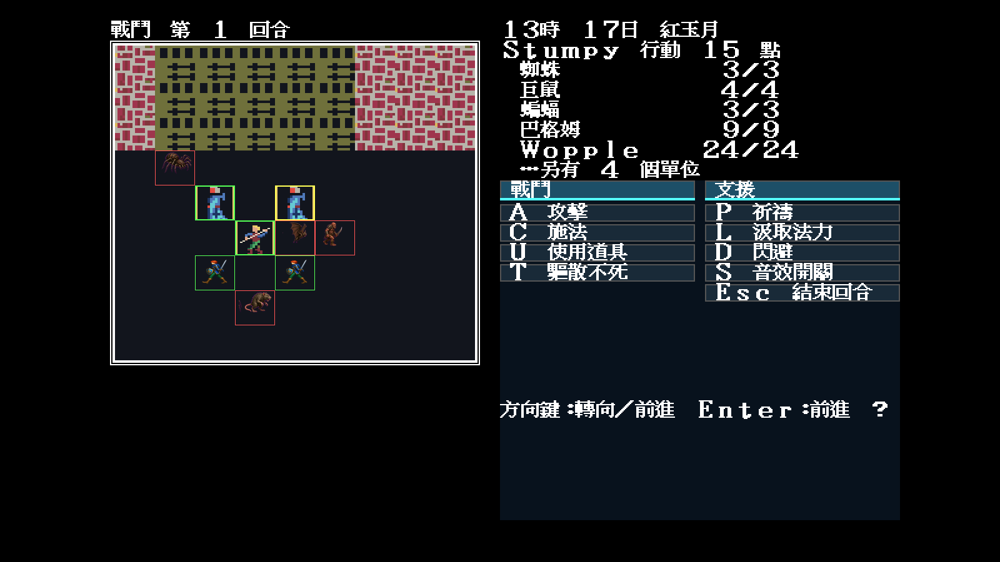

# 37 — Modern Icon 怪物四向量產第二波

日期：2026-07-30

## 範圍

第二波沿用 JSON `monsterSets` 與相同透明裁切器，完成八組：

- `0x0d`：不死戰士（骷髏、殭屍、食屍鬼、守墓人）；
- `0x0e`：骷髏法師／死靈法師；
- `0x0f`：腐敗土丘／雪人／Mane；
- `0x10`：邪靈／幽魂／Spectre；
- `0x12`：蜘蛛；
- `0x13`：鼠；
- `0x14`：蝙蝠；
- `0x15`：Bugem。

每組正面、背面與東側面均保持同角色；西側面精確鏡射。兩波合計完成
16 組、128 個 frame，加上先前 Orc 個別 frame 後，盤點覆寫率是 129/224。



## 固定戰鬥抽樣

| 不死族 `7,8,63,11` | 蟲獸 `3,4,5,6` |
|---|---|
|  |  |

共同參數：

```text
-video=modern
-modern-icon-dir=artwork/modern-icon/m1/trial
-battle -seed=11
```

## 裁決

- 兩場固定戰鬥均由實際 `MONSTER.DAT SpriteIndex` 消費素材；
- 不死戰士、法師、土丘與幽魂的輪廓不共用；
- 蜘蛛八足、鼠尾、蝙蝠翼與 Bugem 武器均完整保留；
- 幽魂透明層次存在，所有角色均無黑底或洋紅背景塊；
- 同方向第二步仍暫共用視圖，後續可由個別 frame 覆寫。
