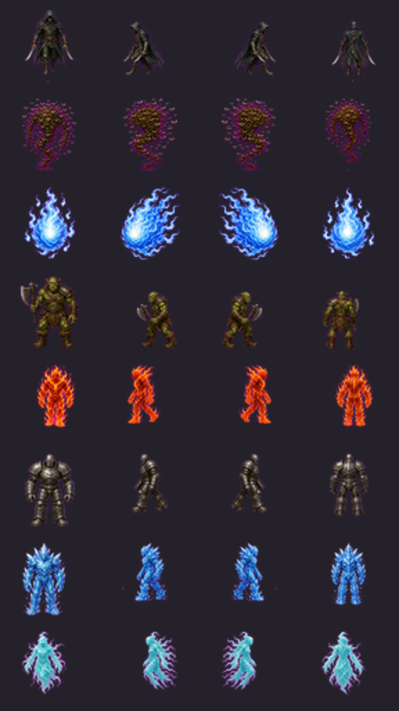
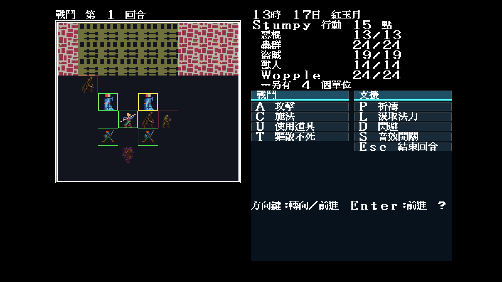
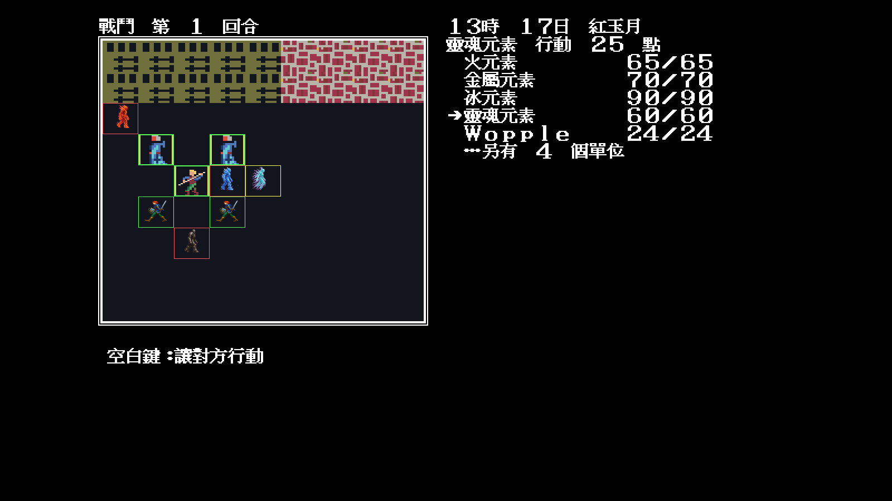

# 38 — Modern Icon 怪物四向量產第三波

日期：2026-07-30

## 範圍

第三波完成八組：

- `0x06` Stalker；
- `0x09` 蟲群／Dervish；
- `0x0a` 鬼火；
- `0x11` Orc／Goblin；
- `0x16` 火元素；
- `0x17` 金屬元素；
- `0x18` 冰元素；
- `0x19` 靈體元素。

Orc 原本只有個別 `0x8d` frame；現在升級成完整四向組並移除 JSON 單格特例，
避免相鄰回合在兩種畫風間切換。三波共完成 24 組、192/224。



## 固定戰鬥抽樣

| 混合怪物 `79,49,80,2` | 元素 `39,40,42,43` |
|---|---|
|  |  |

共同參數：

```text
-video=modern
-modern-icon-dir=artwork/modern-icon/m1/trial
-battle -seed=11
```

## 裁決

- Stalker、蟲群、鬼火與 Orc 均由真實 SpriteIndex 消費；
- 火、金屬、冰與靈體元素在 64×56 仍有不同材質與輪廓；
- Orc 回合相位不再落回舊單格畫風；
- 新素材無黑底或洋紅背景塊，選取框與腳下地形保持正確；
- 剩餘怪物是風元素、龍、惡魔／Xeres 與巨人四組，共 32 frame。
