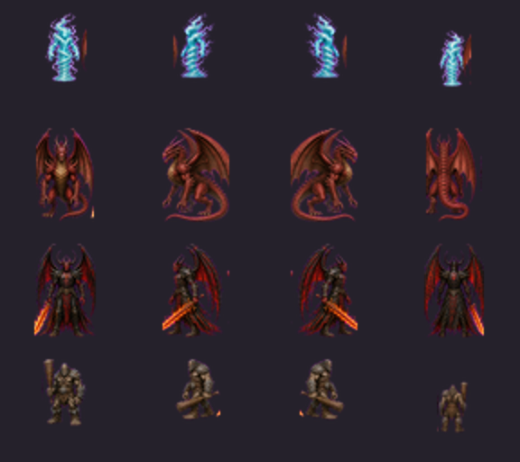
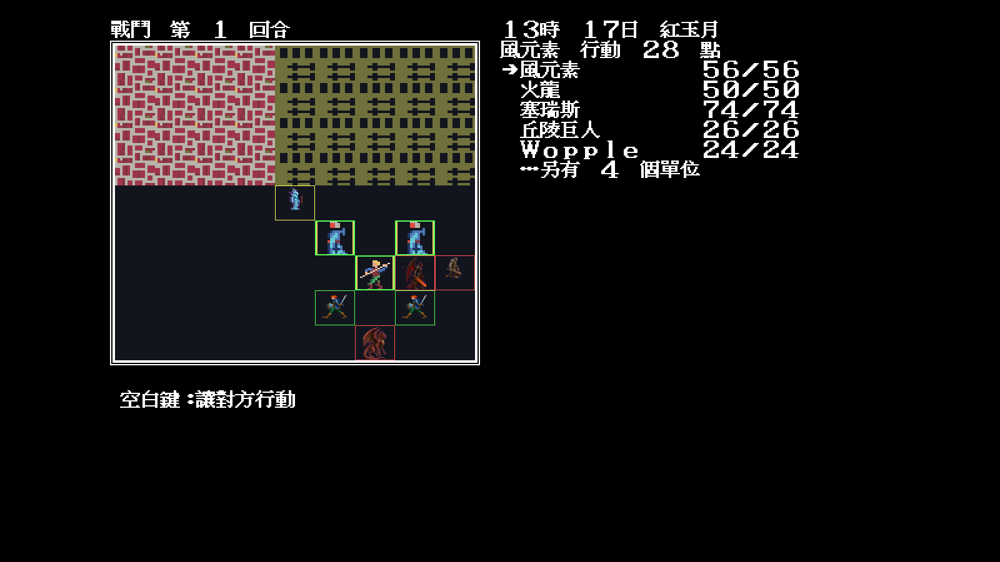

# 39 — Modern Icon 怪物四向覆寫 224/224

日期：2026-07-30

## 最終四組

最終波完成：

- `0x1a` 風元素；
- `0x1b` 龍；
- `0x1c` Gargoyle／惡魔／Xeres 共用外觀；
- `0x1d` 巨人。



`tools/battleframeinventory` 以 `MONSTER.DAT` 證明 99 隻怪物實際使用 28 組
SpriteIndex；四波 `monsterSets` 已覆寫全部 224 個方向／步態 frame。

## 固定高風險抽樣

```text
-video=modern
-modern-icon-dir=artwork/modern-icon/m1/trial
-battle -battle-monsters=41,74,91,10 -seed=11
```

這場同時放入風元素、火龍、Xeres 與山丘巨人：



## 裁決

- 28 組怪物的南／西／東／北方向覆寫為 224/224；
- 風、龍、惡魔與巨人的材質、體型和輪廓可辨；
- 翅膀、龍尾、元素氣流與武器均未被裁掉；
- 透明角色、腳下地形及選取框層級正確；
- 同方向的兩個原版步態目前共用視圖，因此完成的是「外觀與方向」，不是
  第二步動畫 polish；個別 frame 覆寫路徑已保留供後續補動畫。
