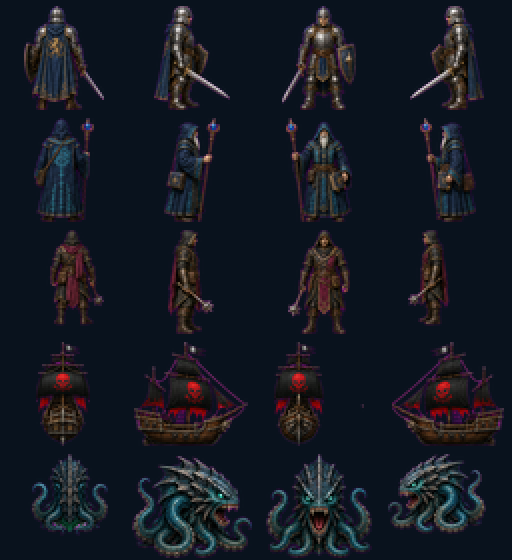
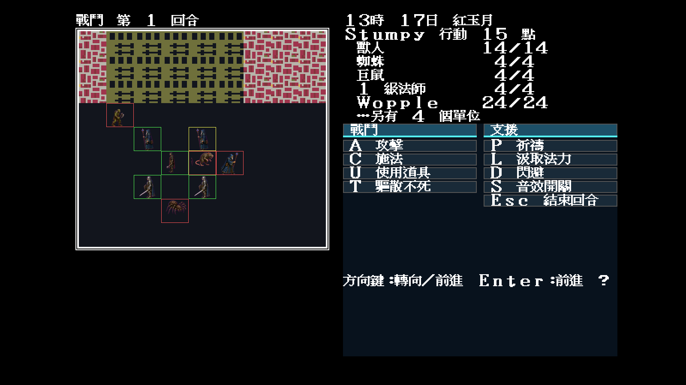
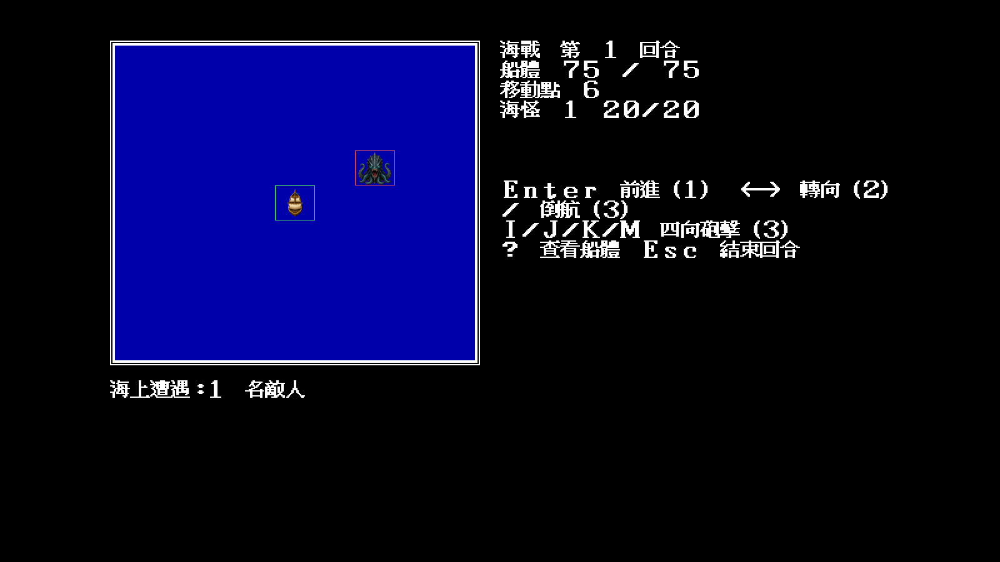

# 40 — Modern Icon 隊員與敵方海戰四方向

日期：2026-07-30

## 索引證據

- `COMBAT.SHE` 隊員公式為 `0x14 + facing×2`，職業 6–9 再加 8，
  職業 3–5 再加 `0x10`。因此三組實際範圍為 `0x14–0x1b`、
  `0x1c–0x23`、`0x24–0x2b`，共 24 幀。
- 海戰 runtime 只使用 `SHIP.SHE` 前三組：玩家船 `0x00–0x07`、
  海盜船 `0x08–0x0f`、海怪 `0x10–0x17`。`0x18–0x1f` 沒有現有
  規則呼叫端，不為填滿圖集虛構用途。

## 製作與資料契約

母稿是獨立高解析重繪，不是原版素材縮放。`tools/chroma_direction_grid.py`
依「北、東、南、西」四欄切格、去除洋紅底並底部定錨至 64×56；
`artwork/modern-icon/m1/rebuild-combat-and-sea.sh` 可完整重建輸出。

隊員 24/24 與海戰實際使用 24/24 幀都由
`artwork/modern-icon/m1/trial/theme.json` 指派，沒有在 Go 內硬編素材路徑。
同方向兩個動畫相位目前共用同一張圖，後續可逐幀覆寫第二步。

## 視覺抽驗

固定 `seed=11`、`-video=modern` 與
`-modern-icon-dir=artwork/modern-icon/m1/trial` 在 Xvfb 實跑：

| 一般戰鬥 | 海怪海戰 |
|---|---|
|  |  |

結果：透明底、底部定錨、方向、格位框與地形還原層均正常。這批完成的是
角色／敵船的基礎四方向覆寫，不代表 Modern Icon 全主題或第二步動畫已完成。
