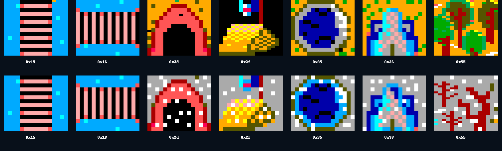
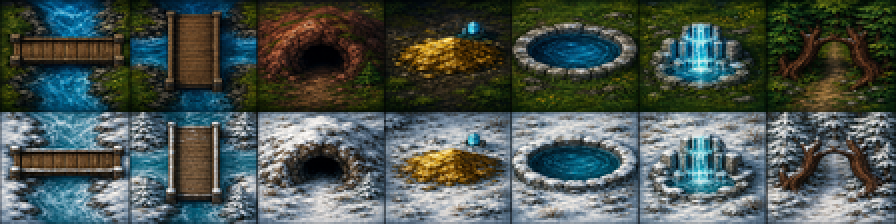
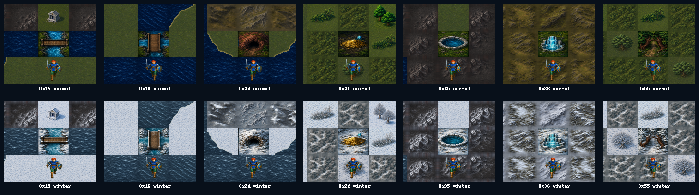

# 41 — Modern Icon 世界地圖實際索引覆寫閉合

日期：2026-07-30

> **2026-07-30 勘誤與補完：**本篇原先只掃 map 33–64，因此漏掉 map 21
> 大量使用的凍土 `0x5a`。全域 namespace 檢查抓出後，已新增正常／冬季各
> 八變體及固定場景實跑；現在改用全部 SUM.MAP 世界段驗收。完整證據見
> [`docs/playtest/51`](51-modern-icon-tundra-and-dungeon-inventory.md)。

## 盤點方法

`tools/mapwindow -inventory -min-map 33 -max-map 64` 盤點世界子地圖實際
tile；新增 `-theme` 後會同時讀取 `theme.json` 的單格與變體索引，分別檢查
正常／冬季差集。它不是從截圖猜地形，而是逐格讀原版地圖資料。

補圖前的差集為 `15 16 2d 2f 35 36 55`。原版
`DEMON.SHE/WINTER.SHE` 解碼證據如下：



語意邊界：

- `0x15/0x16`：水平／垂直木橋；
- `0x2d`：洞窟入口；
- `0x2f`：金色土丘／地標；
- `0x35`：已由規則證實的治療水池；
- `0x36`：冰泉／瀑泉狀地標；
- `0x55`：出口型林間入口；劇情名稱未知，因此只保留可穿越輪廓。

## 重繪與實機

`artwork/modern-icon/m1/rebuild-world-specials.sh` 以
`tools/terrain_grid.py` 從母稿重建 14 張 64×56 不透明 PNG。



七個索引都以固定座標、`seed=11`、F8 Modern Icon 與 Tab 冬季切換實跑：



結果：

```text
theme normal missing: none
theme winter missing: none
```

這項只證明世界子地圖 33–64 的實際 tile 覆寫閉合；地城仍沿原版
EGA/CGA 呈現層，不能把它擴張解讀成整個 Modern Icon 主題已最終核准。
