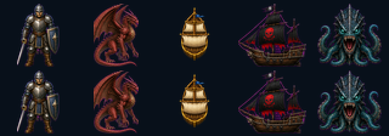

# 42 — Modern Icon 怪物與海戰 A/B 相位

日期：2026-07-30

## 原版可觀察邊界

- 怪物與召喚物：`MONSTER.SHE` 每方向兩幀，runtime 以戰鬥回合奇偶切換。
- 玩家船、海盜船、海怪：`SHIP.SHE` 每方向兩幀，runtime 以海戰回合奇偶切換。
- 隊員 `COMBAT.SHE` 現有原版呼叫只取 `0x14 + facing×2` 再依職業分組，
  沒有回合奇偶加值。故不為隊員虛構「原版第二步」。

## JSON 與素材

`monsterSets` 與新增的 `shipSets` 可在四方向各指定 `southB/westB/eastB/northB`。
沒提供 B 時仍安全沿用 A；個別 frame 仍有最高優先權。

`tools/sprite_phase.py` 不縮放、不旋轉，只把透明角色整體上浮 1 px，產生
乾淨的呼吸／浮動 B 相位；`rebuild-battle-phases.sh` 可重建全部輸出。

上列是 A，下列是 B：



`battleframeinventory` 現在把「有覆寫」與「A/B 已分離」分開計數：

```text
summary: monsters=99 appearances=28 frames=224 covered=224 animated=224
```

玩家船、海盜船與海怪三組也都由 `shipSets` 提供四方向 A/B。這完成的是
可觀察的回合呼吸／浮動 polish，不宣稱每種怪物都有獨立攻擊動作。
