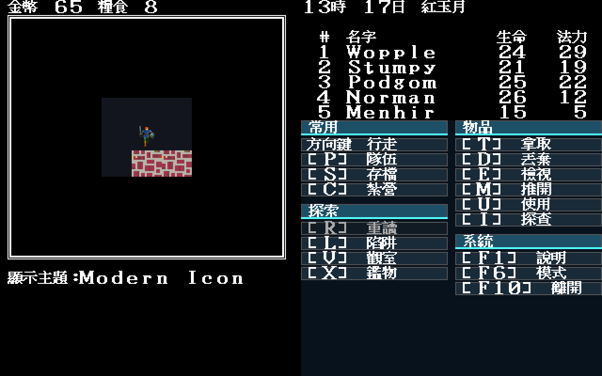
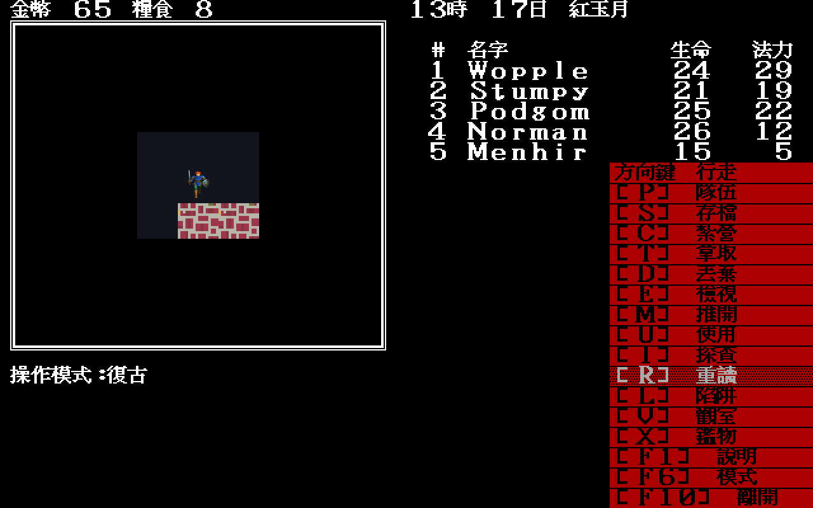
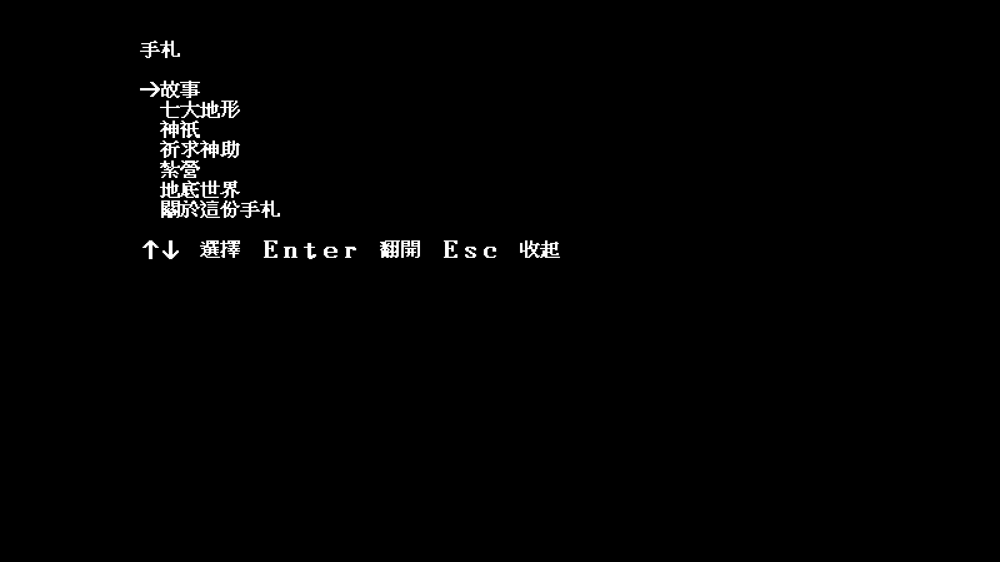

# 2026.07.30 發行包 A6 抽樣

## 目的

這輪不是從開發樹執行，而是解壓
`demonwinter-zh-Hant-2026.07.30-linux-amd64.tar.gz` 後直接啟動其中的
`demonwinter`。驗證打包後仍能找到 JSON 文案、手札與 Modern Icon 自製素材。

固定條件：`-scene armory -seed 11 -volume 0`，原版資料與倚天字型皆唯讀掛載，
存檔寫在 `/tmp`。

## 結果

- 啟動日誌明確記錄載入包內
  `artwork/modern-icon/m1/trial`，不是退回舊調色預覽。
- F8 可由 EGA → CGA → Modern Icon；地圖格位、隊員位置與右側數值不變。
- F6 可把現代兩欄卡片切回原版紅底直式命令列。
- F1 在切換操作模式後仍固定開啟手札。
- 解壓後 `-list-scenes` smoke test 通過。
- 發行 staging 的禁入掃描通過：沒有原版
  `.DAT/.DTT/.SHE/.SHP/.PIE/.PIC` 或倚天字型檔。
- 最終包含 446 張 Modern Icon PNG、836 條 UI key，共 467 個檔案。
- `package-release.sh` 的建置、staging、禁入掃描、壓縮與雜湊現在全部位於
  同一個無網路、具資源限制的 Docker 容器；checksum 只記錄檔名，可在任意
  解壓目錄直接驗證。

最終 SHA-256：

```text
0d8ba6e8415598a892d1c5109e2f31c57e84664882cbcc27decb3fc4e5d0b6fe  demonwinter-zh-Hant-2026.07.30-linux-amd64.tar.gz
```

2026-07-30 最後收斂吐息地形規則、怪物繞障、Modern Icon 地城 namespace、
JSON 文字與 README 索引後重新打包；`sha256sum -c`、Xvfb 下直接執行包內
`demonwinter -list-scenes`、446 張 Modern Icon PNG、467 檔及禁入掃描均再次通過。
新增的 16 張是 `0x5a` 正常／冬季各八個凍土變體；母稿與開發文件不進玩家包。
其後納入使用者核准的地城第一批四張 runtime 素材與 README 審稿結果並再次
重建。最後完成地城 atlas 59／59後又重建一次；解壓後 `-list-scenes`、校驗碼、
禁入掃描再次通過。最新版包含 **466 張 Modern Icon PNG、487 個檔案**：

```text
c13024eec3f51cb0c954ce5d41d5beff1e2353618365457fb703da218027f226  demonwinter-zh-Hant-2026.07.30-linux-amd64.tar.gz
```

上方 446／467 與舊雜湊保留為第一批歷史基線，不是最新版。

音效 XREF 收尾、吐息修正、可注入測試與 README 試聽索引納入後再次重建；
解壓後 `-list-scenes`、466 張 Modern Icon PNG、487 檔與禁入掃描通過。
最新 SHA-256：

```text
fe8b855b1eac57fd450d42dbd95a0b42f8d9bf9fea47045b7b08ef041a1df905  demonwinter-zh-Hant-2026.07.30-linux-amd64.tar.gz
```

| Modern Icon 與現代命令卡 | 復古紅色命令列 | F1 手札 |
|---|---|---|
|  |  |  |

這是使用者同意的 A6 抽樣範圍之新增發行回歸，不宣稱重新逐房間完整破關。
