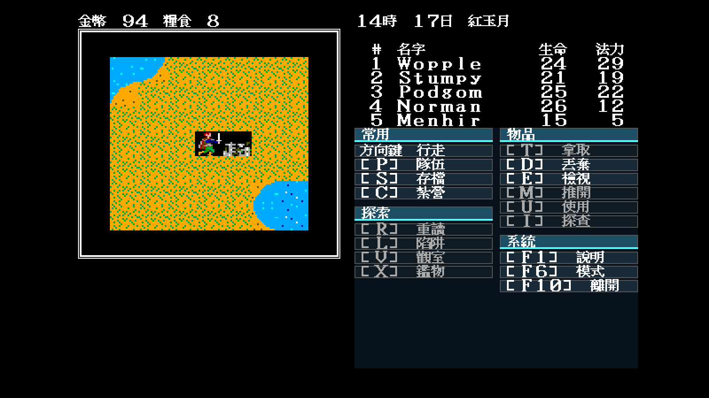
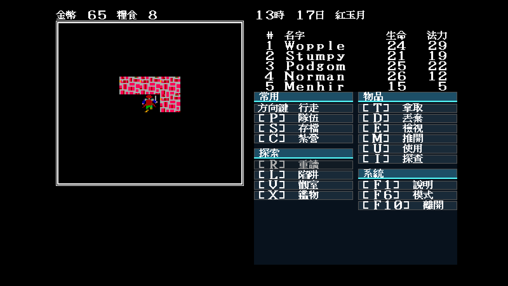

# 48 — 遭遇倒數與移動 A6 重驗

日期：2026-07-30

## 範圍

這是本輪改動後的比例式重驗，不重複宣稱逐房間完整破關：

1. 固定場景穿過地圖 1 鐵籠房間西牆密門，驗一般移動／事件模態沒有退步。
2. 在新遊戲世界起點把遭遇倒數明確設為 1，以 seed 11 走一步觸發真正的
   野外遭遇，讓 `-autofight` 完整打完、結算、回到世界、繼續移動並存檔。

兩段都走 `tools/playthrough.sh` 的真實 Ebiten／Xvfb 輸入與 trace，不呼叫
規則函式假裝玩過。工具同輪補上 `--network none`、記憶體、CPU 與 PID 限制。

## 結果

密門段從地圖 1 `(13,26)` 出發，經 `(13,27) → (9,27)` 的事件文字後，
確實抵達牆西側 `(9,26)`；沒有卡在模態畫面。

遭遇段的關鍵 trace：

```text
野外 (28,50)
戰鬥紀錄：在平原遭遇了敵人
遭遇：蜘蛛、巴格姆、巴格姆、巴格姆、巴格姆
戰鬥 第1回合
── 第 2 回合 ──
怪物全滅
每人獲得 22 點經驗
撿到 29 枚金幣
Wopple 撿到短劍
野外 (27,50)
……
訊息="已存檔"
```

這條路同時覆蓋倒數觸發、以目前地圖基準挑怪、兩回合 AI、自動戰鬥、
經驗／金幣／魔法戰利品、回到探索與存檔。輸出的 `PARTY.DAT` 長度為
1,494 bytes，五份 `nSS.DAT` 與 `ITEMLOCB.DAT` 也寫入隔離輸出目錄，
沒有改動原版資料。

| 固定倒數遭遇結算後 | 密門重驗 |
|---|---|
|  |  |

截圖已人工檢視：倚天 16×15 文字、現代兩欄命令排版、隊伍狀態、世界圖與
訊息區均正常，沒有顯示 `reason.*` key 或缺字方框。

