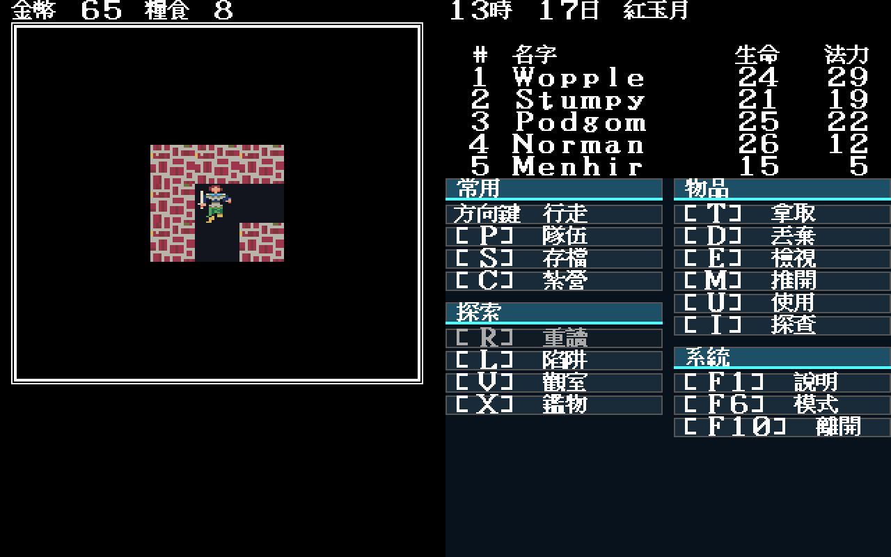
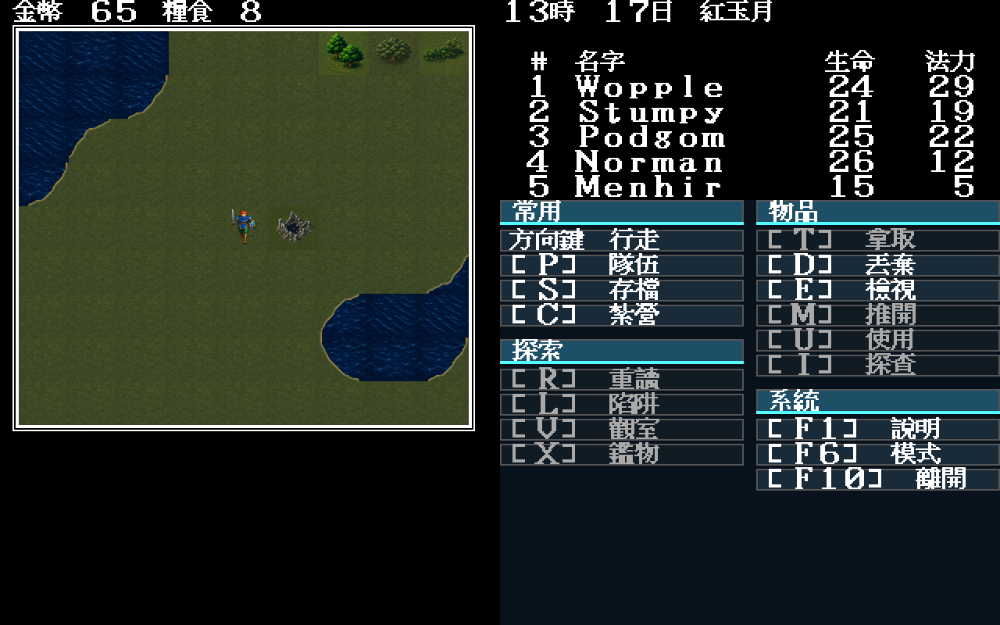
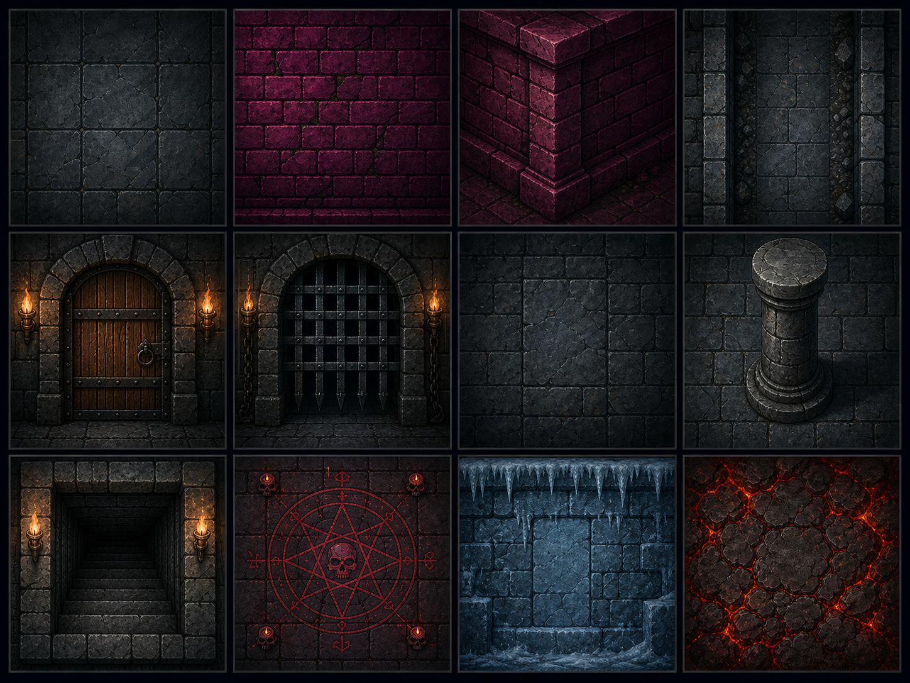

# Modern Icon 地城命名空間與失敗即關閉驗證

日期：2026-07-30

## 問題

Modern Icon 的高解析 `tiles.normal`／`tiles.winter` 原本只以 tile index 查圖。
世界 `SUM.MAP` 與 `MAP1.MAP`–`MAP5.MAP` 地城會重用相同數字，語意卻不同；
例如 `0x01` 在世界是森林，在地城不是森林。原本的最終畫布覆寫沒有先分辨
地圖類型，因此進地城時可能把正確的 EGA／CGA 地城格覆成世界素材。

## 修正

- `theme.json` 新增獨立的 `dungeonTiles` JSON namespace。
- loader 把世界 normal／winter 與地城圖分成三張 map，不共用 index 查表。
- `terrainAt(mapID, ...)` 先以 `world.IsWorldSubMap`／MAP1–MAP5 分流。
- `dungeonTiles` 尚未列出的格維持原版主題底稿；不拿森林、海岸或假圖補洞。
- 世界與地城戰鬥的單位清底也走同一個分流，不會在地城戰誤畫世界地表。
- 無效地圖編號不套用任何 Modern Icon terrain。

固定測試包含 MAP1–MAP5、世界 map 11／34／64 與無效 map 0／6／10／78／80，
並以同一個 `0x01` 同時放入世界、地城 namespace，證明兩者回傳不同圖片。

## 實機抽樣

| MAP1 地城：保留正確歷史底稿 | map 34 世界：高解析素材仍啟用 |
|---|---|
|  |  |

共同條件：

- 使用原版 `PARTY.DAT` 的容器內副本，不改原檔；
- `-video modern`；
- Modern Icon 由預設 `artwork/modern-icon/m1/trial` 載入；
- 1280×800 Xvfb 實機畫面，人工檢視。

左圖的牆、門洞、走道與人物維持地城語意，沒有森林／海岸誤覆寫；右圖的海岸、
平原、樹、廢墟與隊伍仍使用 64×56 高解析呈現，證明保護條件沒有把世界主題
一起關掉。

## 地城美術現況

`dungeonTiles` 目前刻意為空，表示「資料契約完成，正式地城重畫尚未量產」。
新方向稿延伸使用者已核准的 Modern Icon 概念，不是 runtime atlas：

它只用來審查牆、地、門、閘、密牆、柱、樓梯、儀式、冰與熔岩的材質語言。
未完成逐 index 語意表、64×56 邊界檢查與實機驗收前，不得把方向稿切圖冒充成品。
