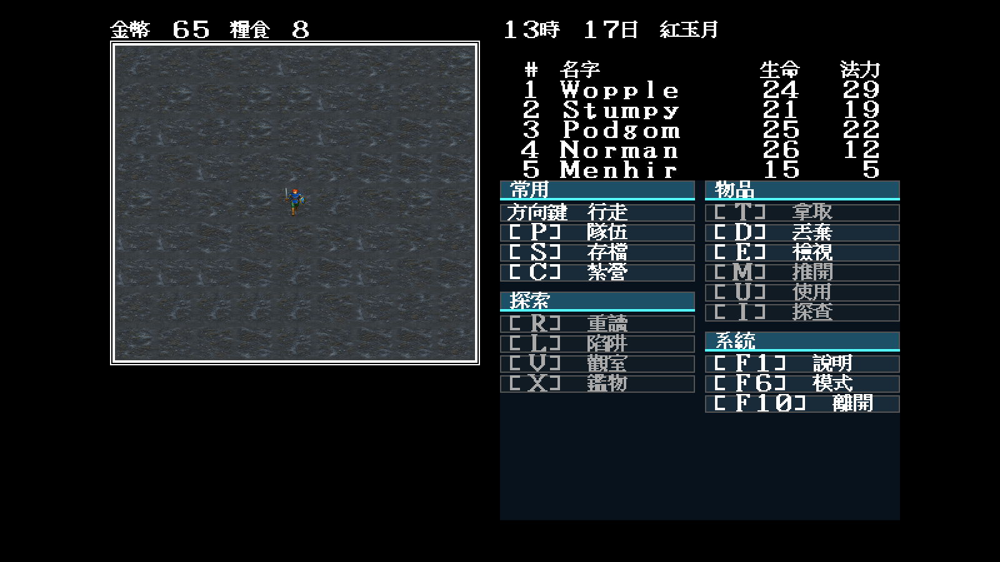
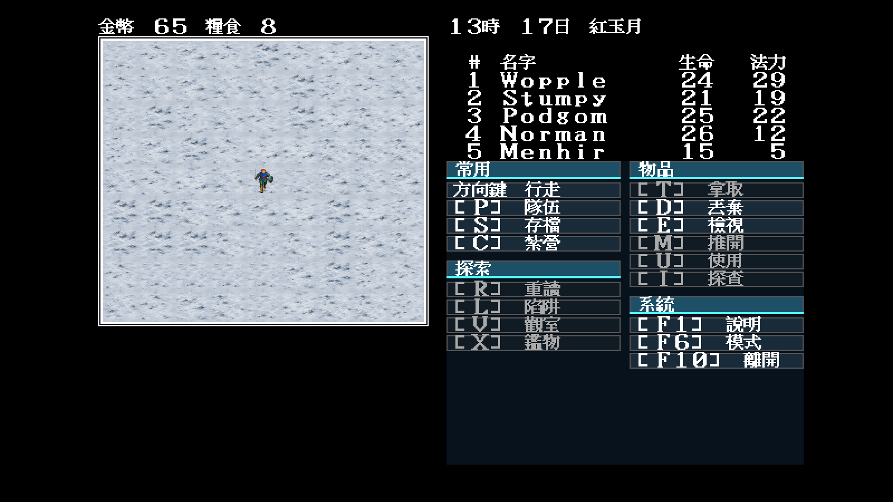

# Modern Icon 全域盤點：凍土補完與地城 JSON 清單

日期：2026-07-30

## 問題

早期世界完成度只跑 `-min-map 33 -max-map 64`。SUM.MAP 其實還含
12、13、21、22、23、25 等較低編號地圖；因此「世界差集為零」不能證明
這些地圖也完整。

新的 namespace 檢查掃過所有地圖後，世界正常／冬季各缺一格：

```text
theme normal missing: 5a
theme winter missing: 5a
```

`mapwindow -find-tiles 5a -min-map 6` 定位到 map 21，包含多個 9×9 全為
`0x5a` 的純凍土視窗。`FILES.DAT` 值為 5，與既有逆向研究的凍土類別一致。

## 修正

- 依使用者核准的非像素化 Modern Icon 世界方向，重新產生正常與冬季凍土
  高解析母稿；沒有裁切或放大原版圖塊。
- [`rebuild-tundra.sh`](../../artwork/modern-icon/m1/rebuild-tundra.sh) 從兩張
  母稿各取八個區域，經共用邊界工具輸出正常／冬季各八張 64×56 變體。
- `theme.json` 的 `tileVariants.normal/winter["0x5a"]` 明列全部檔案；
  選圖仍只讀座標雜湊，不改遊戲 RNG。

固定場景：map 21 `(47,27)`、seed 11、同一存檔與隊伍狀態。冬季圖只多送
Tab 切換 `useWinter`：

| 正常凍土 | 冬季凍土 |
|---|---|
|  |  |

兩圖均人工檢視：Modern Icon loader 有載入、隊伍與 UI 座標一致、沒有原版
`0x5a` 點陣放大；八變體比四變體降低大面積棋盤重複。純單一地形仍保留可辨識
的材質節奏，之後若使用者要求更低紋理對比，可只調母稿，不改索引與規則。

## 地城盤點

同一輪把 MAP1–MAP5 輸出成
[`dungeon-inventory.json`](../../artwork/modern-icon/m1/dungeon-inventory.json)：

- 59 個實際索引；
- 總頻率與逐地圖頻率；
- 第一個座標；
- `FILES.DAT` 原始通行值；
- `blocked`、`exit`、`submap-floor`、`terrain-*` 或 `special` 客觀行為。

JSON 由工具生成；重跑後 `cmp` 完全一致。地城 theme 閘門目前刻意失敗並列出
59 格，證明未經使用者審稿的方向圖沒有被當成 runtime atlas。

## 驗證命令與結果

```bash
go test ./tools/mapwindow

go run ./tools/mapwindow \
  -data workplace/orig/demwin/DEM_DATA \
  -inventory -theme artwork/modern-icon/m1/trial/theme.json \
  -min-map 6
```

結果：

```text
theme normal missing: none
theme winter missing: none
```

地城 `-min-map 1 -max-map 5` 則仍列出 59 個 `theme dungeon missing` 並回傳
失敗，符合 fail-closed 美術閘門。
