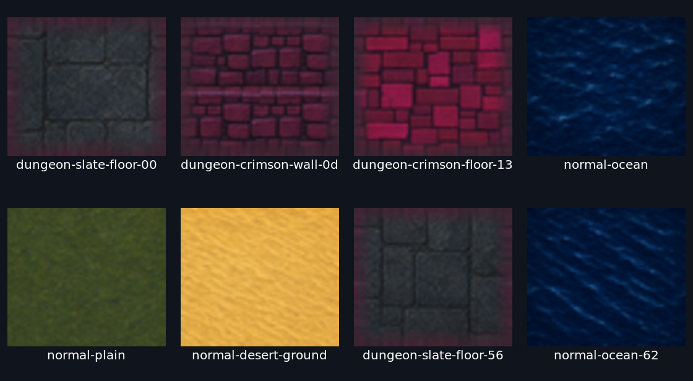
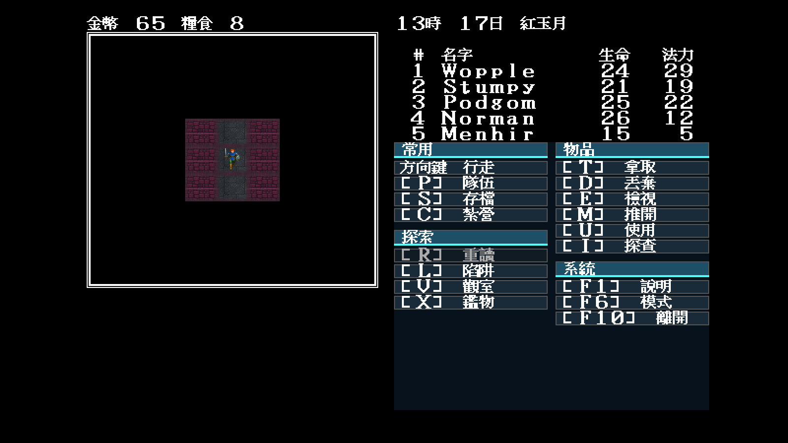
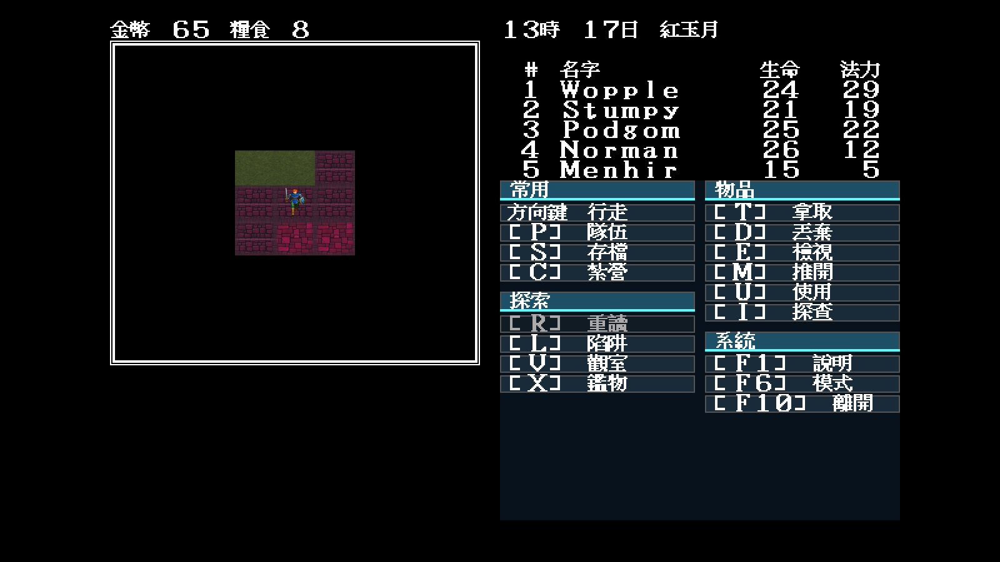
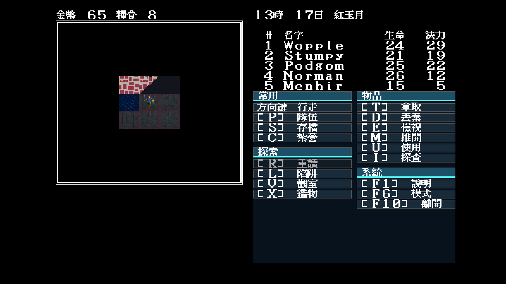

# Modern Icon 地城方向核准與 D1／D5 第一批

日期：2026-07-30

## 結論

- 使用者已明確回覆「modern icon 地城風格 ok」；`dungeon-review.json` 的總狀態
  與十二格決定均改為 `approved`。
- `dungeonTiles` 從 0/59 推進到 **25/59**；完成度閘門仍失敗並列出剩餘
  34 格，不把第一批冒充完整 atlas。
- 新畫的 `0x00/0x56` 暗石板、`0x13` 緋紅磚面及高頻阻擋牆 `0x0d`
  都是新的高解析母稿，不是裁切或縮小方向稿。
- MAP1–MAP5 也含戶外區段；森林、岸線、平原、沙地、凍土與水面只在原版
  索引構圖和規則語意相同時，明確重用已核准的 Modern Icon 世界素材。

## 第一批畫面



| 暗石板走廊與 0x0d 牆 | 緋紅磚面 | 水域交界 |
|---|---|---|
|  |  |  |

暗石板圖是在 map 1 `(21,5)`、緋紅磚面在 `(40,13)`、水域在 `(51,40)`，
固定 seed 11；地城照明仍按存檔光源內縮。緋紅磚面改用相鄰無事件座標，
完整介面與人物透明疊圖均已人工檢視。

## EGA／CGA 人物黑格裁決

使用者從 GitHub 截圖注意到 EGA／CGA 人物周圍有黑色矩形。重新核對同場景的
DOSBox 原版原生截圖後，這不是 remake 新增的差異：

- 原版 `222f:0bbc` 把人物 glyph 索引直接寫進地圖繪製緩衝區，整格取代地形；
- `workplace/dump/tilecmp/orig-native-crop.png` 的原版人物格就是黑底；
- `workplace/dump/tilecmp/ours-ega.png` 保留相同的 32×28 邏輯黑格；
- Modern Icon 才採「先畫腳下地形、再疊透明人物」的現代美化。

因此 EGA／CGA 不改透明，避免為了視覺順眼反而破壞歷史還原。

## 可重播檢查

```bash
go run ./tools/mapwindow \
  -review-check artwork/modern-icon/m1/dungeon-review.json

go run ./tools/mapwindow \
  -data workplace/orig/demwin/DEM_DATA \
  -inventory -min-map 1 -max-map 5 \
  -theme artwork/modern-icon/m1/trial/theme.json
```

第二支目前應列出 34 個 `theme dungeon missing` 並以非零狀態結束；這是
失敗即關閉（fail-closed）的正確結果。

> 本文件記錄第一批當時的歷史基線；後續已完成 59／59，請以
> [`docs/playtest/53`](53-modern-icon-dungeon-atlas-complete.md) 為最新狀態。
