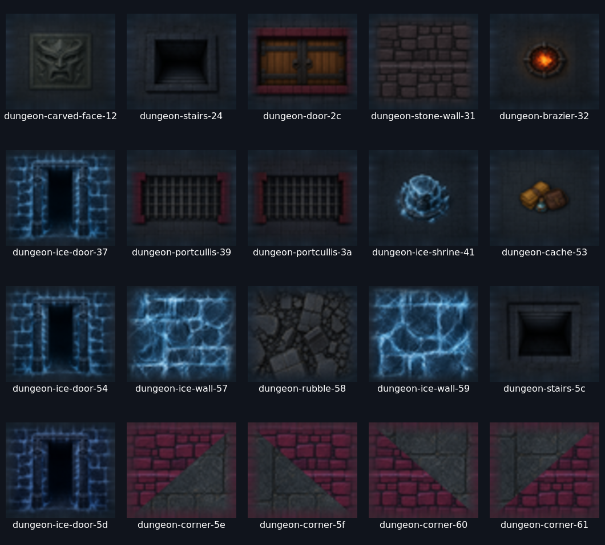
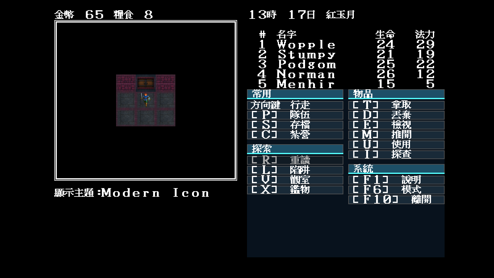
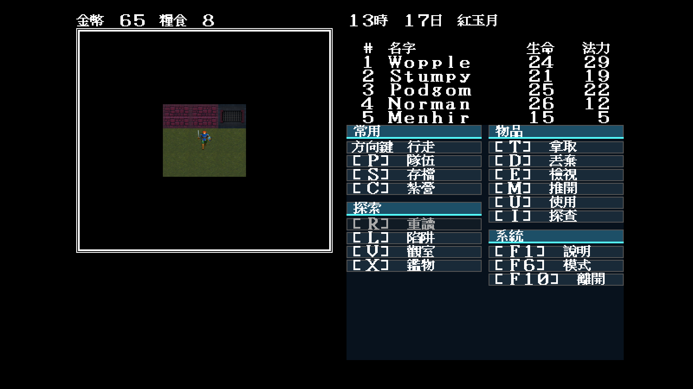
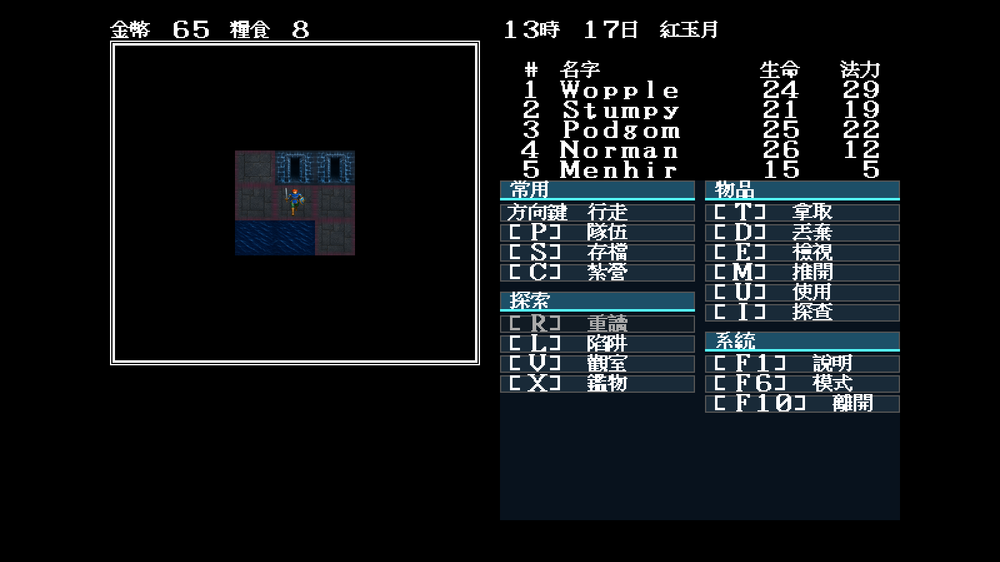
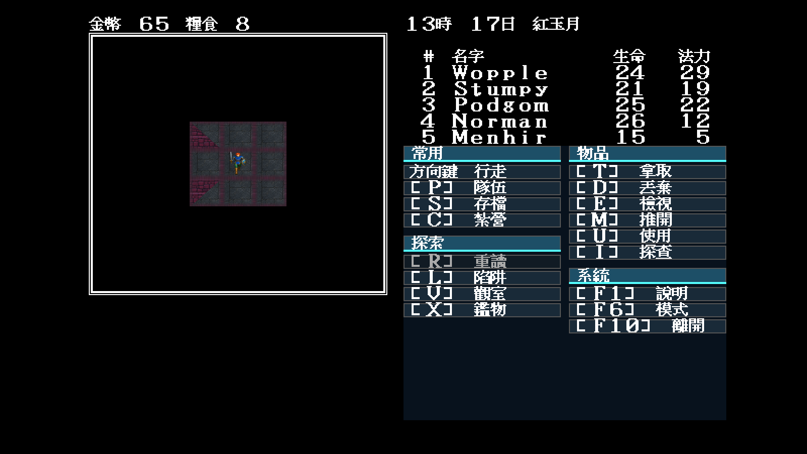

# Modern Icon 地城 atlas 59／59

日期：2026-07-30

## 結論

- MAP1–MAP5 實際使用的 59 個 tile index，已全部在 `dungeonTiles` 明列；
  `theme dungeon missing: none`。
- D2–D4 新增門、鐵閘、樓梯、冰牆、冰門、冰封神龕、火盆、物資、瓦礫、
  雕面機關與四種轉角。素材由獨立高解析母稿重繪，不是把概念圖或原版圖塊
  縮小。
- 森林、岸線、城鎮、學院、火山等只有在 MAP1–MAP5 的原始索引構圖與規則
  語意相同時，才於 JSON 明列重用已核准的世界素材；沒有 loader 隱式借圖。
- `0x11` 是原版全黑特殊格，Modern Icon 使用不洩漏機關資訊的石板底面；
  F8 切換不改碰撞、密門、劇情旗標、亂數或存檔。

## 素材與實機證據



| 木門 | 鐵閘 | 冰區 |
|---|---|---|
|  |  |  |

四種斜角的近看圖如下；這張刻意只驗地圖拓撲，不當作完整介面驗收：



畫面以 seed 11 重播。門場景從 EGA 啟動後按 `Return, F8, F8` 切到 Modern
Icon，因此同時驗證 F8 的 EGA → CGA → Modern Icon 路徑。鐵閘與冰區畫面
保留完整 640×400 中文介面；轉角近看只負責確認斜面方向和相鄰石板連續。

## 自動驗證

```bash
go run ./tools/mapwindow \
  -data workplace/orig/demwin/DEM_DATA \
  -inventory -min-map 1 -max-map 5 \
  -theme artwork/modern-icon/m1/trial/theme.json
```

預期輸出：

```text
theme dungeon missing: none
```

`TestBundledModernIconDungeonMatchesInventory` 另會載入實際隨附 theme，逐一比對
inventory 的完整集合；loader 同時檢查 PNG 尺寸與不透明度。P3-D 的客觀量產
到此完成，仍不替使用者宣告 P4 最終視覺審查通過。
