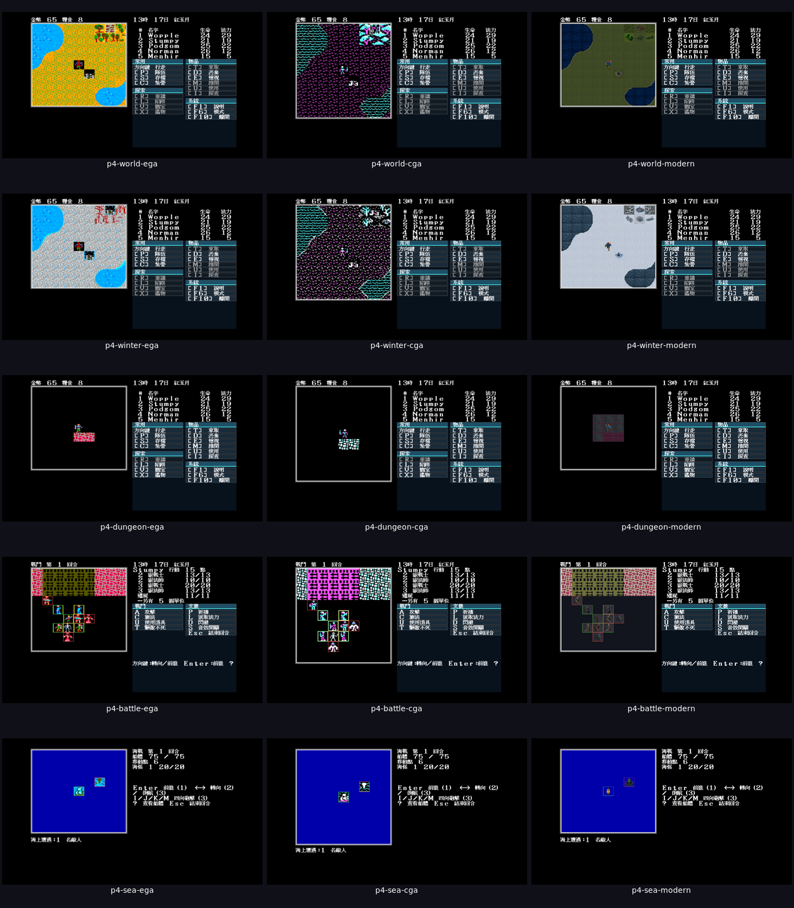

# P4 三主題最終視覺審查板

日期：2026-07-30

## 方法

一次建置後，在同一個受限 Docker／Xvfb 環境拍攝 15 張圖：

- 主題：EGA、CGA、Modern Icon；
- 場景：正常世界、冬季世界、地城兵器庫、一般戰鬥、海戰；
- seed 固定 11，地圖／座標或戰鬥 fixture 在三主題間不變；
- 倚天 16×15 粗體、現代操作介面一致；
- 每次使用獨立 `/tmp` 測試存檔，不覆寫原版資料。

可重播命令：

```bash
tools/p4-capture.sh
```



原尺寸圖片位於 [`docs/design/img/p4/`](../design/img/p4/)。

## 人工檢查

- 五列的金幣、糧食、時日、隊員數值、戰鬥隊形與海戰船體在三欄一致。
- EGA／CGA 保留原版整格人物 glyph 黑底；Modern Icon 是透明人物疊圖。
- 正常／冬季三主題都有非零像素差異；CGA 差異較不顯眼但不是切換失效：
  全畫布 AE 分別為 EGA 225,536、CGA 36,960、Modern Icon 289,650。
- 地城仍依同一光源規則內縮；Modern Icon 沒有因高解析材質洩漏黑暗區域。
- Modern Icon 戰鬥與海戰只換呈現素材，單位格位、面向與數值不變。

## 邊界

這份畫板完成 P4 的可重播技術證據與代理人工檢查，但視覺喜好必須由使用者
決定。未取得使用者核准前，狀態仍是「待審」，不把代理自己的檢視冒充產品
驗收。
