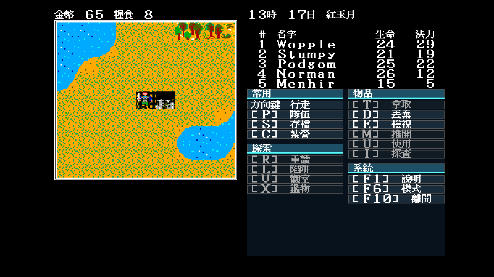
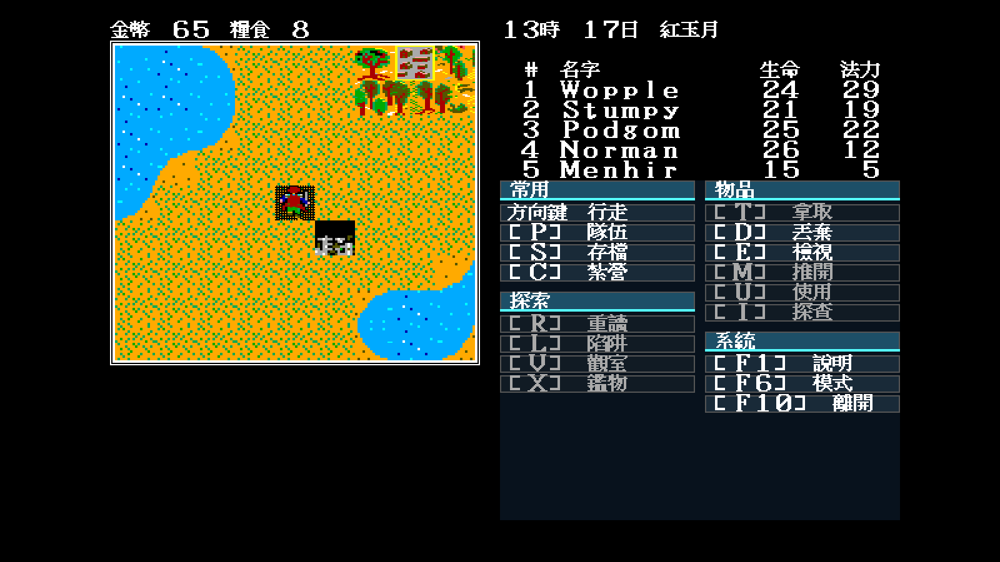
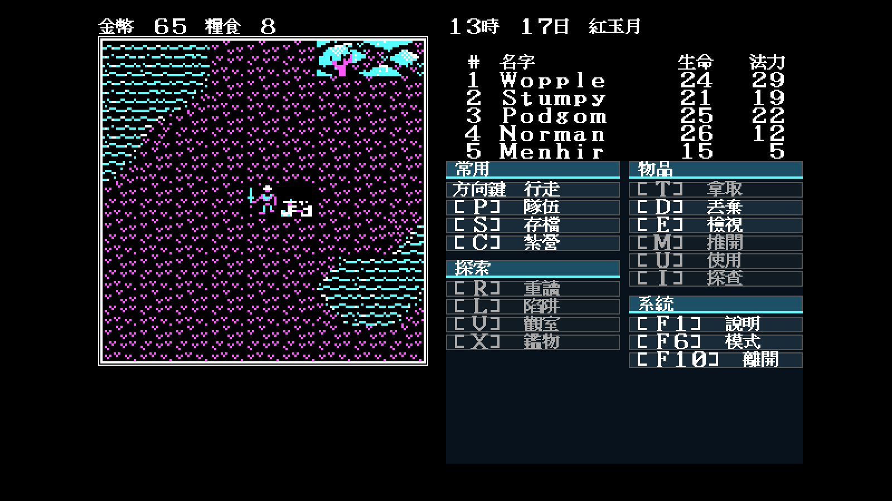
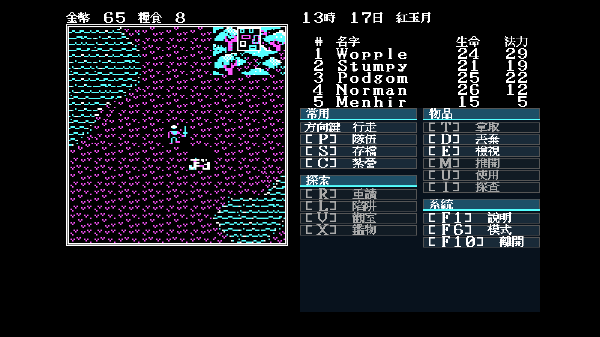

# EGA／CGA 步行人物透明合成修正

日期：2026-07-30

## 問題與使用者裁決

先前 remake 直接把 `DEMON.SHE/.SHP` 的隊伍 glyph 當完整地形格畫入中心，
因此人物四周出現純黑方框。既有文件曾依原始素材與繪製緩衝區寫法把它裁成
歷史行為；使用者檢查畫面後明確指出這與其原版參考不同，要求修正。

最新產品裁決取代舊結論：**EGA／CGA 步行人物都必須透明疊在腳下地形上。**
船隻仍使用完整圖塊，不在本次範圍。

## 實作

- `game.PartyGlyph` 的四方向、座標奇偶兩步動畫與索引完全不變；
- 中心格先畫真正的地形，再疊人物 glyph；
- 遮罩只清除與圖塊邊界連通的純黑背景；
- 緊貼彩色本體的一圈黑色保留，避免衣服、盾牌與輪廓被挖空；
- EGA 與 CGA 共用相同遮罩規則，Modern Icon 原有透明高解析素材不變。

## 兩步實機證據

| 主題 | 動畫相位 A | 實際向北一步後相位 B |
|---|---|---|
| EGA |  |  |
| CGA |  |  |

四張皆由 `tools/screenshot.sh` 在 Docker／Xvfb、map 34、seed 11 拍攝。相位 B
是從相位 A 的座標實際送出 `Up`，不是只替換靜態圖片。兩格都能看見原地形
紋理穿過人物周圍，不再有 32×28（CGA 放大後 32×32）純黑方框。

P4 的 15 張原圖與審查板亦已重拍；世界與冬季列使用同一修正版 runtime。
