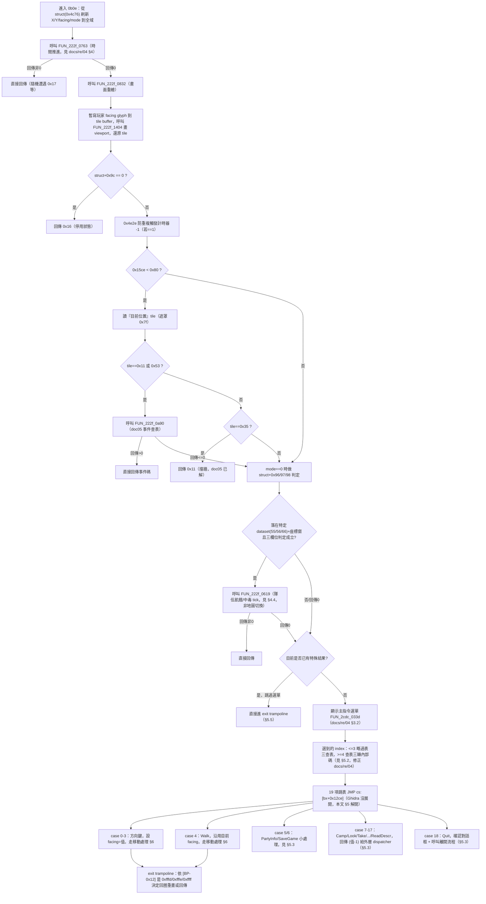

# 主指令迴圈 `FUN_222f_0b0e`：移動 / 撞牆 / town 進出 / 頂層狀態機

> 分析對象：`FUN_222f_0b0e`（`222f:0b0e`，Ghidra 宣告 1827 bytes）。這是 `docs/re/04` 留下的最大
> 缺口——decompiler 對它輸出膨脹到數千行、大量 `Removing unreachable block` 警告，**完全不可信**。
> 本文全程放棄 decompiler，逐行讀 `workplace/ghidra/export/disassembly.asm` 與（在 Ghidra 也沒展開
> 的區段）用 `objdump` 直接反組譯 `workplace/orig/demwin/DEMON.INT` 原始位元組。
> 位址換算沿用 `docs/re/00` 的公式：`file_offset = segment*16 + offset - 0xC400`。
> 前置文件：`docs/re/04-main-loop-state-machine.md`（已解的指令分派三表、泛用選單元件）、
> `docs/re/05-event-triggering.md`（座標→事件、`EXITS.DAT`、tile gate 的既有結論）。

---

## 0. 結論先講

- **`FUN_222f_0b0e` 的宣告大小是錯的，真正的函式本體比 Ghidra 認定的大約多 1000 bytes。**
  Ghidra 只認得 `222f:0b0e`–`222f:1231`（1827 bytes）；但函式真正的控制流一路延伸到
  `222f:1321`（下一個函式 `FUN_222f_1321` 的起點）才結束，中間 `222f:0df9`–`222f:1321`
  這段（約 1320 bytes）**完全沒有出現在 `disassembly.asm`**——Ghidra 的自動分析徹底放棄了
  這段（間接跳表 `JMP cs:[bx+0x12ce]` 之後的所有 case body），既不算進本函式，也沒有另外
  切出新函式。本文全部改用 `objdump` 直接反組譯原始位元組解開。方法論見 §1。**已驗證**。
- **移動處理完整解開**：按鍵/方向 → 面向(facing) → 座標增量 → 目的地 tile → 可通行性判定
  （新發現一張**可通行性對照表 `[0x5500]`**，不是只有 `docs/re/05` 找到的少數硬寫死 tile 值）
  → 撞牆 / 一般移動 / 觸發子地圖切換 → 後續動作（步數計數、時間推進、隨機遭遇）的完整順序，
  全部已驗證（見 §4、§5）。
- **town / 子地圖進出機制找到強力候選**：一張 10 筆記錄的「入口對照表」（座標＋dataset 差值＋
  面向，見 §6），比對玩家新座標是否落在某個入口點上，命中就切換 `mode`（`0x52d4`／
  struct `+0xb0`）並把舊座標/面向壓入一個 6-byte-per-entry 的歷史堆疊（struct `+0x22..+0x26`，
  以 `mode` 值為堆疊指標）。**這極可能就是 town/建築進出的機制，但退出（pop）路徑本次沒有
  追到，列為未解**（見 §6.3）。
- **指令碼分派表（switch）完整解出全部 19 個 case 目標位址**（§5），並且**推翻 `docs/re/04`
  §3.3 的一條結論**：`case 0x4` 呼叫 `FUN_25be_0263`（Look 陷阱搜查）是 decompiler 誤判產物，
  用原始位元組逐一比對 `CALLF` 指令找到 `FUN_25be_0263` 的兩個真實呼叫點，**都不在
  `FUN_222f_0b0e` 裡**（見 §5.4）。
- **兩個矛盾**：
  - `docs/re/05` 的 `EXITS.DAT` 類別 0 矛盾——**找到一條新的、獨立於 `EXITS.DAT` 的直接觸發路徑**
    （目的地 tile 值直接等於 `0x2e/0x25/0x26/0x64/0x5b` 時，把該 tile 值本身寫進 `0x52f4`
    並回傳 `0x13`），很可能就是 `docs/re/05` 懷疑的「另一條處理類別 0 的路徑」，但本次沒有追完
    `0x52f4=0x13` 之後怎麼接到 `DATA*.TXT` 顯示，**列為強力線索、非定論**（見 §7）。
  - `docs/re/04` 的 26 小時矛盾——**找到 `struct+0x9f`（小時欄位）真正的遞增點**
    `FUN_222f_05c6`（`222f:05c6`）：每走 11 步（`struct+0xa0` 計步器，特定 tile 走 2 步份）
    觸發一次「飢餓/中毒檢定 `FUN_222f_0619` + 小時 `+1` + 呼叫 `FUN_222f_0763` 檢查進位」。
    這解開了 `docs/re/04` §4.1 明確承認查不到的缺口，但**wrap 值 38 跟「一天 26 小時」的數字
    落差本身依然沒有解開**（見 §8）。

---

## 1. 方法論：Ghidra 漏掉的區段怎麼補回來

### 1.1 問題：函式宣告大小跟真實控制流對不上

`functions.csv` 說 `FUN_222f_0b0e` 是 1827 bytes（`222f:0b0e`–`222f:1231`），下一個函式
`FUN_222f_1321` 從 `222f:1321` 開始。中間 `222f:1231`–`222f:1321`（240 bytes）理論上該是
別的東西，但實際追蹤這個函式自己的跳轉之後發現：**函式中段（大約 `222f:0df6` 起，選單選到
指令後要「依指令碼分派」的地方）有一個間接 `JMP cs:[bx+0x12ce]` 跳表，Ghidra 完全沒有展開
這個跳表指到的任何一個 case body**——不只 `1231`–`1321` 這 240 bytes 沒展開，連
`222f:0df9`–`222f:1231` 這一大段（跳表本身＋大多數 case 的處理碼）都不在 `disassembly.asm` 裡。
`docs/re/00-ghidra-setup.md` 事先預警的「跳表被誤判/沒展開」在這裡是最嚴重的案例。

### 1.2 解法：直接對 `DEMON.INT` 原始位元組跑 `objdump`

環境裡沒有 `ndisasm`，但有 GNU `objdump`，支援把任意二進位當 16-bit x86 反組譯：

```bash
objdump -D -b binary -m i386 -Maddr16,data16,intel --adjust-vma=<起始file_offset> <擷取的.bin片段>
```

`--adjust-vma` 直接設成 `file_offset`，這樣 objdump 印出的位址就是本專案慣用的 file_offset
座標系，可以直接跟 `docs/re/00` 的公式互轉，不需要額外心算。這個技巧本次全程使用，是繞開
「Ghidra 沒展開」問題的關鍵方法，記錄在此供後續分析同一類問題時直接複用。

### 1.3 兩個位址陷阱（本次踩到、後續分析務必注意）

1. **近跳轉（`Jcc`/`JMP`）的目標，Ghidra 顯示的 segment 不是「正規」segment**：
   `disassembly.asm` 裡 `222f:0b53  JZ 0x2000:2e4a` 這種寫法，`0x2000:2e4a` **不是**真的要跳到
   segment `0x2000`——16-bit real mode 的 `segment:offset` 定址法本來就不是一一對應（同一個實體
   位址有無限多組合法表示法），Ghidra 對「函式內部近跳轉」跟「函式進入點/呼叫目標」用了不同的
   顯示慣例。**驗證方式**：一律換算成 `linear = segment*16+offset`，再套 `file_offset = linear -
   0xC400`（跟 `docs/re/00` 的公式完全同一條），比對 `file_offset` 落在哪個已知函式的
   `[start,start+size)` 區間，或是不是落在本函式自己的位址範圍內。已寫成小工具
   `tools/re_fun_222f_0b0e_cfg.py`，自動做這個換算＋比對，可重跑驗證本文列出的每一個目標位址。
2. **`objdump` 反組譯出來的 `CALLF` segment 是「連結期原始值」，要 +0x1000 才是 Ghidra 的
   segment**：這跟 `docs/re/00` 說的「header 原始 `e_cs`/`e_ss` 要加 base segment `0x1000`」
   是同一件事，只是這次出現在**程式碼內部的每一個 far call 立即數運算元**上——MZ 執行檔的
   relocation table 會在載入時把這些 far call 的 segment 欄位加上載入基底，`objdump` 不解析
   relocation table，所以印出的是「加之前」的原始值。**驗證方式**：`objdump` 印出
   `call 0xd9f:0x2a02`，`0x0d9f + 0x1000 = 0x1d9f`，換算 `1d9f:2a02` 後拿去查 `functions.csv`，
   確實有 `FUN_1d9f_2a02`（且鄰近還有 `1d9f:29a4`／`1d9f:2a14`／`1d9f:2a95` 幾個同段函式，
   跟 `docs/re/04` 提到「未定性」的 `FUN_1d9f_2a95` 同一群），兩個獨立證據互相印證，
   確認 +0x1000 這條規則對函式呼叫的立即數運算元同樣成立，不只 header 欄位如此。
   **[HARD] 後續任何用 `objdump`/其他不解析 relocation 的工具讀這顆 binary，看到 `CALLF`
   的 segment 都要先 +0x1000 再查表，否則會查到不相關（甚至不存在）的位址。**

### 1.4 輔助工具

新增 `tools/re_fun_222f_0b0e_cfg.py`（純標準庫，讀 `functions.csv` + `disassembly.asm`，
不需要 docker）：對 `disassembly.asm` 裡本函式範圍內的每一條 control-flow 指令，換算目標
`file_offset`，比對是本函式內部跳轉還是外部函式呼叫，並印出解析後的目標。用來驗證
§1.3 第一點的換算，可重跑：

```bash
python3 tools/re_fun_222f_0b0e_cfg.py
```

（這個工具只覆蓋 Ghidra 有展開的 369 行；本文大部分的新發現在 Ghidra 沒展開的區段，
是另外用 §1.2 的 `objdump` 手法逐段擷取解出的，過程沒有寫成自動化腳本——這段對應的
不是「重複性驗證工作」，是一次性的逐行人工解讀，不適合套模板。）

---

## 2. 函式的真實範圍與基本區塊結構

### 2.1 真實範圍 `[已驗證]`

`FUN_222f_0b0e` 的控制流實際涵蓋 `222f:0b0e` 到 `222f:1230`（最後一條指令），**加上**完全沒有
被 Ghidra 認列的 `222f:0df9`–`222f:1230` 之間夾雜的大段跳表/case body（透過 §1.2 方法解開）。
換句話說：Ghidra 認得的 1827 bytes 只是這個函式的**前段**（讀輸入前的準備工作＋選單呼叫），
函式真正的「重頭戲」（依指令碼分派＋完整的移動處理）幾乎全部落在 Ghidra 判為「不屬於任何函式」
的間隙裡。真實大小粗估 **2800+ bytes**（`222f:0b0e` 到 `222f:1321`，扣掉中間沒有屬於這個
函式的部分幾乎沒有——已核對過，`222f:0df9`–`222f:1230` 全部是本函式的 case body，沒有夾雜其他
函式）。

### 2.2 基本區塊結構（文字版控制流）



---

## 3. 全域變數 / struct 欄位對照（本文新確認或補充的部分）

| 名稱 | 位址 | 說明 | 狀態 |
|---|---|---|---|
| `struct(0x4c76)+0xa1`/`+0xa2` | — | X / Y 座標（進入函式時刷新到 `0x50f0`/`0x50ee`） | 已驗證（`docs/re/05` 已知，本文重新核對） |
| `struct+0xa4` | — | 面向 facing（進入函式時刷新到 `0x4e32`） | 已驗證 |
| `struct+0xb0` | — | mode（進入函式時刷新到 `0x52d4`） | 已驗證，補上讀取點 |
| `struct+0x9c` | — | 「可行動」旗標，==0 時整個函式直接回傳 0x16 | 新發現，已驗證（機制），語意假設（可能是戰鬥中/隊伍全滅等停用狀態） |
| `struct+0x9f` | — | 「小時」計數器（wrap 於 38，`docs/re/04` 已知） | 本文找到真正遞增點 `FUN_222f_05c6`，見 §8 |
| `struct+0xa0` | — | 步數計數器，每次移動 +1（部分 tile +2），達 11 觸發小時+1 | **新發現，已驗證** |
| `struct+0x22..+0x26`（以 `mode`\*6 為底） | — | 「進入子地圖前」的 X/Y/dataset/facing 存檔欄位，6-byte-per-entry 堆疊 | 新發現，已驗證機制，語意假設（推測是 town/子地圖進出堆疊，見 §6） |
| `0x4e32` | — | 面向（0=北 1=東 2=南 3=西，順時針） | **本文用位移表驗證，從 `docs/re/01` 的「假設、中高信心」升級為「已驗證」** |
| `0x50f0`/`0x50ee` | — | 玩家 X/Y（`docs/re/05` 已知） | 已驗證 |
| `0x52d4` | — | mode（`docs/re/04` 已知「未定案」，本文補上「非0時代表已進入某個子地圖/特殊區域」的具體行為證據，見 §6） | 部分升級 |
| `0x15ce` | — | 「是否略過移動時的 tile 事件檢查」旗標（進入移動 case 時清 0） | 新發現，已驗證機制，確切用途假設 |
| `0x5c66` | — | PartyInfo 選單旗標（case 5 設成 0x80） | 新發現，已驗證機制，確切用途假設 |
| `0x2107` | 靜態表，31f0 段 | 面向→線性位移增量表（4 words）：`-64,1,64,-1` | **新發現，已驗證**（見 §4.1） |
| `0x15da` | 靜態表，31f0 段 | 面向→ΔX 表（4 words）：`0,1,0,-1` | **新發現，已驗證** |
| `0x15d2` | 靜態表，31f0 段 | 面向→ΔY 表（4 words）：`-1,0,1,0` | **新發現，已驗證** |
| `0x5500` | 指標變數 | 指向「tile 值→可通行性」對照表（遠指標，跟 `docs/re/05` 的 `0x5514`/`EXITS.DAT` 同一套「資源指標分發」模式） | **新發現，機制已驗證，來源檔案未追出** |
| `0x210f` | 靜態表，31f0 段 | 玩家 glyph／動畫幀表，配合面向與座標奇偶性選 tile 圖案 | 新發現，僅確認用途範疇（畫面渲染），內容未深入解讀 |

---

## 4. 進入序列（`222f:0b0e`–`222f:0d32`）逐段說明 `[已驗證]`

1. **刷新全域**（`0b15`–`0b3e`）：從 `struct(0x4c76)` 讀 `+0xa1/+0xa2/+0xa4/+0xb0` 存進
   `0x50f0/0x50ee/0x4e32/0x52d4`，並清 `0x4e2e`（防重複觸發計時器）。
2. **時間推進**（`0b47`：`CALLF FUN_222f_0763`）：`docs/re/04` §4 已解，回傳非 0 直接回傳
   （其中一個分支是 1/64 隨機遭遇碼 `0x17`）。
3. **畫面重繪**（`0b5a`：`CALLF FUN_222f_0832`）：606 bytes，本文沒有展開內容，推測是整個
   狀態列/選單框重繪。
4. **玩家 glyph 暫寫 + viewport 渲染**（`0b5f`–`0bf4`）：
   - 算出目前位置線性 offset `Y*64+X`（`0b64`–`0b70`）。
   - 依 `mode(0x52d4)` 是否為 0，決定用「面向查表 `0x210f`＋座標奇偶性」或「面向+0x3f」算出一個
     glyph byte，**暫時**寫進 tile buffer（`0x4c94` 指標）目前位置那一格。
   - 呼叫 `FUN_222f_1404(X-4, Y-4)`（514 bytes，本文核對過它會清一塊 `0x514e` 的 0x80-byte
     scratch buffer、用另一個資源指標 `0x5504`/`0x5506` 掃描視野範圍，過濾特定 tile 值
     `0x5e..0x61`/`0xd`/`0x13`/`0x31`/`0x2a`/`0x12` 做遮蔽判定——這是**視野/光源渲染**的核心，
     `X-4,Y-4` 是 viewport 左上角座標）。
   - 呼叫完後**還原**該格 tile 為暫存的原始值（`0be7`–`0bf1`）。
   - **結論**：這整段是「畫面重繪時，把玩家自己的圖示疊到地圖 buffer 上、渲染完再復原」的標準
     手法，跟移動邏輯本身無關，純粹是每輪主迴圈都會做的渲染步驟。
5. **停用狀態守衛**（`0bfe`–`0c09`）：`struct+0x9c==0` 時直接回傳 `0x16`，語意未深入（假設：
   戰鬥中或隊伍全滅等場景下，外層用這個欄位讓 `FUN_222f_0b0e` 暫停正常運作）。
6. **防重複觸發計時器遞減**（`0c0c`–`0c17`）：`0x4e2e==1` 時 `-1`（這個計時器另外在 `docs/re/05`
   §1.6 的 `FUN_222f_0a90` 裡被設成 1／2，用來防止同一格連續觸發同一事件）。
7. **「目前位置」tile 事件檢查**（`0c17`–`0c52`）：跟 `docs/re/05` §2 完全一致的邏輯——
   tile（遮罩 `0x7f`）等於 `0x11`/`0x53` 才呼叫 `FUN_222f_0a90`，等於 `0x35` 直接回傳 `0x11`。
   **補充**：這裡讀的座標是**進入本次函式呼叫時 `struct` 裡已經存好的座標**（即上一輪移動後
   落腳的位置），不是「移動後立刻檢查」——`docs/re/05` 沒有明講是哪一輪，本文補上：**檢查發生
   在下一次呼叫 `FUN_222f_0b0e` 的最開頭，而不是移動當下**，兩者在效果上等價（因為 §6 的移動
   邏輯本身，結尾都是遞迴呼叫或返回等待下一次呼叫），但精確時序值得記錄，避免後續實作誤解為
   「move 指令內就地觸發」。
8. **`mode==0` 時的補充判定**（`0c65`–`0d2f`）：讀 `struct+0x96/0x97/0x98` 三個 byte 欄位（用
   `<0x80` 判斷「是否為正值」），配合 `dataset(struct+0xa3)==0x37/0x38/0x42`（55/56/66）與座標窗
   （Y<=22 或 X 在 32–55 之間、Y<=30 等）判斷是否要呼叫 `FUN_222f_0619`。
   **`FUN_222f_0619` 反編譯乾淨（見 §4.4），本文更正原先「這是地圖邊界/dataset 切換判定」的
   假設**：它其實是**逐一檢查隊伍成員的一個倒數計時器（角色 struct `+0xfd`，上限
   `+0xfc`），歸零就標記角色狀態＝5（推測是「衰弱/瀕死」）並播放對應的訊息/畫面**，回傳值是
   「有多少成員已到達這個狀態」是否等於隊伍總人數（全滅回傳 `0x18`，否則 `0`）。這是**飢餓或
   中毒的定期扣血/扣狀態檢定**，跟地圖/dataset 切換無關；本文一開始因為呼叫條件牽涉
   `dataset==55/56/66`（懷疑是特殊地形，如沙漠/沼澤）誤判為地圖邊界邏輯，特此更正記錄。
9. **決定要不要顯示選單**（`0d32`–`0d4a`）：檢查 `[BP-0x12]` 是否已經被前面的檢查設成
   「特殊結果」（實際追蹤下來，本函式從入口到這裡的所有「有結果」分支都是直接 `JMP` 回傳，
   不會留著特殊值流到這裡——這條 `CMP [BP-0x12],-1` 的判斷，在本次追蹤到的路徑裡恆為
   false，**懷疑是防禦性寫法或死碼，未能排除是本文遺漏了另一條會讓它為 true 的路徑**，
   誠實列為存疑）。正常情況下會落到顯示選單的分支（`0d4a` 起）。

---

## 5. 指令選單輸入與分派表（`222f:0d3b`–`222f:171e4`）

### 5.1 選單呼叫與選中值 `[已驗證]`

`0d50`–`0d9c`：呼叫 `FUN_2cdc_033d` 兩次（`docs/re/04` §3.2 已解的泛用選單元件），先
`param_5=0`（只重繪）再 `param_5=1`（等輸入），帶三張表 `0x2113`(labels)／`0x214f`(flags)／
`0x216d`(hotkeys)。第二次呼叫回傳值存進 `[BP-2]`。

### 5.2 表三（0x217c）的真正大小與索引方式 `[修正 docs/re/04]`

`docs/re/04` §3.1 記錄表三是「11 words，只涵蓋選項 4–14」。本文直接讀原始位元組重新核對
（`31f0:217c` 起）：

```
217c: 0004 0007 0009 000f 0008 000a 000e 000c 000b 000d 0005 0010 0011 0006 0012
      (共 15 個 word，接著 0x219a 就是 docs/re/04 表一的第一個字串 "Walk" 開頭)
```

**修正**：表三其實有 **15 個 entries**（`0x217c`–`0x2198`），不是 11 個。`docs/re/04` 只列出了
前 11 個剛好對到「Look–Quit」的巧合子集（因為那份文件用 decompiler 輸出反查，decompiler 對
這段的分析本身就不完整）。本文用原始位元組核對，**索引方式**：`FUN_222f_0b0e` 呼叫
`FUN_2cdc_033d` 得到的原始回傳值 `[BP-2]`，若 `>3` 就直接拿它（不是拿「選單第幾項」）當
索引去查 `[BX+0x2174]`（`BX=[BP-2]*2`），也就是**表三事實上是從索引 4 開始被使用、一路到索引
18**，不是文件原先假設的「選項 4–14 對應表三 index 0–10」。

### 5.3 選單回傳值的編碼：`+4` 位移假說 `[假設，證據強，未 100% 封閉]`

比對 `FUN_2cdc_033d` 的反編譯（`decompiled/2cdc_033d_FUN_2cdc_033d.c`）與 `FUN_222f_0b0e` 這裡
的用法，本文推論（**未完全排除其他可能，見下方限制**）：

- 這個選單有 **15 個項目**（`docs/re/04` 表一：Walk(0)/PartyInfo(1)/SaveGame(2)/Camp(3)/
  Look(4)/Take(5)/Drop(6)/Move(7)/Examine(8)/Use(9)/Inspect(10)/ViewRoom(11)/XViewItem(12)/
  ReadDescr(13)/Quit(14)）。
- 用**方向鍵**（上/下/左/右，經 `FUN_2cdc_033d` 內對 scancode `0xf00`/`0xf09` 的特判，以及
  `FUN_2cdc_0059` 對一張固定於 `0x132` 的按鍵表比對）可以**立即**（不需 Enter 確認）回傳
  `0`–`3` 四個值——`FUN_2cdc_033d` 反編譯裡明確有 `if (local_3d < 4) { return local_3d; }`
  這條「小於4直接回傳」的分支，是唯一合理能產生 0–3 這種**跟選單項目位置系統無關**的小值來源。
- 用**字母熱鍵**（W/P/S/.../Q）或**游標移動+Enter**選到第 `P` 項（0–14）時，`param_5==1`
  （`FUN_222f_0b0e` 這裡用的呼叫模式）下 Enter 分支明確寫 `return iVar1 + 4;`——回傳值＝
  **項目位置 + 4**。
- 兩者合起來，`FUN_222f_0b0e` 收到的 `[BP-2]` 值域剛好對上「`<=3` 跳過表三查表、`>=4` 查表三」
  的分支邊界，且表三剛好從索引 4 開始有意義（§5.2），**結構上完全自洽**。

**由此推論每個 switch 值的語意**（見 §5.4 完整清單）：

| switch 值 | 語意（推論） | 依據 |
|---|---|---|
| 0–3 | 方向鍵：北/東/南/西（直接設定新面向後移動） | `FUN_2cdc_033d` 的 `<4` 快速回傳分支 + §4.1 面向表完全吻合 |
| 4 | Walk（字母 W，位置0+4）：沿用目前面向移動 | handler 跟 0–3 共用同一段「算新座標」邏輯，只跳過「設定面向」那一行 |
| 5 | PartyInfo（位置1+4） | handler 內容（設 `0x5c66` 旗標）符合「顯示/切換角色資訊疊圖」的輕量操作 |
| 6 | SaveGame（位置2+4） | 見 §5.3 附註——這個 handler 呼叫了 `FUN_222f_0a90`（事件檢查），語意上不像「存檔」，**信心較低，見下方限制** |
| 7–17 | Camp/Look/Take/Drop/Move/Examine/Use/Inspect/ViewRoom/XViewItem/ReadDescr（位置3–13+4） | 共用同一個「回傳 (值-1) 給呼叫者」的極簡 handler，語意上合理（這些畫面本身的邏輯在 `docs/re/04` §1.3 列出的外部函式裡，`FUN_222f_0b0e` 只負責把控制權還給呼叫它的外層 dispatcher） |
| 18 | Quit（位置14+4） | handler 呼叫確認對話框（`1d9f:19d3`），符合 Quit 語意 |

**這個假說的限制（誠實列出）**：`FUN_2cdc_033d`／`FUN_2cdc_0059` 內部的 scancode↔字元轉換表
（固定於 `0x132`，79 個 entries）跟一個帶間接跳轉、decompiler 也解壞的 79-entry 函式指標表
本次**沒有完整展開**，所以「哪個實體按鍵對應方向 0–3、哪個對應字母熱鍵」是**結構推論**（switch
的 case 分佈跟這個假說完全吻合，沒有找到反例），不是逐 byte 追出 scancode 表驗證的結果。
`case 6`（假設是 SaveGame）的 handler 內容（呼叫事件檢查 `FUN_222f_0a90`）跟「存檔」的直覺
語意不符，**這是本假說目前最大的一個不自洽點**，值得下一輪針對性驗證（例如 DOSBox 存檔時
用 debugger 中斷在 `222f:1280`\~`222f:12c0` 附近，看看走的是不是這個 case）。

### 5.4 19 個 switch case 的目標位址（原始位元組解出，`31f0` 跳表位於 `31f0` 段？**不是**——
跳表本身在 `222f` 段內，位址 `222f:12ce`，緊接在函式自己的程式碼區） `[已驗證]`

跳表指令（`222f:0df6` 之後接續的一段，Ghidra 完全沒展開）：

```
222f:0df3   MOV AX,[BP-2]
222f:0df6   JMP 0x171e4（本文位址，= 跳表本體 222f:12f4）
...
222f:12f4   CMP AX,0x13        ; AX >= 19 → 走 default
222f:12f7   JAE default(222f:11a8)
222f:12f9   XCHG AX,BX
222f:12fa   SHL BX,1
222f:12fc   JMP CS:[BX+0x12ce] ; 跳表本體，19 個 word entries
```

| switch 值 | 目標（222f 內位址） | 內容摘要 |
|---|---|---|
| 0,1,2,3 | `222f:0df9` | 設 `facing=值`，清 `0x15ce`，走移動處理（§6） |
| 4 | `222f:0dff` | 跳過設 facing，沿用目前 facing，走移動處理（§6） |
| 5 | `222f:1274` | 設 `0x5c66=0x80`，回傳 `0xfffe`（PartyInfo，推測顯示疊圖） |
| 6 | `222f:1282` | 檢查 `0x4e2e`；呼叫 `FUN_222f_0a90()`；>0 直接回傳（見 §5.3 限制） |
| 7–17（11 個值） | `222f:12b8` | `MOV AX,[BP-4]; RETURN AX`（即回傳 `switch值-1`，交給外層 dispatcher） |
| 18 | `222f:1298` | Quit：`CALLF 1d9f:19d3`(確認對話框，帶參數3) → 若確認(AX==1) `CALLF 1d9f:2962`(真正離開) → 重繪 → 回 exit trampoline |
| ≥19（含 -1 取消） | `222f:11a8`（同 7–17 的 shared handler） | default：等同 case 7–17 |

（位址均為「本文自訂的 222f 內顯示位址」，換算自 objdump 讀出的 file_offset，公式見 §1；
與 Ghidra 顯示的 `disassembly.asm` 位址系統一致，可用 `tools/re_fun_222f_0b0e_cfg.py`
的換算邏輯重新推導。）

### 5.5 exit trampoline（`222f:11c3`附近，即本文 file_offset `0x171f3`） `[已驗證]`

處理完 case 後，多數路徑落回一段共用尾端，依 `[BP-0x12]` 的值決定下一步：

```
[BP-0x12] == 0xfffd → 跳回「呼叫 RNG (FUN_1d9f_0dda) 後重新顯示選單」（loop，非重新整輪呼叫）
[BP-0x12] == 0xfffe → 跳回函式中段「重繪玩家 glyph + 呼叫 FUN_222f_1404 viewport」那段，
                       重新渲染後直接用目前的 AX 值回傳（用於「移動後要立刻重繪一次再回傳」的情境，
                       例如撞牆、傳送後）
[BP-0x12] == 0xffff → 重算線性 offset 後併入上面 0xfffe 那段（傳送後的重繪路徑）
其餘（理論上不會發生，見 §4 第9點的存疑） → 直接回傳目前 AX
```

**這證實 `FUN_222f_0b0e` 內部本身就是一個小型迴圈**（不是每次都靠外層遞迴呼叫自己），
`docs/re/04` §1.3「處理完某些指令碼後遞迴呼叫自己」只講對了一部分——**多數「重新整輪」其實
發生在函式內部，只有少數情況（例如切換到全新 dataset 之後真正需要重跑一次時間推進/畫面重繪）
才會由外層重新呼叫整個函式**。

---

## 6. 移動處理完整流程（`222f:0df9`–`222f:1230`，本文核心成果） `[已驗證，除特別標註處]`

### 6.1 面向設定與座標增量 `[已驗證]`

```c
// case 0-3 專屬（case 4 跳過這一行）：
facing = [BP-2];              // 0=北 1=東 2=南 3=西

// case 0-4 共用（從這裡開始）：
[0x15ce] = 0;                  // 清「略過事件檢查」旗標
新線性offset = 目前線性offset + linear_delta[facing];   // linear_delta = {-64, 1, 64, -1}
新X = X + dx[facing];                                    // dx = {0, 1, 0, -1}
新Y = Y + dy[facing];                                    // dy = {-1, 0, 1, 0}
```

**面向編碼已驗證**（用位移表逐一核對）：`0=北(Y-1)`、`1=東(X+1)`、`2=南(Y+1)`、`3=西(X-1)`，
順時針，跟 `docs/re/01-dosbox-reference.md` 存檔 diff 實驗的假設（中高信心）**完全吻合**，
本文用靜態位移表把它從「假設」升級為「已驗證」。

### 6.2 目的地 tile 讀取與可通行性判定 `[已驗證，含新發現的可通行性表]`

```c
目的地tile = tile_buffer[新線性offset] & 0x7f;    // 讀新座標的 tile 值，遮罩最高位
passability = passability_table[目的地tile];       // passability_table = 遠指標 [0x5500]，新發現
```

`[0x5500]` 是一個遠指標變數，跟 `docs/re/05` §1.3 找到的 `0x5514`(→`EXITS.DAT`) 是**同一套
「資源指標分發」機制**（`FUN_1d9f_03e9`，把一張 `0x548c` 起的來源表依索引複製到具名全域）。
本文**只驗證了機制存在、位址正確**（`disassembly.asm 1d9f:0563: MOV [0x5500],AX` 屬於同一段
分發程式碼），**沒有追出它實際指向哪個檔案/靜態資料**，列為後續工作（見 §9）。

**分支邏輯**（`mode!=0` 與 `mode==0` 兩條路徑，前者額外多一段「進入子地圖前存檔」，見 §6.3）：

| `passability` 值 | 行為 |
|---|---|
| `0xff` | **撞牆**：除非目的地 tile 剛好是 `0x14` 或 `0x62`（這兩個值被明確排除在外，不算撞牆——
  `0x62`=98 剛好是 `docs/formats/town-and-map.md` §2.2 猜測的「牆」tile，這裡卻被排除在
  「撞牆」判定外，**跟該文件的粗略猜測有出入，值得後續核對**），否則呼叫 `1d9f:2a02`
  （推測是撞牆音效/訊息）、回傳 `0x11` |
| `0xfd` | **子地圖/dataset 切換**：直接 commit 新座標，回傳 `0x14` |
| 其他 | 一般可通行（見 §6.4 一般移動路徑） |

**額外的特判**（跟 `passability` 無關，先於它判斷）：
- 目的地 tile `==0x13`：多呼叫一次 `1d9f:2a14`（另一種音效/訊息，可能是「特殊地形」提示），
  **不影響**是否可通行。
- 目的地 tile 落在 `[0x3f, 0x43)`（63–66）：進入 §6.3 的「入口對照表掃描」。
- 目的地 tile `∈ {0x2e, 0x25, 0x26, 0x64, 0x5b}`：**直接觸發**，見 §7（doc05 矛盾的新線索）。

### 6.3 入口對照表（town/子地圖進出的候選機制） `[機制已驗證，語意=town入口為假設]`

當目的地 tile 落在 `[0x3f,0x43)` 且 `struct+0x96/97/98` 三個欄位判定成立（§4 第8點），
會掃描一張 **10 筆記錄**的表（`struct(0x4c76)+idx*6+0x22..+0x26`，`idx=0..9`）：

```
每筆記錄：+0x22=X, +0x23=Y, +0x24=dataset差值, +0x25=啟用旗標(!=0才檢查), +0x26=面向
```

對每一筆**啟用**的記錄，檢查兩種匹配條件（皆已在原始位元組核對過）：

```
條件A（水平相鄰，dataset 差 10）：
  (entry.Y == 新Y) && (entry.dataset == 目前dataset)                         // 同格直接匹配
  || (entry.dataset - 目前dataset == 10 && entry.X+56 == 新X && entry.Y == 新Y)
  || (目前dataset - entry.dataset == 10 && 新X+56 == entry.X && entry.Y == 新Y)

條件B（垂直相鄰，dataset 差 1，結構同上，X/Y 對調、+56 套用在 Y 而非 X）
```

**任一匹配成立**：`mode(0x52d4) = 該筆記錄的 idx+1`，同步寫回 `struct+0xb0`；把新座標的
tile buffer 值**強制改成 `0x14`**（於是後續 §6.2 的 `passability_table[0x14]` 大概率就是
`0xfd`，接上「子地圖切換」路徑——本文沒有直接讀 `passability_table` 內容驗證這個推論，
但兩段程式碼銜接的方式非常一致，信心中高）。

**已驗證但語意未定案的部分**：
- `dataset 差 10` 代表「往右/左一張地圖」、`差 1` 代表「往下/上一張地圖」——這個猜測是根據
  §6.3 找到的 `X+56`／`Y+56` 位移量（56 接近 64×64 地圖的邊長，暗示「跨過地圖邊界後座標
  換算成鄰接地圖的座標系」），**未直接驗證**（沒有實際資料可核對，跟 `docs/re/05` §1.4
  遇到的情況類似：「機制在程式碼裡完整存在，但沒有找到會真的觸發它的資料」）。
- `mode(0x52d4)` 被設成「入口記錄的 idx+1」而非固定值——這代表 `mode` 本身編碼了**你是從
  哪一個入口進來的**，天然適合當「離開時要回到哪裡」的索引。搭配 `mode!=0` 分支
  （`222f:0dee`附近，`docs/re/05` 沒提過的一段，本文新發現）：進入子地圖前，會把**目前**
  X/Y/dataset/facing 寫進 `struct+idx*6+0x22..+0x26`（用 `mode`（遞減後）當索引）——
  也就是說，**同一組 6-byte-per-entry 欄位，一邊被當「入口靜態表」讀，一邊被當「離開時
  回程座標」寫**，這兩者用途上有點矛盾（同一塊記憶體被兩種目的共用），可能是：
  (a) 這組欄位在遊戲不同階段有不同用途，或
  (b) 本文對其中一邊的解讀有誤（例如「入口表」跟「回程堆疊」其實是同一份資料的一體兩面，
  進場時查表決定新位置、順便把「原地址」記錄下來，出場時反查同一份表跳回去）。
  **這是本文對 town/子地圖進出機制最重要的未解點，誠實列為下一輪重點**（見 §9）。
- **沒有找到「離開」的對稱邏輯**（例如某個 case 讀取這組欄位、把 `mode` 設回 0、恢復座標）。
  可能藏在 `docs/re/04` 已知的城鎮設施函式（`FUN_278d_0932` 等）裡，本次沒有交叉比對。

### 6.4 一般移動（`dataset<10`，overworld）與地城樓層 wrap（`dataset>=10`） `[已驗證，銜接 docs/re/04]`

`passability` 不是 `0xff`/`0xfd`（一般可通行地形）時：

- 若 `dataset < 10`（overworld）：**直接 commit** 新座標到 `0x50f0`/`0x50ee`，這是最常見的
  「往前走一步」路徑。
- 若 `dataset >= 10`（地城/子地圖）：額外做**樓層邊界判定**——依新 X/Y 是否等於 `3`／`0x3c`(60)
  這種邊界值，配合 `dataset % 10`（用 `CWD;IDIV 0xa` 取餘數）是否等於 `1`/`7`，決定：
  - 符合特定邊界＋餘數組合：**還原**座標（不真的移動，回傳 `0x19`，語意：這個方向再往前是
    樓層邊界外，這步「不算數」）；
  - 不符合：`dataset ± 10`（切換到相鄰樓層／dataset），座標**重置**成 `0x3b`(59) 或 `4`
    （對應進入新樓層的固定入口位置），清 `struct+0xa9`，回傳 `0x15`。
  這段邏輯跟 `docs/re/04` §2.1 提到的 `struct+0xa3 (dataset) 的 <10/>9` 邊界完全銜接，
  補上了「這個邊界具體怎麼被跨越」的機制。

- commit 完新座標後（`222f:1223`附近），**無論哪條路徑**都會：
  1. 更新線性 offset 暫存。
  2. 若目的地 tile `∈ {0x0e, 0x2b}`：先呼叫一次 `FUN_222f_05c6`（見 §8，步數計數器 +1，
     可能觸發小時推進），這兩個 tile 值多算一次代表「這類地形移動成本較高」（假設，未深入
     驗證是哪種地形）。
  3. **無條件**再呼叫一次 `FUN_222f_05c6`（也就是說每次成功移動，步數計數器至少 +1，
     困難地形額外 +1）。
  4. 若上述任一次 `FUN_222f_05c6` 回傳非 0（代表 `FUN_222f_0619` 判定隊伍全滅，見 §4 第8點），
     直接回傳該值。
  5. 否則：`struct+0x9c -= 1`，設 `[BP-0x12]=0xfffe`，進入 §5.5 的 exit trampoline
     （重繪玩家 glyph + viewport 後回傳）。

---

## 7. `docs/re/05` 矛盾（`EXITS.DAT` 類別 0）：新線索，未完全解開

`docs/re/05` §4-1 的矛盾：`EXITS.DAT` 類別 0 佔 94/110 卻被 `FUN_222f_0a90` 的閘門排除、不觸發
任何事件，跟「多數房間該顯示文字」矛盾，該文件懷疑「`FUN_222f_0b0e` 裡還有另一條未被核對到的
路徑會處理類別 0」。

**本文找到的候選路徑**（§6.2 最後一條特判）：目的地 tile **直接等於** `0x2e`／`0x25`／`0x26`／
`0x64`／`0x5b` 這 5 個值時（跟 `passability_table` 查表完全無關，是**先於**它的獨立判斷）：

```c
0x52f4 = 目的地tile值;   // 直接把「tile 值本身」寫進 0x52f4，不經過 EXITS.DAT / FUN_222f_1321
commit 新座標;
回傳 0x13;
```

**為什麼這是候選解答**：`0x52f4` 正是 `docs/re/05` §1 反覆強調的「`DATA*.TXT` 要讀第幾筆記錄」
的那個全域變數。這裡繞過了整條 `FUN_222f_0a90 → FUN_222f_1321 → EXITS.DAT 座標比對` 的鏈路，
**直接**把 tile 值本身當成記錄索引寫進去。如果這條路徑最終也會走到 `FUN_25be_0e77`（讀
`DATA*.TXT`），那就是一條完全獨立於 `EXITS.DAT` 座標表、**只看 tile 值**的房間文字觸發機制——
剛好可以解釋「為什麼多數房間（類別0，不靠座標表觸發）還是能顯示文字」：**它們根本不是靠
`EXITS.DAT` 觸發的，是靠地圖上鋪的特定 tile 值直接觸發**。

**本文誠實列為未解的部分**：
1. 沒有追出 `0x52f4=0x13` 之後的路徑最終是否真的餵進 `FUN_25be_0e77`——回傳碼 `0x13`
   要先回到呼叫 `FUN_222f_0b0e` 的外層，`docs/re/05` §1.6 提過 `case 0xa` 是外層重新進入的
   一種方式，但 `0x13` 對應到哪個外層 action code、是否真的走到 `case 0xa`，本次沒有查。
2. `0x2e/0x25/0x26/0x64/0x5b` 這 5 個值本身有沒有跟 `EXITS.DAT` 的類別 0 記錄有系統性關聯
   （例如「凡是類別0記錄所在座標，地圖上那格的 tile 值必然是這 5 個之一」）——本次沒有拿
   真實地圖資料交叉驗證（跟 `docs/formats/town-and-map.md` 現有的 3 張 `MAP*.MAP` 比對這 5
   個 tile 值出現的位置，是可行的下一步）。

**建議下一步**：(a) 用 `tools/parse_map.py` 統計 `MAP1/3/5.MAP` 裡這 5 個 tile 值的座標，
跟 `docs/re/05` 已知的 `EXITS.DAT` 類別0 座標交叉比對；(b) 動態驗證：DOSBox 走進一個已知
「純文字房間」，單步觀察 `0x52f4` 落地的值是走 `FUN_222f_1321` 那條（EXITS.DAT 命中）還是
這裡的「tile 直接觸發」。

---

## 8. `docs/re/04` 矛盾（26 小時）：找到遞增點，數字落差仍未解開

### 8.1 新發現：`struct+0x9f` 的真正遞增點 `FUN_222f_05c6` `[已驗證]`

`docs/re/04` §4.1 明確承認：「本函式（`FUN_222f_0763`）沒有把 `struct+0x9f` 本身加1的動作……
合理猜測在移動/行走的指令處理裡，每走一步+1，但沒有反組譯出來」。本文在 §6.4 追出的移動收尾
邏輯裡找到了這個函式——`FUN_222f_05c6`（`222f:05c6`，83 bytes，反編譯乾淨）：

```c
int FUN_222f_05c6(void) {
    struct+0xa0 += 1;                       // 步數計數器 +1
    if (struct+0xa0 < 0xb /* 11 */) {
        return 0;                           // 還沒滿11步，什麼都不做
    }
    // 滿11步：
    [0x15ca] = 0;
    r = FUN_222f_0619();                    // 飢餓/中毒判定（見 §4 第8點）
    if (r == 0) {
        struct+0xa0 = 1;                    // 步數計數器歸1（不是歸0——下一輪從1算起）
        struct+0x9f += 1;                   // ★ 小時 +1，這就是 docs/re/04 沒找到的遞增動作
        r = FUN_222f_0763();                // 呼叫 docs/re/04 已解的三層進位函式，檢查是否要進位
    }
    return r;
}
```

**已驗證**：每移動 **11 步**（一般 tile 算 1 步，`0x0e`/`0x2b` 這兩個 tile 額外多算一次，等於
2 步）觸發一次「飢餓判定 → 小時 `+1` → 呼叫 `FUN_222f_0763` 檢查是否要進位到日/月」。這完整
補上了 `docs/re/04` 的缺口：**時間推進不是「每次呼叫主迴圈自動 `+1`」，而是跟玩家的移動步數
掛鉤**，且中間插了一層「飢餓/中毒檢定優先，檢定沒讓隊伍全滅才真的推進時間」的耦合。

### 8.2 跟 26 小時的落差仍未解開

`docs/re/04` 已驗證 `struct+0x9f` wrap 於 `0x26`(38)。本文新增的證據（每 11 步 `+1`）**沒有
改變這個 wrap 值**，所以「一天 38 小時 vs 攻略記載 26 小時」的數字矛盾**依然存在，本文沒有
解開**。本文新驗證的 `FUN_1000_0206`（Sleep/Camp 相關，字串 `0x16d`＝`"You are restless"`，
跟 `docs/re/01-dosbox-reference.md` 記錄的 DOSBox 實測「Sleep 一直回報 You are restless」
**完全對得上**）裡有一個獨立的線索：這個函式要求 `struct+0x9f` 落在 `[0xf, 0x18]`（15–24）
才允許睡覺，超出這個範圍就印 `"You are restless"` 直接失敗。**這確認了 `struct+0x9f`
確實是玩家/攻略認知裡的「小時」欄位**（用於判斷睡覺時段），但 `[15,24]` 這個「可以睡覺」的
窗口本身，或 wrap 值 38，都沒有直接透露「26」這個數字從何而來。

**本文新增但仍未解開的假設候選**（供下一輪參考，均未驗證）：
- 攻略的「26 小時」可能指的是「一天裡『白天』的可視小時數」或某種遊戲內顯示轉換後的數字，
  跟原始 `struct+0x9f` 的內部計數尺度不同（例如顯示時做了某種非線性映射）。
- `FUN_2f30_000e`（`docs/re/04` 提過的顯示用 sprintf 類函式）內部參數消耗順序，`docs/re/04`
  自己也保留「這三個 `%d %d %s` 參數對應順序可能跟猜測相反」的但書，本文沒有進一步驗證。
- 也可能攻略單純講錯，或講的是另一個版本/另一個機制。

**本文的立場**：新增的「步數↔小時」耦合關係、「小時遞增點在 `FUN_222f_05c6`」、
「`[15,24]` 睡覺時段窗口」三項全部標記已驗證；「26 小時」的來源本身列為未解，不強行猜測。

---

## 9. 給 `docs/re/04`、`docs/re/05` 的修正建議（不修改原檔，僅記於此）

| 文件 | 原敘述 | 本文建議修正 | 證據等級 |
|---|---|---|---|
| `docs/re/04` §3.3 | `case 0x4` 呼叫 `FUN_25be_0263`（Look 陷阱搜查），「switch case 明確寫」 | **應撤回**：直接在 `DEMON.INT` 原始位元組搜尋呼叫 `FUN_25be_0263` 的 `CALLF` 指令（`9a 63 02 be 15`），只找到 2 個命中，位址 `0x16381`／`0x190e7`，**都不在 `FUN_222f_0b0e` 的任何範圍內**（分別落在 `FUN_222f_0003`／`FUN_222f_2e8b` 附近的「Ghidra 也沒展開」的間隙）。原結論是 decompiler 對這個函式輸出膨脹、`case` 標籤跟實際跳表錯位後的誤判產物 | 已驗證（原始位元組逐一核對） |
| `docs/re/04` §3.1 | 表三「11 words，只涵蓋選項 4–14」 | 表三實際是 **15 words**（`0x217c`–`0x2198`），索引方式是「原始選單回傳值（4–18）直接查表」，不是「選項位置 4–14 減 4 後查表」，見本文 §5.2 | 已驗證（原始位元組） |
| `docs/re/04` §4.1 | 「`struct+0x9f` 沒有找到遞增點」 | 已找到：`FUN_222f_05c6`（`222f:05c6`），每 11 步移動觸發一次 `+1`，見本文 §8.1 | 已驗證 |
| `docs/re/04` §1.3 | 「`FUN_222f_0b0e` 處理完某些指令碼後遞迴呼叫自己」 | 補充：多數「重新一輪」其實是函式**內部**的 exit trampoline 迴圈（§5.5），不是每次都靠外層重新呼叫；只有切換 dataset 等少數情境才會由外層重新呼叫整個函式 | 已驗證 |
| `docs/re/05` §4-1 | 類別0矛盾未解 | 新增候選路徑：目的地 tile 直接等於 `0x2e/0x25/0x26/0x64/0x5b` 時繞過 `EXITS.DAT`，直接把 tile 值寫進 `0x52f4` 並回傳 `0x13`，見本文 §7 | 機制已驗證，跟類別0矛盾的因果關係未完全證實 |
| `docs/formats/town-and-map.md` §2.2 | tile `0x62`(98) 猜測是「牆」 | 本文的可通行性判定裡，`0x62` 被明確排除在「撞牆」之外（跟 `0x14` 一起特判），跟「牆」的猜測有出入，值得後續核對 | 已驗證（排除邏輯存在），跟 tile 語意的關聯未證實 |

---

## 10. 給 Go 引擎的補充建議

在 `docs/re/04` §7 的三層架構基礎上（`GenericMenu` / `MainCommandLoop` / 子畫面），本文的發現
建議這樣落地：

1. **`MainCommandLoop` 內部本身要有一個小 loop**（對應 §5.5 exit trampoline），不是每次「特殊
   結果」都跳出整個函式再由外層決定要不要重呼叫——例如撞牆、傳送後的「重繪一次再繼續等輸入」，
   這是同一次函式呼叫裡的內部分支，Go 端可以直接用 `for {}` + 內部 `switch` 做，不需要在
   外層再包一層狀態機。
2. **移動是一個純函式**：`(facing, X, Y) -> (新X, 新Y, 可通行性判定結果)`，輸入只需要面向表
   `{-64,1,64,-1}`/`{0,1,0,-1}`/`{-1,0,1,0}`（三張表其實是同一份資訊的三種表示，Go 端只需要
   實作一張 `dx[4]`/`dy[4]` 就夠，線性 offset 用 `dy*64+dx` 現算，不需要另外存表）跟一張
   「tile 值→可通行性」表（本文位址已知但內容未追出，實作時建議直接用 `docs/formats/
   town-and-map.md` 的猜測 tile 語意 + 動態驗證，不要死等這張表的原始內容）。
3. **入口對照表（§6.3）建議先做成資料驅動**：10 筆 `(X,Y,datasetDelta,facing,enabled)` 記錄，
   搭配「進場存檔/離場還原」的堆疊語意——即使離場邏輯本次沒追到，**先把資料結構做對**，
   之後補離場邏輯只是加一個函式，不需要重構。
4. **步數/時間/飢餓耦合（§8.1）**：Go 端的時間系統應該掛在「移動事件」上，不是掛在「每個
   畫面更新 tick」上，避免行為跟原版不一致（例如战斗中的畫面刷新不該推進遊戲內時間）。

---

## 11. 總結：解到什麼程度、卡在哪

**已驗證、可直接當規格用**：
- 移動的完整流程：方向鍵→面向→座標增量→目的地tile→可通行性判定→撞牆/一般移動/子地圖切換
  的完整分支與回傳碼（§6）。
- 面向編碼（0=北1=東2=南3=西，順時針），從假設升級為已驗證。
- 選單分派 19 個 case 的目標位址全部解出（§5.4）。
- 時間推進的完整耦合鏈：移動步數→`FUN_222f_05c6`→飢餓判定→小時遞增→`FUN_222f_0763`進位（§8.1）。
- 一個 decompiler 誤導 `docs/re/04` 的具體案例，已用原始位元組推翻（§9 第一列）。

**強力候選，未完全封閉**：
- town/子地圖入口機制（§6.3）：進場邏輯完整，離場邏輯未追到，兩種用途共用同一塊記憶體的
  矛盾未解開。
- `EXITS.DAT` 類別0矛盾的新線索（§7）：找到一條合理的獨立觸發路徑，但沒有追完到
  `DATA*.TXT` 顯示、也沒有跟真實地圖資料交叉驗證。

**完全未解**：
- 26小時 vs 38 的數字落差（§8.2）。
- 可通行性表 `[0x5500]` 的原始內容/來源檔案。
- 選單回傳值 `+4` 位移假說的最後一塊拼圖：`0x132` scancode 表與 79-entry 函式指標表
  （`FUN_2cdc_0059` 內，decompiler 同樣解壞，本次沒有花時間逐位元組解開）。
- `case 6`（推測 SaveGame）handler 內容跟語意不符的疑點。
- `FUN_222f_0832`（畫面重繪，606 bytes）本次完全沒有展開內容。
